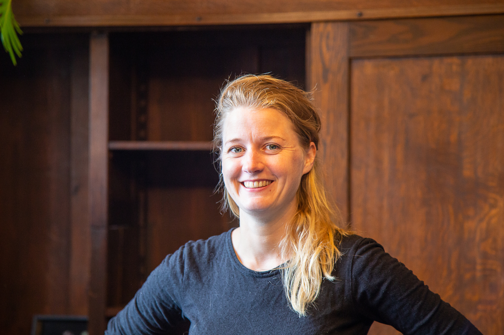

**Over de link tussen onze verwachtingen en onze ervaring van geluk wordt al heel lang geschreven. Mo Gawdat kwam zelfs met een formule: _geluk = realiteit – verwachting_ (De logica van geluk, 2017). Deze sluit aan bij een reeks aan wetenschappelijk gefundeerde theorieën, onderzoeken en publicaties (denk aan de cognitieve gedragstherapie RET en het meer recente ACT). Zit je jezelf in de weg rond een bepaald thema, dan is het de moeite waard om je verwachtingen zelf of samen met een coach te onderzoeken. Aan de hand van de oefeningen in dit blog kun je daarmee direct een start maken.**

Het staat buiten kijf dat verwachtingen kunnen leiden tot mentale wrevel. Maar hoe kom je je eigen verwachtingen op het spoor? Hoe onderscheid je onschuldige verwachtingen van belemmerende verwachtingen? En wat doe je als je een belemmerende verwachting op het spoor bent gekomen?

**Drie stappen**

We beschrijven drie stappen die je kunt nemen om je verwachtingen op een gestructureerde manier tegen het licht te houden:

*   Stap 1. Bewust worden van belemmerende verwachtingen.
*   Stap 2. Vervangen van verwachtingen door bewust gekozen opvattingen.
*   Stap 3. Commitment vergroten door innerlijk besluit.

Het doel van deze stappen is bewust te kiezen volgens welke leidraden je gaat leven. Onze samenleving is doordrenkt met verwachtingen. Denk aan de verwachting om hard te werken en productief te zijn. Maar hoe kijk jij zelf aan tegen productiviteit? Door heel bewust je eigen zienswijze te formuleren en te besluiten deze als leidraad voor jouw gedrag te hanteren kun je met meer zelfvertrouwen je eigen pad kiezen.

Aan het eind van deze blog schetsen we een beeld van Suzan die aan de hand van de drie bovenstaande stappen aan de slag is gegaan met haar verwachtingen op het gebied van productiviteit. Door heel bewust haar eigen zienswijze te formuleren en te besluiten deze als leidraad voor haar gedrag te hanteren kon ze met meer zelfvertrouwen eigen keuzes maken. Met welke belemmerende verwachting ga jij aan de slag?

**Belemmerende verwachtingen die we vaak tegenkomen**

*   Ik moet leuk gevonden worden door mensen om mij heen.
*   Ik moet mijn leven op orde hebben.
*   Ik moet zo productief en nuttig mogelijk zijn.
*   Ik moet gelukkig en dankbaar zijn, want ik heb het goed

**Stap 1. Bewust worden van verwachtingen**

Soms weet je zelf al van welke belemmerende verwachting je last hebt. In andere gevallen vraagt dit nog wat verder onderzoek. Het is handig om aanwijzingen te kennen die duiden op een belemmerende verwachting; op een idee over hoe je zou _moeten_ leven. Eén van de aanwijzingen is het woord ‘moeten’. Belemmerende verwachtingen hebben vaak een dwingend karakter dat ligt besloten in het woordje ‘moeten’. Om zicht te krijgen op jouw belemmerende verwachtingen over je leven, kun je de onderstaande oefening doen.

*   a) Pak pen en papier erbij en vul onderstaande zin minimaal drie keer aan.  
    Ik moet altijd…  
    Bijvoorbeeld: ik moet altijd… op tijd komen
*   b) De aanvullingen die jij hebt opgeschreven, mag je nog een keer herhalen, maar ditmaal begin je de zin drie keer met:  
    Ik heb de gedachte dat…  
    Bijvoorbeeld: ik heb de gedachte dat ik altijd op tijd moet komen. Merk je dat je met de tweede variant al met iets meer afstand kunt kijken naar verwachtingen die jij hebt?
*   c) Ter voorbereiding op stap 2: Lees de zinnen nog eens na en omcirkel één van de zinnen waarop jij het meest spanning voelt.

**Stap 2: Wat is jouw opvatting? Wat vind jij belangrijk?**

Veel van onze verwachtingen hebben we afgeleid van wat onze ouders en verzorgers ons hebben meegegeven: “Doe voorzichtig”, “Doe je best”, “Gedraag je”. Ik vermoed dat iedereen deze woorden wel herkent. Onderdeel van het onderzoek naar verwachtingen is de vraag hoe jij zelf aankijkt tegen bepaalde thema’s waarop je vastloopt. Met andere woorden: Wat vind jij eigenlijk? Wat is jouw opvatting? Vind jij echt dat iedereen altijd op tijd moet komen? Hieronder vind je een simpele manier om daarachter te komen!

> Je hebt aan het eind van de vorige oefening één van de zinnen omcirkeld, bijvoorbeeld: ik moet altijd zo snel mogelijk reageren op berichten (mails, appjes) van anderen waarin mij iets gevraagd wordt.
> 
> Stel je voor dat je in de kroeg zit met een vriend of vriendin die worstelt met dezelfde verwachting als jij. Hij of zij wil graag horen hoe jij aankijkt tegen wat hem of haar dwars zit. Hij of zij vraagt bijvoorbeeld: Vind jij ook dat mensen altijd zo snel mogelijk moeten reageren op berichten van anderen?
> 
> Formuleer jouw antwoord op die vraag. Het formuleren van jouw opvatting kan ingewikkeld zijn. Het kan helpen om jezelf te dwingen bij elke uitspraak die jij doet, de zin te vervolgen met ‘want….’

**Stap 3: Wat is je innerlijke besluit?**

Verwachtingen die we al heel lang met ons meedragen, laten zich niet makkelijk opzijzetten. Het is menselijk om een vriend of vriendin goed te adviseren, maar dat advies zelf in de wind te slaan. Het is als de longarts die zelf rookt. Hoe kan dat? Er is een reden waarom je voorheen nog niet in lijn met je opvatting gehandeld hebt. Je huidige gedrag levert jou iets op, al is het maar het kunnen handelen vanuit routine, wat aanvankelijk minder moeite kost dan bewust handelen.

Wanneer je met die routine wil breken, is het dus van belang om een stevig innerlijk besluit te nemen om te handelen in lijn met je eigen opvattingen. Het kan helpen om je opvatting op een bepaalde thema met iemand te bespreken en het voornemen uit te spreken om volgens die opvatting te gaan leven. De ervaring leert bovendien dat je je commitment aan jezelf kunt vergroten door precies te formuleren wat er in je alledaagse praktijk/gedrag verandert, oftewel: welke consequenties jij besluit te accepteren.

Betrek indien mogelijk een vriend(in), collega of coach bij de inzichten die stap 1 en 2 je hebben gegeven. Bespreek met hem of haar dat jouw besluit is om te handelen in lijn met je opvatting en dat je dit graag met hem of haar deelt.

> Vraag deze persoon ook met je mee te denken over de volgende vraag: ‘Wat zal er in de praktijk veranderen als ik ga leven in lijn met mijn opvatting?’

**Een voorbeeld**

We nemen je mee in het voorbeeld van Suzan om nog beter beeld te krijgen voor hoe het onderzoek naar verwachtingen.

_Suzan is een keiharde werker met een drukke baan. Ze heeft zeer regelmatig last van een schuldgevoel als ze een onproductieve dag heeft gehad. Tegenwoordig komt dat vaker voor dan haar lief is. Ze krijgt er stress van en is vaak ontevreden. Ze heeft de behoefte om haar verwachtingen onder de loep te nemen en volgt de drie stappen._

**_Stap 1_**

_Bij de oefening springt één van de zinnen er voor haar heel duidelijk uit. ‘Ik moet altijd zo nuttig en productief mogelijk zijn.’ Terwijl ze de zin opschrijft voelt ze direct de spanning; er zit iets dwingends in de manier waarop ze erover denkt. Ze vormt de zin om: ‘ik heb de gedachte dat ik altijd zo nuttig en productief mogelijk moet zijn.’ Als ze deze zin tot zich door laat dringen, merkt ze dat de spanning direct wat af neemt omdat ze er met een afstand naar kan kijken._

**_Stap 2_**

_Suzan denkt zich in wat ze zou zeggen tegen een vriendin die met dezelfde dwingende verwachting kampt en haar visie hierop vraagt. Ze komt tot de volgende opvatting:_

_Ik vind dat mensen niet altijd productief hoeven te zijn, want dat doet geen recht aan wat het betekent om mens te zijn. Ik vind dat mensen productief moeten kunnen zijn als ze iets willen bereiken, maar dat hen niet dwars moet zitten, want dan is werken niet fijn, niet duurzaam en ben je niet vrij. De boog hoeft niet altijd gespannen te zijn, ik ga werken binnen vaste tijden en ook als niet alles af is, zijn de avonden voor mijzelf._

**_Stap 3_**

_Suzan belt een collega op met wie ze altijd goed kan spreken over onderwerpen waarmee ze worstelt. Ze is verrast hoe ver ze al is gekomen. Ze kan aan haar collega heel goed uitleggen welke verwachting haar belemmert en ook wat haar opvatting is op het thema productiviteit. Ze spreekt uit dat ze heeft besloten om te gaan leven in lijn met haar opvatting en dat het haar zou helpen om te bespreken wat dat betekent voor haar dagelijkse praktijk._

_Al pratende met haar collega komt ze tot de conclusie dat ze haar plichtsbesef en prestatiegerichte ‘zelf’ niet te veel ruimte moet geven en ook dat dat niet gemakkelijk zal zijn. Het betekent dat ze soms moet verdragen dat anderen op haar aan het wachten zijn en mogelijk niet blij met haar zijn, maar ze is bereid die consequentie te aanvaarden. Haar besluit staat vast._

**Hoe ver ben je gekomen?**

Het is een levenskunst om steeds scherp te blijven op je verwachtingen en hoe zij de regie en het geluk dat jij ervaart in je leven beïnvloeden.Hopelijk ben je met de bovenstaande 3 stappen een eind gekomen en heb je nu zicht op waar voor jou de winst ligt en hoe je, met een door jou gekozen opvatting, steviger en gelukkiger in je leven staat.

Het kan prettig zijn om in meer detail de stappen te doorlopen en begeleid te worden bij het volhouden van het bewust gekozen gedrag. 

Als je behoefte hebt om nog wat steviger aan de tand gevoeld te worden, dan kan een coach daar goed bij helpen. Neem hier een kijkje om meer te weten te komen over de coachingsmogelijkheden bij Yep. 

Dit blog is geschreven Anna Stutje. Sinds begin 2020 is ze verantwoordelijk voor alle coachingsactiviteiten bij Yep.