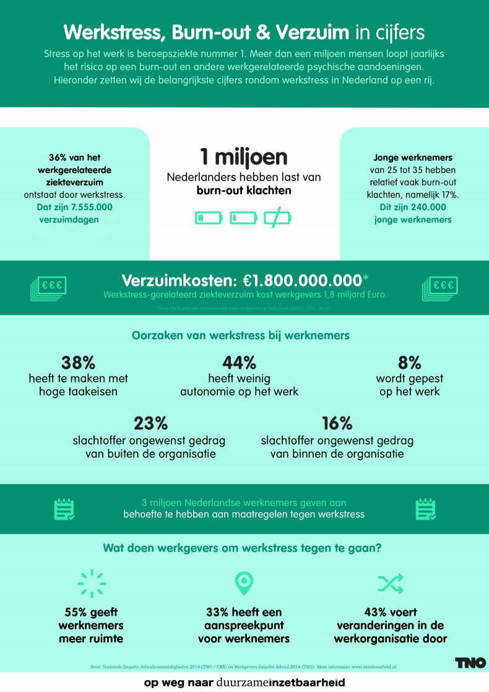
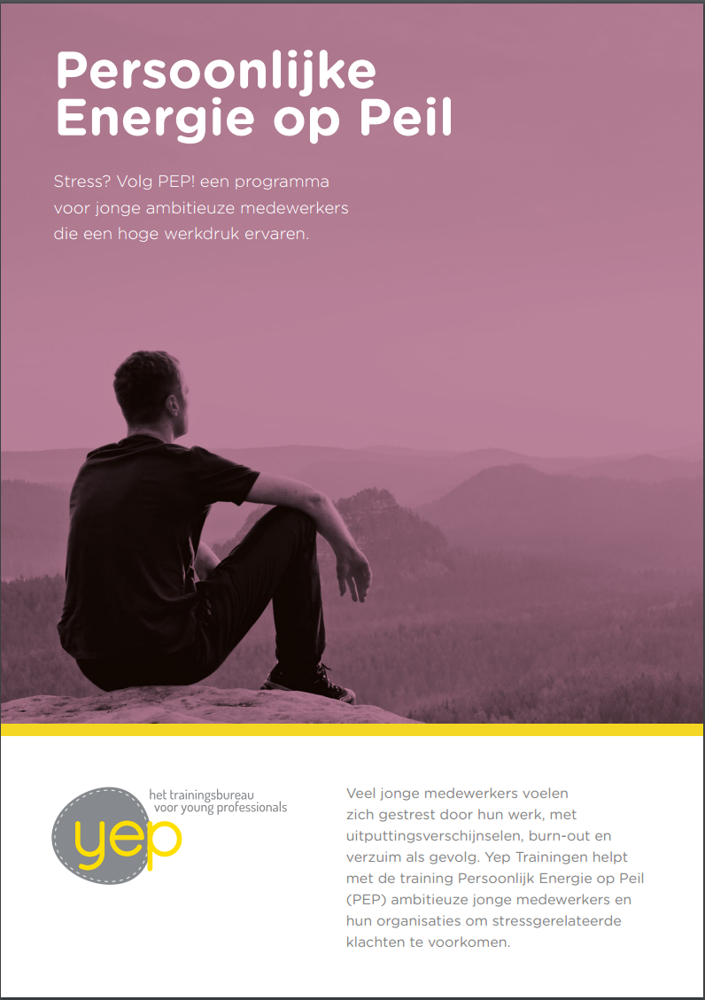
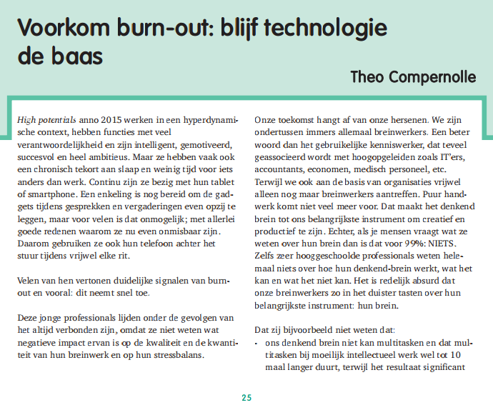
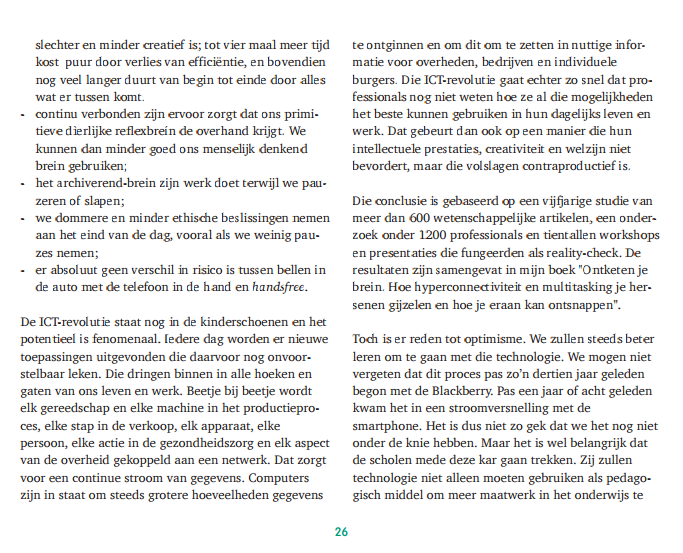
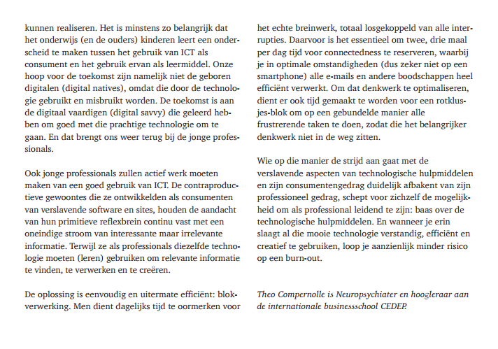

Burn-out is een syndroom van emotionele uitputting, afstand hebben van het werk, en twijfelen aan de eigen competentie met als oorzaak stressvolle factoren uit het werkdomein (naar [Taris, Houtman en Schaufeli, 2013: Burn-out de stand van zaken](https://lirias.kuleuven.be/bitstream/123456789/526881/3/Burnout_de_stand_van_zaken.pdf)). Het komt op het moment helaas zeer veel voor, zeker onder sterk betrokken medewerkers tussen de 25 en 35 jaar.

## Hoge werkdruk onder 25-35 jarigen

Merk je dat je werkdruk langdurig hoog is? Je staat niet alleen. Van alle starters en young professionals tussen de 25 en 35 jaar ervaart een heel groot gedeelte een langdurige hoge werkdruk. Bij [1 op de 5 personen leidt dit tot ernstige burn-out klachten](http://www.monitorarbeid.tno.nl/publicaties/factsheet-werkstress) (TNO). Kom vroegtijdig in actie om klachten, ziekte en misschien ook wel een volledige burn-out te voorkomen. Een proactieve houding is nodig, al weet ik dat je nu denkt: daar heb ik geen tijd voor. Realiseer je dat wanneer de burn-out komt, het wel een jaar kan duren voordat je weer op krachten bent. En werkgevers zijn lang niet allemaal in staat om een burn-out vroegtijdig te herkennen of je succesvol te ondersteunen bij het terugvinden van de balans, dus helaas moet je hier vooral zelf op letten! 

## Herkennen van burn-out klachten

Mensen die een burn-out krijgen, worden erdoor overvallen (lees [dit artikel](http://nl.newsner.com/gezinsleven/vergeet-nooit-als-iemand-waarvan-houdt-burn-out/) van een psychiater die het zelf overkwam, of [hier zijn eigen site](http://niklasnygren.se/), maar dan moet je er wel een vertaling op loslaten vanuit het Zweeds). Terugkijkend kunnen zij zien dat hun manier van werken en leven te veel eisend was: steeds een gevoel van urgentie en gejaagdheid met daarbij nauwelijks tijd om bij te komen en jezelf (lees: je hersenen) tot rust te laten komen. Steeds lukt het om er toch weer tegenaan te gaan door nieuwe trucs toe te passen om het maximale uit je lijf te halen: de wekker eerder zetten, van alles met elkaar proberen te combineren, jezelf voorhouden dat het vandaag gaat lukken omdat het gisteren lukte. Tot op een dag je lichaam weigert en je cognitief niet meer doorkan op dezelfde manier. Je hersenen hebben te lang blootgestaan aan stress-hormonen en functioneren daardoor niet meer op de manier die je gewend was. Dus je zult scherp moeten zijn op (vroegtijdige) stressklachten om een échte burn-out voor te zijn. Veelgenoemde stressklachten zijn:

* Slaapproblemen
* Oververmoeidheid
* Overmatig piekeren
* Constant gejaagd gevoel, het gevoel niet of nauwelijks te kunnen voldoen aan alle verwachtingen
* Hartkloppingen
* Spanningshoofdpijn
* Oorsuizen
* Hoge spierspanning in nek en schouders
* Hyperventilatie
* Concentratieproblemen
* Snel geïrriteerd of geëmotioneerd raken
* Groeiend gevoel van afstand, apathie of cynisme als je aan je werk denkt

Herken je een aantal van deze klachten? Het lijstje kan je helpen om gezonde en ongezonde stress van elkaar te onderscheiden. Want 'gewone' of 'gezonde' stress hoort bij het leven en iedereen is/lijkt voortdurend druk. Zeker rond de dertig speelt dit: naast een verantwoordelijke functie spelen er ook talloze privé kwesties: de komst van kinderen, ziekte of overlijden van ouders, een scheiding. Dit is van alle tijden.

## Waardoor kun je de toename in burn-outs verklaren?

Hoe kan het dat het nu zoveel vaker voorkomt? En waarom juist bij de jonge doelgroep? Factoren die er de laatste 10 jaar bij zijn gekomen kunnen naar mijn idee (dus niet wetenschappelijk gefundeerd) de volgende zijn:

* Grote reorganisaties waardoor men met minder mensen hetzelfde werk moet doen, steeds als tijdelijk gepresenteerd maar uiteindelijk langdurig gebleken.
* De economische crisis waarmee zij te maken kregen toen zij de arbeidsmarkt betraden. De daarmee samenhangende voortdurende baan-onzekerheid: veel minder vaste contracten en meer zelfstandig ondernemers.
* De financiële noodzaak en/of wens om twee inkomens per gezin te hebben.
* De transitie in de zorg naar zelfsturende teams waarbij verantwoordelijkheden onduidelijk zijn en er minder steun/signallering naar elkaar is.
* Het feit dat meerdere collega's ook een burn-out hebben waardoor je met nog minder mensen het zelfde werk moet doen.
* De hoge mate van protocollering in het werk, niet met zorg en naar eigen inzicht kunnen werken maar lijstje moeten afwerken, om zo efficient mogelijk met tijd om te gaan,volgens een ander.
* De grote rol die sociale media en technologie spelen in het leven tegenwoordig en de daarmee samenhangende overvloed aan informatie, verstoringen, voortdurende bereikbaarheid en hoge verwachtingen van het leven.

## Steun vanuit werkgever belangrijk maar zeldzaam

In een recent verschenen onderzoek van Kantar Public (bijv op [23 mei 2017 in het AD](http://www.ad.nl/binnenland/werkgever-leert-niets-van-burn-out~ab7e4ee8/) ) blijkt dat de meeste werkgevers (zelfs!) niets doen om terugval na revalidatie van een burn-out te voorkomen. 

Zij leggen de schuld bij de zieke en houden op de werkvloer alles hetzelfde. Een aantal werkgevers en leidinggevenden had niet eens één gesprek gevoerd met de getroffen medewerker. De medewerker wordt meestal gestimuleerd om meer aan yoga of meditatie te doen met daarbij soms begeleiding door een psycholoog. Allemaal gericht op het slachtoffer, waardoor wordt gesuggereerd dat de verantwoordelijkheid voor het krijgen en het voorkomen van een (volgende) burn-out volledig bij die persoon ligt.

## Oorzaken aanpakken

In plaats van alleen symptomen te gaan bestrijden door meer aan yoga of meditatie te gaan doen, kun je ook oorzaken aanpakken. Met andere woorden: je kunt zelf beter leren omgaan met stress en een hoge werkdruk, natuurlijk. Maar hoe fijn zou het zijn om daarnaast ook een aantal veranderingen door te voeren waardoor er in de eerste plaats een stuk minder stress is? Waarbij je handige aanpassingen in je werkwijze kan doorvoeren die ervoor zorgen dat je meer steun, controle en energie ervaart. En niet allemaal zelf, maar met de steun en betrokkenheid van enkele collega's. Want een burn-out is niet 'de schuld' van degene die slachtoffer wordt, maar is een samenspel van het werk zelf, de match met je persoonskenmerken, hoeveel eigen ideeën je in je werk kwijt kunt, de werkcultuur, de ondersteuning die je op het werk krijgt en meer. In het onderzoek bleek hoe belangrijk (en helaas ook hoe zeldzaam) de steun vanuit het management is voor een vlot en duurzaam herstel. uit ander onderzoek, [Taris, Houtman en Schaufeli, 2013: Burn-out de stand van zaken](https://lirias.kuleuven.be/bitstream/123456789/526881/3/Burnout_de_stand_van_zaken.pdf), blijkt dat een combinatie van persoonsgerichte interventies (zoals het vergroten van gevoelens van competentie en copinggedrag, sociale steun of ontspanningsoefeningen ) en organisatiegerichte interventies (zoals de organisatie van het werk, de manier van leidinggeven het vergroten van regelmogelijkheden en het verlagen van taakeisen), het grootste en meest langdurige effect opleveren.

## Yep helpt met PEP

Heb je een aantal stressklachten en ben je benieuwd naar een aanpak waarbij jij, samen met een betrokken leidinggevende wordt begeleid om binnen een half jaar weer langdurig de balans terug te hebben? Kijk dan eens naar ons [PEP programma]TODO:(../../static ): Persoonlijke Energie op Peil. Hierin krijg je zicht op belangrijke factoren die je op dit moment energie kosten en ga je systematisch aan de slag om passende oplossingen te vinden. Een activerend traject dat stapsgewijs kracht geeft en heldere resultaten oplevert! Uiteraard gaan we voor de combinatie van persoonsgerichte oplossingen en werkgerichte oplossingen zoals hierboven beschreven. De trainingsdagen vinden in een kleine groep (max 5 personen) plaats onder begeleiding van een trainer die ook psycholoog is. Toch leent het programma zich niet voor personen die denken al een burn-out te hebben. Zij kunnen beter voor één op één therapie terecht bij een gespecialiseerd psycholoog. 

 TODO: link invoegen naar trainingen

## Wat kun je zelf al doen

Heb je na het lezen van dit bericht behoefte om meteen iets in gang te zetten om je eigen werkstress te verminderen? Je kunt al een paar dingen doen:

* Ga sporten. Lichaamsbeweging helpt je lijf om te herstellen van stress-hormonen.
* Zoek ondersteuning op je werk: kun je wat taken kwijt die je veel energie kosten? Kun je er iets bijnemen wat juist energie geeft?
* Bespreek de mogelijkheid met je leidinggevenden voor ondersteuning

## Meer lezen?

TNO doet veel onderzoek naar werkstress onder jonge werknemers en de doelgroep hoogopgeleide starters springt er uit. [Dit is een interessant artikel](http://www.duurzameinzetbaarheid.nl/62100/151117_jongerenenwerkstress.pdf?v=0) om te lezen: zeven wetenschappers schrijven over oorzaken en oplossingen van werkstress onder jongeren. Ik heb er één visie uitgelicht: 

  