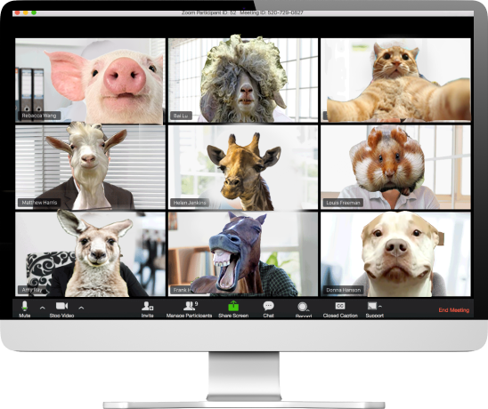

Sinds het begin van de coronatijd werken we vaker vanuit huis en onderhouden digitaal contact met collega's middels beeldbellen.

Voor wie het nog niet helemaal in de vingers heeft, zetten wij graag wat do's en don'ts op een rij, zodat je meteen professioneel bezig bent en niet alles zelf door schade en schande hoeft te ontdekken!

*   **Kies de ruimte met zorg** 
    Kies je positie in de ruimte bewust. Ben je zelf goed verlicht? Een rustige achterwand zonder afleidende zaken is ook prettig. Kijk voor je de verbinding maakt zelf eens met een frisse blik rond in je thuiskantoor. Ik zie bijvoorbeeld wel eens iemand met op de achtergrond een volgeladen wasrek, of, ook vervelend, een fel belicht gezicht waardoor iemand er heel anders uitziet. 
   
*   **Bepaal je oriëntatie tot de webcam** 
    Een losse webcam heeft vaak de voorkeur, die kun je zo positioneren dat je er ongeveer recht inkijkt wanneer je naar je scherm kijkt. Dat is prettig voor de mensen met wie je overlegt, zij ervaren zo meer contact. 
   
*   **Let op je kleding** 
    Het lijkt een open deur, maar dit gaat dus wel vaak mis! Zorg ervoor dat in elk geval je bovenlijf er professioneel uit ziet. Ik zie wel eens mensen inbellen met een ongekamde coupe of een uitbundig t-shirt aan, terwijl ze normaal gesproken strak in het pak gaan. Dat zorgt wel voor wat vreemde blikken: gaat het wel goed met je? Ben je arts, dan is het voor de arts-patient relatie ook helpend als je er herkenbaar als arts uitziet (en je achtergrond doet hier ook veel).
   
*   **Gebruik de mute-knop** 
    Wanneer je met een grote groep belt of wanneer er achtergrondgeluid is in je ruimte, zet dan je microfoon tussen opmerkingen door steeds uit. Dat scheelt een hoop ruis! 
   
*   **Zet je camera op tijd uit** 
    Wees je ervan bewust dat je camera mogelijk al verbinding maakt voordat jij dit zelf ziet. En dat je camera de hele tijd aan staat, ook wanneer je met de groep naar een gedeeld scherm zit te kijken oid. Zet hem uit wanneer je het moeilijk vindt om rustig te blijven zitten of van je gezicht af te blijven. 
   
*   **Wijs een voorzitter aan** 
    De voorzitter is bij een digitale vergadering onmisbaar. Diegene plant de meeting in, stuurt alle deelnemers de vergaderlink toe en houdt tijdens de vergadering in het oog of iedereen wel aan bod komt. Het programma switcht namelijk vaak direct naar degene die het hardste praat. Als voorzitter zorg je ervoor dat je ook de rest actief een beurt geeft om meningen te uiten. Ook kun je als voorzitter ('host') bepaalde dingen die anderen niet kunnen. Wanneer jij bijvoorbeeld een Whiteboard opent, kan iedereen daarop schrijven, maar kan jij alleen dingen ordenen of verwijderen. Wil je eens oefenen met het digitale voorzitterschap? Vraag een (online) coaching aan! 
   
*   **Firewall en technische problemen** 
    Check tevoren of het gekozen programma werkt met de firewall instellingen van je bedrijf. Er zijn veel platforms, dus werkt het één niet, dan kun je altijd iets anders uitproberen. Populair zijn: Zoom, Teams, Hangouts, Whereby en Skype. Wanneer een deelnemer technische problemen ervaart, is het raadzaam om diegene te adviseren via WhatsApp of de chatroom met jou contact te hebben in plaats van de vergadering op te houden. 
   
*   **Geef de beurt** 
    In grote groepen is het heel moeilijk te zien wie er wil gaan praten en wordt er gemakkelijk door elkaar gepraat. De gespreksleider heeft dan een meer belangrijke rol om mensen de beurt te geven. Je kunt als gespreksleider ook zelf alle andere microfoons op mute zetten. 
   
*   **Gebruik de chat** 
    Wat heel leuk werkt in een grote groep is de chatbox. Je kunt als gespreksleider een vraag stellen (of typen in de chatroom) en ieder daar gelijktijdig zijn/haar antwoord laten typen. Bijvoorbeeld: Waar zoek je nog een oplossing voor? Of: Hoe heb je, op een schaal van 1 tot 10 de informatiebijeenkomst ervaren? 
     
    Zo heb je het overzichtelijk op een rij en kost het weinig tijd. Ook kun je een chatbox of gedeeld whiteboard gebruiken om de belangrijkste punten uit het gesprek samen te vatten. 
   
*   **Maak gebruik van het beeld** 
    Vraag deelnemers bijvoorbeeld om hun standpunt visueel te maken. Denk hierbij bijvoorbeeld aan een vorm als petje op petje af, kleuren kaarten om mee te stemmen of laat deelnemers fotos delen van wat ze zijn tegengekomen. 
   
*   **Gebruik de tijd online spaarzaam** 
    Het digitaal vergaderen wil je, zeker in een groep van meer dan 4 personen, liever kort houden. 1,5 uur vind ik aan de lange kant. Benut goed de mogelijkheden om vooraf iets te laten voorbereiden, of leg de vergadering even stil om subgroepjes een opdracht te geven, waarna je de boel weer oppakt. De subgroepen kunnen dan in afzonderlijke kamers (Break-out rooms) of telefonisch met elkaar aan de slag. 
   
*   **Noteer actiepunten of notulen** 
    Hoewel je dit wellicht in een reguliere vergadering standaard doet, is het online net zo goed van belang! Wijs iemand aan die de conclusies en actiepunten vastlegt.

We wensen je heel veel succes! Mocht je vragen hebben, dan weet je ons te vinden: info@yeptrainingen.nl 
 
Wist je dat wij je ook verder kunnen helpen bij het beeldbellen of faciliteren van online sessies? Dit kan door coaching, team-intervisie een maatwerk training of bestaande trainingen zoals de Train-de-trainer of cursus Verbindend beeldbellen.