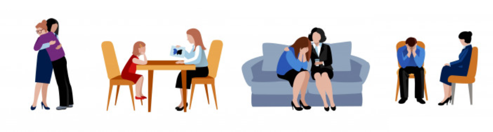

Misschien kom je op dit blog terecht omdat je de tip hebt gekregen om wat meer afstand te bewaren. In mijn werk als trainer zie ik veel onderwijzers, zorgverleners, accounthouders, coaches, trainers en andere daadkrachtige professionals die begaan zijn met de personen waar zij mee - en voor - werken. Ze willen problemen van anderen helpen oplossen, liefst zo snel en zo goed mogelijk en zien hiervoor talloze mogelijkheden. Veelal gedreven mensen met veel energie, die graag hun cliënten en leerlingen met raad en daad willen bijstaan. Helpers, die veel aankunnen, die geweldig zijn, én die zichzelf gaan tegenkomen..

Want wie niet bewust afstand bewaart in zorgende taken, gaat hier last van krijgen.

## Een paar voorbeeldsituaties, steeds met 2 mogelijke reacties erbij
------------------------------------------------------------------

> _Door een familiesituatie kan een WO student de verplichte les die jij geeft niet bijwonen. Zij komt erg verdrietig bij jou om haar verhaal te vertellen en vraagt om jouw hulp._

Reactie A: Je maakt een kop thee, gaat samen op een rustige plek zitten en neemt er flink de tijd voor om haar verhaal te horen. Je stelt haar vervolgens gerust met een oplossing: zo belangrijk is dat verplichte lesje ook weer niet, ze mag het missen, als ze het maar voor zichzelf houdt.

Reactie B: Je laat merken dat je de situatie vreselijk voor haar vindt en legt de bal bij haar: wat heeft zij nodig om de situatie op te kunnen lossen? Je eigen regels (en die van de onderwijsinstelling) blijven overeind.

> _Een vader zit hartverscheurend te huilen op de couveuseafdeling. Zoveel ellende in 24 uur tijd heeft hij nog niet eerder meegemaakt en hij weet het allemaal even niet meer._

Reactie A: Je kunt het je zo voorstellen! Je ziet hem daar zitten, denkt aan de andere familieleden van deze man en zijn situatie en huilt letterlijk met hem mee. Slaat een arm om hem heen en zegt: het is ook vreselijk allemaal! Je staat hem daar een tijdje te knuffelen. Uiteindelijk krijg je een oproep en verontschuldig je je.

Reactie B: Je vraagt de vader om even mee te lopen en tijdens de wandeling naar de gang bedaart hij al een beetje. Jullie zoeken een rustige plek op. "Wat voel jij je ellendig, he?" Vader vertelt wat hem zo heeft geraakt, en tot je verbazing waren het niet de testuitslagen. Je helpt hem om weer het overzicht te hebben van hoe alles ervoor staat en om zelf weer zijn ouderrol aan te nemen: zijn gezin heeft hem nu nodig. En je checkt: wie staat er voor hem klaar als hij het nodig heeft? Vader bedenkt dat hij zijn netwerk kan inzetten.

> _Op jouw afdeling zijn er twee personen minder: één is met vakantie en de ander zit met een burn-out thuis. Je leidinggevende werkt zich een slag in de rondte en vraagt iedereen om een deel van de extra werklast op zich te nemen. Jij hebt eigenlijk een paar weken geleden al een gesprek aangevraagd omdat de werkdruk je al te hoog was, maar voor dit gesprek heeft zij nog geen tijd gehad. Hoe ga je om met dit verzoek?_

Reactie A: Je ziet dat zij er alles aan doet en hoopt dat het na de vakantie van je ene collega weer op zijn pootjes terecht komt. Met z'n allen de schouders eronder! Je pakt een deel van het werk op en maakt ook tijd voor een gesprekje met je leidinggevende over hoe het met haar gaat.

Reactie B: Je zoekt je leidinggevende op en vertelt haar dat het jou niet gaat lukken om extra zaken op te pakken, hoe graag je ook zou willen helpen. Jouw boog is al maanden gespannen en je denkt dat de ontstane situatie tot meer uitval in het team gaat leiden. Een structurele oplossing is nodig. Daar wil je over meedenken. Je bent niet bereid meer te doen dan je kan.

Uit deze voorbeelden, waarbij bij Reactie A minder afstand wordt bewaard dan bij Reactie B, blijkt dat afstand bewaren wel een interessant en complex begrip is! Het gaat niet alleen om fysieke afstand. Het gaat ook over de mate waarin je je inleeft en meevoelt met de andere persoon, de mate waarin jij een verantwoordelijkheid op je neemt voor een situatie van een ander.

## Wat gebeurt er als je geen afstand bewaart?
-------------------------------------------

Als het niet lukt om (voldoende) afstand te bewaren, kan dat tot verschillende dingen leiden. Per persoon en situatie verschillend, maar de gevolgen liegen er niet om!

*   jouw werkdruk voelt groter, door de emotionele lading die je steeds mee draagt.
*   je vergroot de kans dat je zelf een burn-out krijgt.
*   je bent minder in staat de ander te helpen met het maken van rationele beslissingen.
*   je bent minder in staat het overzicht te bewaren en daardoor kun je een bijzaak te belangrijk maken of dingen vergeten.
*   Je kunt het gevoel van machteloosheid en verdriet bij de ander vergroten.
*   Je kunt zelf de problemen van anderen 'mee naar huis' nemen, ze beïnvloeden je eigen stemming.
*   Je neemt verantwoordelijkheden/taken op je die eigenlijk bij de ander horen. Meestal kun je dit op de lange termijn niet waarmaken en verzwakt dit de mate van inzet en regie bij de ander.
*   Je deelt privé informatie, waardoor de ander veel over jou weet, en het gesprek mogelijk onnodig over jou gaat ipv de ander. Ook kun je hierdoor makkelijker onder druk worden gezet.

## Kan het ook te veel afstand zijn?
---------------------------------

Ja. Dat kan. Bijna ieder mens vindt het prettig als een ander zijn zorgen kan herkennen, een beetje aansluit bij waar hij staat of reageert op non-verbaal gedrag. En ook als de ander iets van zichzelf laat zien. Je wil weten met wie je te maken hebt. Bij te veel afstand wordt het contact kil en onpersoonlijk.

Afhankelijk van de situatie is meer of minder afstand gepast. Ook kan het zijn dat jij als persoon de voorkeur geeft aan wat meer of wat minder afstand te nemen dan gemiddeld. Zeker in situaties waarbij jij er niks bij kan hebben, is veel afstand gepast. Een reactie als 'nu komt het even niet uit' volstaat dan.

Is er erg veel afstand, dan merk je dat men niet bij jou komt met problemen en vragen. Dat lijkt efficient, maar daardoor mis je wat er speelt en kun je niet tijdig bijsturen.

## Hoe bewaar je afstand?
----------------------

Afstand bewaren zit hem in veel kleine dingen, zoals we bij de voorbeelden al zagen. Zoals:

* Hoe dichtbij sta je? Raak je de ander aan?
* Kijk je de ander diep in de ogen?
* Hoe diep en hoe lang ga je in op iemands verhaal?
* Ga jij het voor de ander oplossen? Huil en lach je mee?
* Hoeveel laat je van jezelf zien? En is dat professionele informatie, of persoonlijk?
* Doe je dit open en bij iedereen, of hangt er een sfeertje omheen van geheimhouding/uitzondering?

De meeste mensen voelen automatisch aan wat er gepast is in een sociale situatie, tijdens of achteraf. Je krijgt bijvoorbeeld na een gesprek met een leerling spijt. Was dat wel gepast en nodig? Of: je eigen afspraak vergeten, balen. Of: je merkt dat je blijft zitten met het verhaal van de ander.

Maar ook als je het over het algemeen goed aanvoelt zijn er momenten waarop het lastig is! Denk maar aan een situatie waarin je in een andere (bedrijfs-) cultuur bent, bijvoorbeeld. Mag je een vraag stellen aan de persoon 'boven' je? Of is dat al ongepast/brutaal? Mag je zomaar bij iemand binnenlopen? Of als je promotie hebt gemaakt: als directe collega kon je je een schuine grap nog wel permitteren en als MT-lid ineens niet meer. Nog een lastige situatie: als je ziet dat de persoon erg kwetsbaar is en niet door iemand anders wordt opgevangen.

Wat kun je doen om (meer) afstand te gaan bewaren? In een notendop: ondersteun, maar neem het niet over.

* Zelf een helder beeld hebben over wat je kan en wil betekenen voor je cliënten, patienten, leerlingen of collega's en wat niet.
* Vragen om een afspraak in te plannen voor een gesprek, wanneer iemand je met een vraag overvalt.
* Denk in termen van 'hoe ga jíj dit oplossen?', 'wat heb je al geprobeerd?', 'wat lijkt jou nu een haalbaar streven?'. Met die tekst geef je wel aandacht en help je iemand om zelf op ideeën te komen. Je neemt het niet op jouw schouders.
* Doorverwijzen naar iemand die ze nog beter kan helpen. Dit is ook bij de kwetsbare personen die niet iemand anders lijken te hebben aan te raden: overleg met hen waar ze terecht kunnen en help bijv met de aanmelding. Het helpt hierbij als je weet welke personen en organisaties er beschikbaar zijn. Vertrouwenspersonen, decanen, maatschappelijke organisaties, etc.

## Méér betekenen
Misschien steunt het je om te weten dat je op deze manier vaak méér kan betekenen voor de ander, omdat je de ander helpt om op zichzelf te vertrouwen. Of omdat je doorverwijst naar iemand die de juiste kennis en bevoegdheid heeft voor de begeleiding die eigenlijk niet in jouw rol past.

Ook uit mijn eigen ervaring, als trainer, docent, pleegouder en vrijwilliger in het basisonderwijs blijkt steeds dat dit handige voorwaarden zijn voor het bewaren van een professionele afstand: vooruitdenken (zodat situaties je minder verrassen), het maken van heldere afspraken, betrouwbaar zijn, het sturen richting eigen verantwoordelijkheid van de ander, weten waar ik naar door kan verwijzen en eerlijk blijven (ook naar mezelf toe).

Misschien kun je je momenten herinneren dat een ander jou heeft verder geholpen? Bij mij waren dat niet de momenten waarop een ander het ook niet meer onder controle had of zelfs meer van slag raakte dan ik zelf.

Afbeeldingen: astronaut: [Travel vector created by freepik - www.freepik.com](https://www.freepik.com/free-photos-vectors/travel), verschillende ondersteunende opstellingen: [Poster vector created by macrovector - www.freepik.com](https://www.freepik.com/free-photos-vectors/poster)