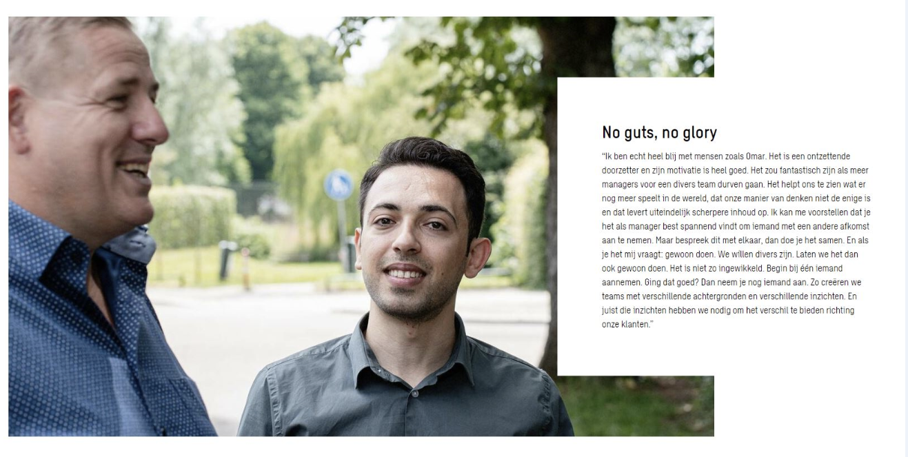

Ik zie enerzijds veel openstaande vacatures en anderzijds zalen vol statushouders die maar wat graag aan het werk willen in Nederland en met elkaar tips en ervaringen hiertoe uitwisselen. Doordat zij de taal vaak niet vloeiend spreken, een erg beperkt netwerk hebben en omdat soms de juiste diploma’s ontbreken, hebben zij een achterstand op de arbeidsmarkt. Hun ervaringen bij het solliciteren zijn vaak niet positief: zij krijgen bijvoorbeeld geen enkele reactie op de brieven die zij met veel zorg uitsturen. 

In de afgelopen 2 jaar was ik vrijwillig jobcoach bij Vluchtelingenwerk Nederland en heb ik vanuit Yep drie groepen ingenieurs en constructeurs met een achtergrond als vluchteling begeleid die bij een groot ingenieursbureau aan de slag gingen, waarbij ik ook kennismaakte met Refugee Talent Hub. Op basis van mijn ervaringen hoop ik de drempel voor jou te verkleinen om een statushouder een stevige kans te geven in jouw organisatie!

## Hoe kom ik in contact met statushouders?

Wil je in contact komen met statushouders om uit te zoeken of er een goede match is met jouw organisatie? Dan kun je mailen met [VluchtelingenWerk](mailto:infodesk-werk@vluchtelingenwerk.nl)  waar jouw aanbod gedeeld kan worden. Ook kun je contact zoeken met [Refugee Talent Hub](https://refugeetalenthub.com/). Zij organiseren speeddates tussen organisaties en vluchtelingen met een passend profiel. Zeker wanneer je op zoek bent naar meerdere nieuwe medewerkers met een zelfde soort profiel is dit een handige methode. En de allermakkelijkste plek om statushouders te werven is het nieuwe platform [RefugeeWork](https://refugeework.nl). Hier kun je je vacatures kwijt, met specifieke informatie die voor statushouders relevant is, zoals bijvoorbeeld het benodigde CEFR taalniveau (A1, A2, B1, B2, enz.). Ook zetten veel gemeentes zich in voor statushouders die werk zoeken, dus het in contact staan met je eigen gemeente hierover kan ook tips opleveren.

## Welke voordelen levert het op om een statushouder in dienst te nemen?

Naast dat het gewoon heel mooi is om iemand na een zware periode een kans te geven om weer bestaanszekerheid op te bouwen, zijn er ook voor de organisatie voordelen. In bepaalde vakgebieden waar tekorten heersen, verruimt het aanbod van vluchtelingen de markt. Het in dienst nemen van vluchtelingen helpt je om bedrijfsdoelstellingen op het gebied van MVO en SSRI te behalen. De diversiteit in je team vergroot je er zeker mee, wat helpt om (uiteindelijk) veerkrachtig te zijn als organisatie en nieuwe inzichten te verkrijgen. Ook geeft het teamleiders en collega’s vaak voldoening om deze nieuwe collega’s te verwelkomen en te leren kennen. Vaak zijn de nieuwkomers nieuwsgierig, leergierig en enorm gedreven om succes te behalen. Zij voelen zich dankbaar en loyaal richting hun werkgevers – de personen die hen de kans geven om het leven weer op te bouwen. Tot slot hoor ik ook terug van organisaties dat hun klanten het op prijs stellen dat zij statushouders opnemen. Dit kan de binding van klanten met de organisatie versterken. 

Hieronder het voorbeeld van Omar die na een speeddate van de Refugee Talent Hub bij een ingenieursadviesbureau aan de slag ging. Daar kreeg hij naast begeleiding in zijn team ook een incompany traject van Yep Trainingen aangeboden, samen met nog enkele statushouders die als constructeur of ingenieur aan het werk gingen: *Thuis in de Nederlandse werkcultuur*. Beiden kijken positief terug op het onboarding proces dat ook heeft geleid tot een lange termijn dienstverband.

## Met welke regelgeving moet ik rekening houden als ik een statushouder in dienst wil nemen? 
Wanneer een asielzoeker een (tijdelijke)verblijfsvergunning heeft, dan is het een 'statushouder' en mag diegene werken met dezelfde rechten en plichten als een Nederlandse staatsburger op de arbeidsmarkt. Wel moet je de werknemer vragen om een geldig ‘Vreemdelingen Identiteitsbewijs met verblijfsvergunning’ en moet je de einddatum van de verblijfsvergunning in de gaten houden. Wanneer een vluchteling een nieuwe verblijfsvergunning heeft, moet die opnieuw door de werkgever gecontroleerd worden. Tijdens de aanvraag voor de verlening van de verblijfsvergunning, mag de werknemer gewoon werken. Mogelijk zijn er regelingen waar je gebruik van kan maken. Het overzicht vind je [hier](https://www.refugeework.nl/praktische-zaken-en-organisatie).

## Wat zijn je belangrijkste tips om de statushouder te laten slagen in mijn organisatie?

- Communiceer met elkaar over interculturele verschillen en verwachtingen, betrek hier het team bij. De bekendste culturele verschillen staan op de site van [RefugeeWork](https://www.refugeework.nl/een-vluchteling-bij-jou-in-dienst)
- Realiseer je dat de begeleiding het eerste half jaar intensief zal zijn. 
- Zorg voor een duidelijke taak voor de nieuwkomer in de eerste periode. Niet ‘aan een hele boel’ laten proeven, maar juist laten bijdragen aan een tastbaar project waar iemand groei in kan tonen en waardevolle ervaring mee opdoet.
- Zorg voor een vast aanspreekpunt in het team, waar de nieuwkomer terecht kan met uiteenlopende vragen. En uiteraard dat deze persoon hier ook ruimte voor heeft.
- Bereid vergaderingen met de nieuwkomer samen voor. Licht per punt toe waar het over zal gaan, wat het belang is van dit punt voor diegene en welke inbreng er gewenst is uit de groep. Op die manier help je de nieuwkomer om assertiever aan de vergadering bij te dragen.
- Kies voor een ruime inwerkperiode waarbij je realistische doelen stelt.
- Vermijd onnodige extra’s – de eerste periode kun je ervan uitgaan dat de nieuwkomer veel energie kwijt is aan alle nieuwe indrukken en alle onzekerheden die er naast het werk mogelijk spelen op het vlak van familie, huisvestiging. 

## Welke begeleiding biedt Yep Trainingen aan bedrijven die net statushouders in dienst hebben genomen?
Wij begeleiden nieuwkomers in kleine groepen bij het thuisraken in de werkcultuur. Zij kunnen met elkaar en een trainer van Yep over dingen praten die hen verbazen en zonder terughoudendheid al hun vragen stellen. We oefenen met gesprekssituaties en dan met name in direct en assertief gedrag. Ook doen we oefeningen op het gebied van zelfreflectie, wat ook voor velen een nieuwe vaardigheid is. Door hier in korte trainingen en coaching sessies aandacht voor te hebben, lopen gesprekken op het werk beter. Deze begeleiding helpt de nieuwkomers om het integratieproces te versnellen, een waardevol netwerk(je) op te bouwen en zich beter te laten zien in de organisatie. Ook helpen we leidinggevenden met gerichte tips en begeleiding, bijvoorbeeld in individuele gesprekken of een gezamenlijke kick-off.

Benieuwd naar ons aanbod? Hier vind je informatie [over de begeleiding die wij bieden aan statushouders en hun leidinggevenden/mentoren](/trainingen/statushouder-begeleiding/)