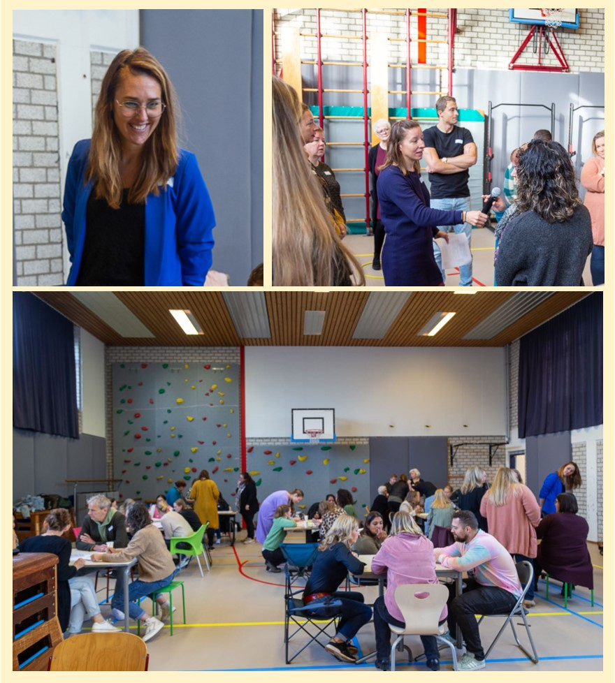
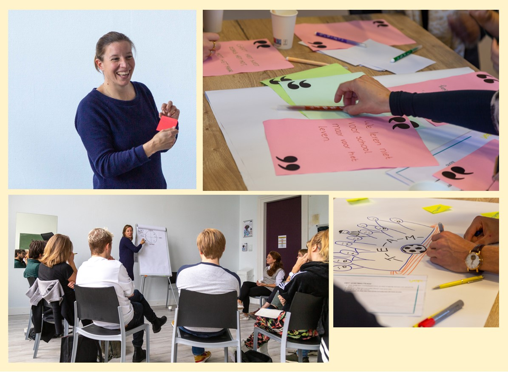

We verzorgen regelmatig trainingen en trajecten in het onderwijs. Deze gaan over didactiek, gespreksvoering, sociale veiligheid, feedback (leren van en met elkaar in het team) en teamcultuur.

Met die laatste twee onderwerpen is iets bijzonders aan de hand. En die hebben dan ook in het bijzonder onze interesse!

Toen we de eerste trainingen over teamcultuur en feedback ontwikkelden en testten, viel één ding op: feedback in het onderwijs wordt sneller persoonlijk opgevat dan in de andere sectoren die wij als trainers meemaken. Een simpele vraag over een leerling (‘Goh, hoe gaat het nu met Kiki? Ze had vorig jaar toch moeite met...’) kan al een verdedigende reactie oproepen.

Dit is ook niet gek.

Anders dan in veel andere beroepen is:

- Een leraar emotioneel landurig en nauw betrokken bij de leerlingen.
- Een leraar wel onderdeel van een team, maar het werk grotendeels solistisch. Ieder een eigen klas met de deur dicht.
- Het beroep voor een leraar vaak een belangrijk deel van de eigen identiteit.
- De werkdruk en toewijding hoog.
- Een leraar al intensief bezig met reflecteren en verbeteren, tav de eigen aanpak.
- En dan nog het voornaamste verschil dat ik zie: verandering werkt ontregelend. Je werkt met kinderen en elke dag is weer anders. Er ontstaat gemakkelijk onrust en als onderwijzer ben jij de stabiele factor. Er is niet één geschikte standaard manier om met alle kinderen om te gaan en om les te geven. Het is belangrijk dat leraren stabiel en voorspelbaar zijn. Dat zijn zij wanneer ze op een authentieke manier kunnen werken. Ieder heeft zo zijn eigen manieren en routines en kan zich door de aard van het werk niet steeds veranderingen permitteren.

>_Het is belangrijk dat leraren stabiel en voorspelbaar zijn. Dat zijn zij wanneer ze datgene doen wat voor hen werkt en dat ze makkelijk vol kunnen houden._

Toch is feedback onmisbaar, ook in het onderwijs. Het is voor onderwijsprofessionals waardevol en wenselijk om dingen te blijven ontdekken die het werk makkelijker maken, de werkdruk verlagen en het gevoel geven dat je er niet alleen voor staat. En natuurlijk van groot belang dat leerlingen uitstekende begeleiding krijgen in een veilige en stimulerende omgeving. Het is daarbij dus extra belangrijk dat de leraar datgene kan uitproberen waar die zelf vertrouwen in heeft.

## Eén sessie werkt averechts

Wat we merken is dat de schoolleiding soms de wens heeft om het team in 1 dag (of halve dag) te trainen in de vaardigheid van feedbackgeven, in de hoop dat het daarna veel meer zal gebeuren onderling. Dit kan slagen als het feedback aan ouders of leerlingen betreft. Maar gaat het om feedback tussen collega’s, dan is er zeker meer nodig. Juist door de extra gevoeligheden die er liggen, is het zaak ook goed aandacht te hebben voor de randvoorwaarden van de gewenste verandering. Tot nu toe gaat het in al onze opdrachten niet zozeer om de vaardigheid, maar veel meer om een omslag in de cultuur, in de manier van doen, in het team. Zodra men het eens is op het gebied van de gewenste cultuur, kun je daar naartoe gaan bouwen. En dan zien we ook dat het hard kan gaan – wij merken dat onderwijsprofessionals die geloven dat iets hun leerlingen gaat helpen niet te stoppen zijn!

## Wat werkt goed?

We delen graag onze ervaring en aanpak. De onderstaande punten werkten goed in de teams die wij tot nu toe mochten begeleiden op het gebied van feedback en teamcultuur.

- Betrek het team bij het proces, inventariseer behoeften en confronteer niemand onverwacht.
- Sta als team achter één missie en formuleer deze concreet. Evalueren van gedrag gaat dan niet meer om persoonlijke voorkeuren, maar om het bereiken van dat gezamenlijke doel.
- Voer waarderende gesprekken. Vraag: ‘Wat doen we al dat bijdraagt aan deze missie? Maak daarbij onderscheid tussen organisatie-, team- en individueel niveau. Wat zou er gebeuren als we dit niet meer zouden doen?’. Een externe hierbij betrekken heeft een meerwaarde, omdat diegene meer geneigd zal zijn om door te vragen. Dit kan ook een nieuw teamlid zijn!
- Bespreek wat beter kan of het proberen waard is. Maak ook hier onderscheid tussen organisatie-, team- en individueel niveau en houd steeds het doel hierbij in het vizier. Dit zorgt er namelijk voor dat men niet alleen wijst, maar ook kijkt naar de eigen invloedssfeer en het eigen gedrag.
- Stimuleer eigenaarschap en invoeld, door mensen zelf te laten reflecteren op hun volgende stap of uitdaging.
- Richt het leren op verschillende manieren in: laat feedback vragen, organiseer collegiale consultaties, laat collega’s gericht sparren, organiseer intervisie, of volg met elkaar een lezing.
- Borg de verandering in je organisatie door ook vooruit te denken: wanneer en hoe komen we hierop terug, wat leggen we vast in onze organisatie?

## Wat kun je verwachten van de aanpak?

De aanpak en tijd die het kost om toe te werken naar een lerende cultuur [verbetercultuur, aanspreek-cultuur] verschilt per groep. Dit komt door de betrokkenheid van het team. Zij zijn voor een groot deel eigenaar van het traject. Gemiddeld zijn wij 3 studiedagen + een paar gesprekken betrokken, waarna de school zonder ons verder kan.

Onze aanpak, die hierboven in de bullets beschreven staat, helpt om het team te motiveren voor feedback onderling en ook de juiste randvoorwaarden te scheppen voor het geven én aannemen ervan. Door het gezamenlijke doel wordt feedback gemakkelijker constructief. Het vertrouwen en de openheid in het team groeit en dat komt de werksfeer ten goede. Het team gaat vervolgens ook gemakkelijker veranderingen of experimenten aan met elkaar. Het is wel zaak aandacht te blijven geven aan de teamcultuur. Bijv bij evaluatiegesprekken, ontwikkelgesprekken en bij het inwerken van nieuw personeel.

> IB’er L. Berkhout: _"Wat een spetterende start van een heel mooi traject wat wij met het team zijn gestart. Wisselende werkvormen die je team laten nadenken op een creatieve manier. Dit traject feedback zijn wij gestart om een professionele cultuur op school steviger neer te zetten. Wij zijn zeer tevreden over de deskundigheid en expertise die Yep ons verder kan brengen in het basisonderwijs."_

> Adjunct-directeur J. Van der Meij: _"Gisteren de kickoff met Marijn en Esther gehad. Enorm positief ervaren zowel door mij als het team (40 leden). Veel afwisselende werkvormen, tempo, theorie afwisselen met praktijk, ochtend met een duidelijke opbouw. Vooraf al zeer prettige intake gehad waarin wij als MT al 'aan' werden gezet. Heel veel vertrouwen om met deze organisatie te werken aan een professionele schoolcultuur."_