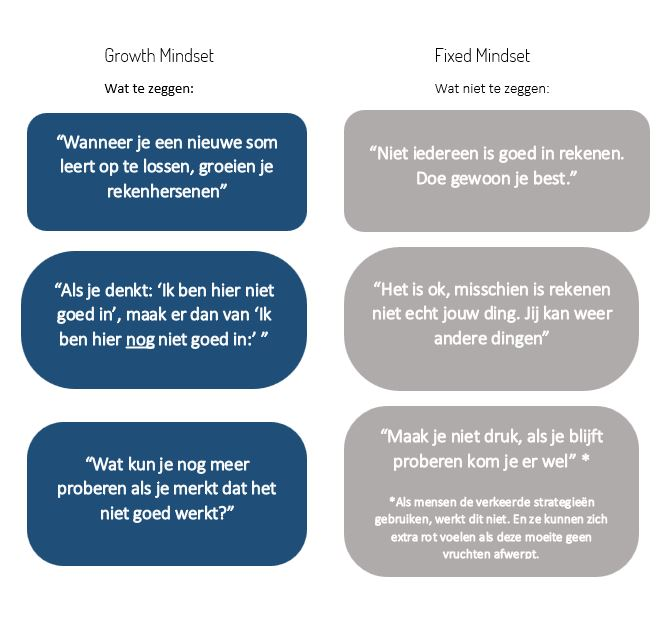

Je hoort misschien wel eens iemand zeggen: 'Het gaat erom dat je de
juiste mindset hebt'. Coaches en trainers gebruiken deze term graag, en het is ook een krachtig begrip. Maar wat houdt het in?

**Een mindset is de manier waarop jij denkt over jezelf en dan metname
over je intelligentie en je kwaliteiten.** Dit beïnvloedt hoe je je voelt,
hoe je je gedraagt en dan met name hoe je met uitdagingen omgaat. Een
mindset is geen waarheid, maar een verzameling van overtuigingen. Als je
gelooft dat je intelligent bent, dan zal je keuzes maken die aansluiten
op dit beeld. Zo ontstaat er een _self-fulling prophecy_. Het kan een
positieve of negatieve spiraal in gang zetten. Je mindset speelt dus ook
een rol in je veerkracht en je probleemoplossend vermogen. Dit merk je
terug in alle aspecten van je leven.

Je mindset hoeft niet in alle situaties gelijk, het kan zijn dat je
overtuigingen over jezelf verschillen per omgeving of situatie.

## Growth mindset en Fixed mindset

Er wordt onderscheid gemaakt tussen twee soorten mindsets die mensen
kunnen hebben. Een 'fixed mindset' en een 'growth mindset'. Mensen met
een fixed mindset geloven dat eigenschappen vast staan en niet kunnen
worden veranderd. Je hebt het nou eenmaal wel, of je hebt het niet.
Daarom denken ze dat het doen van extra moeite niet veel zal uitmaken.
Mensen met een growth mindset geloven dat talenten en capaciteiten in
de loop van de tijd met inspanning kunnen groeien. Carol Dweck (1)
toonde aan dat mensen met een growth mindset zich sneller ontwikkelen en
meer succes hebben. Zij blijven moeite doen én proberen nieuwe
strategieen uit wanneer ze merken dat het oude niet werkt.

## Vraagt jij je af of je een growth of fixed mindset hebt? Een paar voorbeeld situaties met steeds twee reacties:

**Je wilt graag een gezondere leefstijl hebben. Je pakt hardlopen op,
maar na 700 meter rennen staat je longen in brand.**

> Reactie A: Ik weet dat ik niet sportief ben. Ik weet al sinds ik klein
> ben dat ik een geen talent hebt voor sport.
>
> Reactie B: Zo, dat is al 700 meter meer dan gisteren!

**Je krijgt feedback op je werk.**

> Reactie A: Ik kan het ook niet goed doen.
>
> Reactie B: Top, hier kan ik wat mee!

**Je krijgt een opdracht, maar de uitvoering daarvan valt je erg tegen.**

> Reactie A: Dit gaat mij niet lukken. Ik kan het niet. Ik ga vragen aan
> mij collega of ze het over kan nemen.
>
> Reactie B: Wat ik tot nu toe hebt geprobeerd lukt niet. Ik moet het op
> een andere manier aanpakken. Ik kan een collega vragen om mee te
> denken.

Welke reacties paste meer bij jou? Uit deze voorbeelden, past reactie A
bij een fixed mindset en reactie B een growth mindset.

## Voordelen van de growth mindset:

Met een growth mindset, ligt je focus op kansen benutten, leren en
bijdragen. Dit leidt tot:

- Veerkracht

- Het aangaan van uitdagingen

- Doorzetten

- Leren

- Zelfvertrouwen

- Acceptatie van fouten

- Leren van kritiek

- Leren van tegenslag

Een fixed mindset leidt juist tot een gevoel van machteloosheid. Je
richt je dan met name op datgene wat je al kan en gaat het andere uit de weg.

## Hoe beinvloed ik mijn mindset:

Dweck toonde aan dat mensen in staat zijn hun mindset te veranderen. De
eerste stap is bewustwording. Besteedt aandacht aan je (innerlijke)
woorden en gedachten. Vervang negatieve of blokkerende gedachten door
meer positieve. Een eenvoudige manier is om 'nog' in je gedachte te
integreren. 'Ik kan het nog niet'.

Er zijn veel voordelen van het hebben van een 'growth mindset'. Het
eerste stap is dus bewust zijn van wat voor mindset je hebt. Je kan je
mindset veranderen door jezelf te herinneren dat je iets 'nog' niet is
gelukt.

## Hoe beinvloed ik de mindset van anderen?

Grote kans dat je dit blog leest omdat je bijvoorbeeld in het onderwijs
werkzaam bent en op zoek bent naar een manier om leerlingen te helpen
leren. **Jouw taal als ouder, onderwijzer, trainer of begeleider doet er
toe.** Vergelijk de onderstaande zinnen maar eens met elkaar. De linker
kolom draagt bij aan het ontwikkelen van een growth mindset en de
rechter kolom draagt bij aan het ontwikkelen van een fixed mindset.

Bronvermelding

(1). Dweck, C. (2015) Growth Mindset, Revisited.
https://portal.cornerstonesd.ca/group/yyd5jtk/documents/carol%20dweck%20growth%20mindsets.pdf
