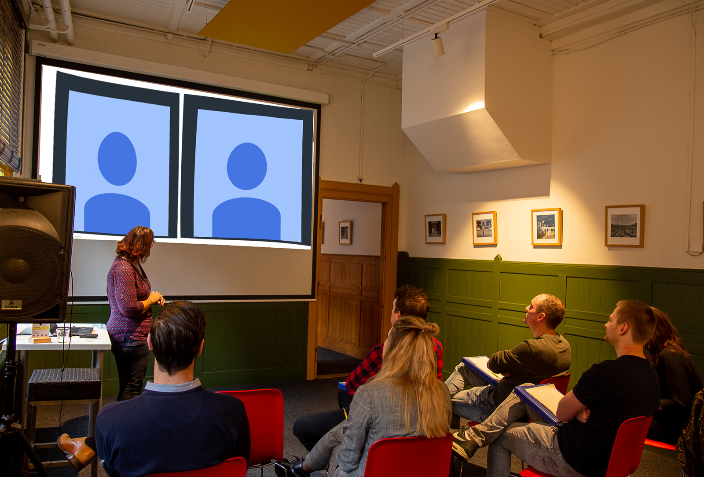

Goede kans dat ook in jouw omgeving nu hybride bijeenkomsten plaatsvinden: een deel van de mensen is fysiek aanwezig, een ander deel logt online in. Hoe werkt het als er een deel offline en een deel op locatie mee wil over leggen? Deze tips en tricks helpen je om dit jezelf ook weer snel eigen te maken!

Wij hebben afgelopen jaar ervaring opgedaan met het verzorgen van fysieke bijeenkomsten waarbij een deel van de groep digitaal aansloot. En delen graag met jullie wat wij tegenkomen. En natuurlijk onze tips!

## Welke problemen kom je zoal tegen bij een hybride bijeenkomst?

- De reguliere webcam laat maar een beperkt deel van de groep zien
- De geïntegreerde webcam-microfoons zijn erop gemaakt om achtergrond ruis te ‘cancelen’, hierdoor is geluid dat wat meer op afstand van de microfoon wordt gemaakt vaak zeer slecht te horen voor de digitale groep
- Het organiseren van oefeningen kost dubbel tijd. Je maakt groepjes voor de aanwezigen en maakt bijvoorbeeld break-out rooms voor de digitaal aanwezigen
- Het is moeilijk om je aandacht tegelijkertijd bij je scherm als in de ruimte te hebben. Zeker als er ook nog in de chat iets gebeurt
- Soms neemt er iemand onverwacht digitaal deel en moet je terplekke werkvormen vertalen naar het digitale kanaal
- Digitale deelnemers verliezen sneller hun aandacht en hebben de neiging stiller deel te nemen dan fysiek aanwezige deelnemers. Het kan dat digitale deelnemers zich minder snel uitspreken of zich niet betrokken voelen

## Sta jij straks voor een hybride groep? **We zetten onze tips voor je op een rij!**

## Verwachtingen

- Maak afspraken over wanneer men zich digitaal mag aanmelden en wat een digitale deelname betekent. Soms kun je een volledig parallel programma optuigen en op andere momenten heb je misschien geen gelegenheid om je aandacht te verdelen. In dat laatste geval willen mensen misschien toch digitaal ‘meeluisteren’ met een overleg.
- Spreek af wat de digitale deelnemer kan doen bij technische problemen of als de bijeenkomst toch niet goed te volgen blijkt te zijn.

## Techniek

- Een microfoon die van veraf werkt is echt nodig – anders valt het geluid steeds weg. Ook helpt het om de automatische ‘ruis verwijdering’ uit te schakelen.
- Een 360 graden webcam zoals een Meeting Owl kunnen wij zeker aanbevelen. Op die manier komt zowel de groep als de spreker met eventueel het whiteboard in beeld.
- Presentaties kunnen het beste dubbel gedeeld worden: in share screen voor de digitale deelnemers en op een scherm voor de aanwezigen op locatie.
- Wanneer alleen de spreker gehoord hoeft te worden, is het voldoende als de spreker een headset op heeft met een microfoon.
- Bedenk of je wil dat de digitale deelnemers te horen zijn voor de hele groep (door installatie van een speaker) of dat het voldoende is als 1 persoon hen kan horen en namens hen kan optreden. Weeg dit goed af, want het delen van het speakergeluid kan voor ruis zorgen.
- Zorg dat je wat eerder in de ruimte bent om de techniek te testen.
- Sommige locaties bieden zalen aan waar de conference tools en bijvoorbeeld livestream mogelijkheden al klaar staan. Dit is handig voor als het maar een enkele keer voorkomt en je er zelf niet bedreven in bent om de conference tools in te stellen. Op zo’n locatie doen ze het vaker en heb je de technische ondersteuning nabij!

## Aandacht verdelen

- Wij merken dat het echt zwaar is om je aandacht over 2 groepen te verdelen. Zwaarder dan we hadden gedacht. Daarom raden wij aan om de verantwoordelijkheden te verdelen over minimaal 2 mensen. Het kan zijn dat je co-trainer of moderator de digitale groep kan ‘dragen’, of, dit werkt tot nu toe het beste – koppel elke digitale deelnemer aan een fysieke deelnemer.
- Start meteen met de dynamiek die je in je bijeenkomst wil hebben. Vraag deelnemers bijvoorbeeld om met elkaar uit te wisselen over een stelling of vraag en zorg dat daarbij de digitale deelnemers meteen goed aan bod komen. In de eerste 10 minuten zet je de toon.
- Laat digitale deelnemers met een vraag of inbreng niet lang wachten – zij voelen zich gezien als je hier snel op inhaakt. Deelnemers op locatie houden het langer vol.
- Krijgen deelnemers niet alles van elkaar mee, bijvoorbeeld door slecht zicht op de chat of doordat de camera niet het hele beeld laat zien? Dan kun je dit compenseren door te benoemen wat er gebeurt en vragen te herhalen alvorens naar het antwoord over te gaan.
- Soms is het voldoende als digitale deelnemers bij 1 of enkele onderwerpen aanwezig zijn. Dat scheelt aan beide kanten.
- Maak duidelijke afspraken over pauzetijden.
- Zeg niet te makkelijk 'ja' als iemand last-minute vraagt om online mee te doen. Je kunt natuurlijk redeneren dat het geen kwaad kan omdat alles wat die persoon meekrijgt mooi meegenomen is. In werkelijkheid kan er een situatie ontstaan waarin de digitale deelnemer zich niet gehoord en gezien voelt of dat jij je niet volledig kunt concentreren omdat je ineens je aandacht moet verdelen.
- Praat achteraf nog even na met de online deelnemers om te zien of er daar nog iets nodig is. Wij vinden dit steeds erg leerzaam voor onszelf: wat hebben de deelnemers gemist? Wat werkte?

Met de juiste voorbereiding kan het veel opleveren! Wij zijn er klaar voor en hebben al verschillende organisaties geholpen met het opzetten van hun hybride overleggen.

Meer tips rondom [digitaal vergaderen](./dos-en-donts), [verbinding met je team](./hoe-behoud-je-het-teamgevoel-als-niemand-op-kantoor-werkt)? Lees verder op ons blog!
