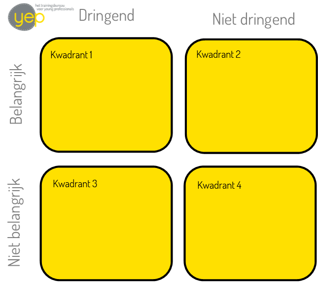

*Voorzichtig loop ik na een dag training geven richting Den Haag Centraal. Het waait hard en de stoep is voortdurend opgebroken. Zeven maanden zwanger en met een instabiel bekken moet ik goed opletten bij elke onregelmatigheid. Gelukkig heb ik heel comfortabele schoenen aangetrokken - en een rolkoffertje meegenomen, zodat ik niks hoef te tillen. De training was leuk geweest, ook uitdagend. Ik begin mijn tocht (van 300 meter en daarna nog een half uur treinen) vol positieve energie. Om me heen zie ik allemaal mensen die zich naar huis haasten en nauwelijks voor elkaar uitkijken en pas op het station besef ik me dat het spits is. Spits in de trein, daar had ik helemaal niet aan gedacht. Ik was zo bezig geweest met het verzorgen van de training en het stuk(je) dat ik moest lopen, dat ik me helemaal had ingesteld op lekker neerploffen in de trein, staan gaat niet meer. Maar goed, met zo'n buik lukt het vast om een plekje te bemachtigen!*

*Bij het instappen gaat het al mis. Een stuk of drie studenten dringen zich vrij ruw langs mij heen en als ik de coupe binnenkom zie ik dat alle stoelen bezet zijn. Ik sta op het punt om in het algemeen te vragen of er iemand is die er geen bezwaar tegen zou hebben om te staan, maar ineens ontglipt me al mijn assertiviteit. De houdingen van de passagiers komen gesloten en afwijzend op me over en mijn teleurstelling hierover is zo groot dat ik geen woord meer kan uitbrengen (zonder in huilen uit te barsten, wat ik wil voorkomen). Ik probeer eerst stevig te gaan staan, maar de trein schudt en het gaat niet goed. Dan ga ik onhandig op mijn koffertje zitten en gelukkig ziet iemand mij met mezelf worstelen. Het is een jonge vrouw, ze moet er zo toch uit - of ik niet op haar plek wil zitten. Ik kan wel janken en als ik eerlijk ben, springen de tranen me ook echt in de ogen. Dank dank dank. En tegelijkertijd vind ik de rest van de passagiers aso's en mezelf slap dat ik niks heb gevraagd.*

Een korte en waargebeurde anekdote waarmee ik wil duidelijk maken dat er soms maar een paar kleine tegenvallers nodig zijn om uit balans te raken. Ik geef veel Timemanagement trainingen en ben er ook echt goed in en vaak bewust mee bezig, en toch! Toch zijn er allerlei leuke en minder leuke 'levensgebeurtenissen' die vragen om een flinke aanpassing op het gebied van keuzes en planning: [de normale methode om inzicht te krijgen in je prioriteiten](http://yeptrainingen.nl/prioriteiten-stellen/) volstaat niet, er is dan een grote herziening van de prioriteiten nodig!

Ik neem als vertrekpunt het kwadrant van Eisenhower, dus mocht je ons [eerdere blogbericht over het stellen van prioriteiten](http://yeptrainingen.nl/prioriteiten-stellen/) nog niet hebben gelezen en het model nog niet kennen, begin dan hiermee! In dit bericht ga ik in op problemen die het kwadrant niet voor je oplost en wat suggesties die mogelijk helpen om de boel weer onder controle te krijgen. Onderaan staat de Stress-schaal van Holmes en Rahe afgebeeld. Deze schaal geeft van 43 positieve en negatieve levensgebeurtenissen aan hoeveel 'stresspunten' deze gemiddeld opleveren en er zit ook een zelftest bij.

## Probleem 1: Kwadrant 1 en 2 overload!

Wanneer er sprake is van een opeenstapeling van stressvolle gebeurtenissen komen er talloze belangrijke en helaas ook vaak urgente zaken bij. De dingen die je normaal uberhaupt niet zou benoemen als 'activiteit' zijn dat ineens wel geworden. 300 Meter lopen uit mijn bovenstaande voorbeeld. Doktersbezoeken. Extra reistijd. Betrokken zijn bij het wel en wee van een ziek familielid. Het vinden van belangrijke spullen bij een verhuizing. Het inwinnen of juist delen van informatie over de verandering in je leven. Er zijn te veel dingen belangrijk.

Oplossing:

* Denk zo goed mogelijk vooruit en schrap meer dan je denkt dat nodig is. Als je verwacht dat de druk wel een tijdje kan aanhouden (en schat dit maar pessimistisch in, als het meevalt dan kun je altijd nog meer gaan oppakken!), schrap dan niet alleen zaken uit je agenda, maar ook 'van het lijstje in je hoofd'. Hiermee bedoel ik: laat een aantal doelen ook echt varen. Anders blijft het toch op je schouders drukken. Ik denk hierbij aan het bewust laten lopen van een promotiekans, of je ideaal om elke avond vers eten op tafel te zetten (of al je afval te scheiden, of altijd overal op tijd aanwezig te zijn) en het stopzetten van tijdrovende nevenactiviteiten. Laat de tuin maar even verwilderen en laat de buurtcommissie maar even aan iemand anders over!
* Voorkom dat je elke paar dagen opnieuw de balans moet opmaken en weer allemaal belletjes moet doen om dingen af te zeggen. Zo blijf je daar ook maar druk mee.
* Bedenk wat je top-prioriteiten zijn. Dit is niet het moment om alles belangrijk te vinden. Meestal komt het neer op je eigen gezondheid, de gezondheid van je naasten, het hebben van een inkomen, onderdak en voedsel. Back to basics, dus.

## Probleem 2: Activiteiten kosten je meer tijd

Als de balans zoek is, dan duren je activiteiten langer en gaat er vaker wat mis. Dit kan komen door een fysieke oorzaak: je beweegt trager of bent vaker afhankelijk van de beschikbaarheid en hulp van anderen. En die anderen zijn ook niet altijd direct beschikbaar. Activiteiten kunnen ook langer duren door een vol hoofd dat snel is afgeleid, door slaapgebrek en/of door emoties. Weer een andere reden is, dat je uit je normale routine bent waarbij je veel zaken op de automatische piloot kon doen en daar weinig aandacht aan hoefde te besteden. Nu moet je bewust nadenken - over een nieuwe taak op je werk bijvoorbeeld, of over de route naar je nieuwe huis. Je kan daardoor minder tegelijk doen en maakt meer fouten. Een verkeerde afslag, de sleutel thuis vergeten, etc. Ellende!

Oplossingen:

* Plan die extra benodigde tijd zo goed mogelijk in. Ga er bij voorbaat vanuit dat je bij de dokter moet wachten, en dat je twee keer per dag een domme fout maakt die je direct weer op moet lossen.
* Probeer daarnaast te zorgen dat je zo min mogelijk afleiding en lawaai om je heen hebt, om je concentratievermogen te bevorderen.
* Doe een ding tegelijk en maak het ook in een keer helemaal af. Dat verkleint de kans op fouten en iedere keer dat je er opnieuw in moet komen, ben je tijd aan het verspillen.
* Begin de dag met het allerbelangrijkste dat je te doen hebt.
* Zorg dat de taken die je inplant duidelijk omschreven zijn, zodat je niet op het moment zelf nog hoeft te zoeken, maar meteen in de actie kan komen.
* Wil je iets overdragen, draag dan liever een heel groot project over dan een aantal kleintjes. Op die manier levert de moeite van het zorgen voor een goede overdracht tenminste veel tijd op! Denk hierbij aan werk en prive oplossingen, want als het op stress aankomt kun je beide bij elkaar optellen. Stuur bijvoorbeeld de kinderen een week uit logeren.
* Ook kun je je sociaal wat terug te trekken en alleen aan een paar hechte vrienden aandacht te blijven besteden. De rest komt later wel weer.

## Probleem 3: Tijdelijke piek in het aantal verstoringen

Grote kans dat je met nieuwe mensen te maken hebt, waarop je nog niet helemaal bent ingespeeld en andersom ook niet. Hierdoor komen er meer momenten van afstemming en vaak ook meer misverstanden. Er zijn ineens meer mensen die je willen spreken en vaak zijn het telefoontjes. De makelaar, voor de derde keer vandaag. Of al je ooms en tantes willen even bijkletsen om te horen hoe het met je gaat. Of je demente moeder belt steeds opnieuw. Je nieuwe stagiaire staat 5x per dag aan je bureau met een onbenullige vraag. Een ander voorbeeld van een verstoring is een alarm dat je je medicatie moet innemen of oefeningen die je tussendoor moet doen. Iedere verstoring kost tijd en haalt je (voor 7-15 minuten) uit je concentratie.

Oplossingen:

* Geef aan je omgeving aan wat je fijn vindt in het contact. Denk maar aan een geboortekaartje waarop rusttijden of juist bezoekuren vermeld staan.
* Durf je telefoon uit te zetten als jij dat nodig hebt.
* Geef mensen in je omgeving meer verantwoordelijkheden, zodat ze niet steeds bij jou hoeven te controleren wat jij wil. Hierbij denk ik aan de makelaar of de stagiaire en ook aan het accepteren van hulp van lieve vrienden en familieleden.

## Probleem 4: Het tot rust komen zelf als prioriteit

Normaal gesproken bestaan je prioriteiten uit het behalen van resultaten op�bepaalde vlakken. Maar als je niet in je kracht staat, dan wordt het een prioriteit om weer tot rust te komen of je weer krachtig te gaan voelen, naast het behalen van enkele resultaten. Hier zijn andere dingen voor nodig, namelijk soms ook zaken die je eerder misschien als 'vluchtklus' (Kwadrant 4) hebt bestempeld. Juist het doen van iets onbelangrijks en niet dringends kan heel ontspannend werken. Bakken, knutselen, een domme film kijken, een uur in bad zitten, uitgebreid bijkletsen met een goede vriendin en op Pinterest of Facebook rondstruinen�voor inspiratie of afleiding.

Oplossingen:

* Gun jezelf de ruimte om ook dingen te doen die niet belangrijk of urgent zijn, als jij ervan opknapt is het goed.
* Vraag jezelf regelmatig af of je nog opknapt van deze activiteiten, anders kun je in uitstelgedrag verzanden.
* Gebruik de relaxte activiteiten als beloning en start de dag met een belangrijk iets.
* Probeer de dingen die je energie geven te combineren. Ga bijvoorbeeld lekker koken met vrienden.
* Schrijf aan het einde van de dag drie dingen op die je energie hebben gegeven tijdens de dag. Dit helpt je om positief te blijven denken en ook te blijven genieten van wat er speelt.

Nog wat interessante achtergrond informatie en een zelftest:

 Zowel positieve als negatieve gebeurtenissen kunnen je uit je balans halen. Een paar kleine gebeurtenissen of één grote stressvolle gebeurtenis kunnen de meeste mensen wel aan. Maar alle gebeurtenissen tellen bij elkaar op en zo kan het te veel worden. De Stress-schaal van Holmes en Rahe (al redelijk antiek, 1970, maar geeft toch een beeld, links afgebeeld) geeft van 43 levensgebeurtenissen aan hoeveel 'stresspunten' deze gemiddeld opleveren. Het idee is dat je alle gebeurtenissen uit het afgelopen jaar bij elkaar optelt. Scoor je hierbij hoger dan 150 punten, dan kun je wel spreken van een aanzienlijk stressniveau of een aanzienlijke balansverstoring. Hier moet ik wel bij vermelden dat het gaat om gemiddelden en dat de impact van gebeurtenissen per persoon en per cultuur sterk kunnen verschillen. Ook staan de gebeurtenissen die bij mijn reis naar huis de druppel vormden er niet bij. Ik vul de lijst voor mezelf aan: *asociaal gedrag van mensen moeten aanzien*: 15 punten, *door een mensenmassa moeten lopen*, 10 punten, *opgebroken stoep*: 5 punten

En dit is een [handige site](http://www.stressvrijleven.com/stress-test/) waarbij je jouw stresspunten van het afgelopen jaar kunt berekenen. Veel succes met jouw stress-reductie en hopelijk kom je een stap verder met de punten uit dit blog! Mocht je meer begeleiding nodig hebben, dan hebben wij allerlei coachings- en trainingsmogelijkheden op het vlak van time management, stress en burnout.

## Hulp bij het terugvinden van je balans

Wanneer je het prettig vind om in een kleine groep te ontdekken wat jij kunt doen om je binnen een half jaar weer in balans te voelen, raden we je aan eens te kijken naar ons programma: Persoonlijke Energie op Peil. Hierin ga je in een kleine groep stapsgewijs aan de slag. En niet alleen jij leert stressklachten te herkennen en goed bij te sturen, we begeleiden ook je leidinggevende zodat je steun ervaart op de plek waar die het meest nodig is!

[Brochure Persoonlijke energie op peil - weg met werkstress!](<./../Brochure-PEP Yep.pdf>) 