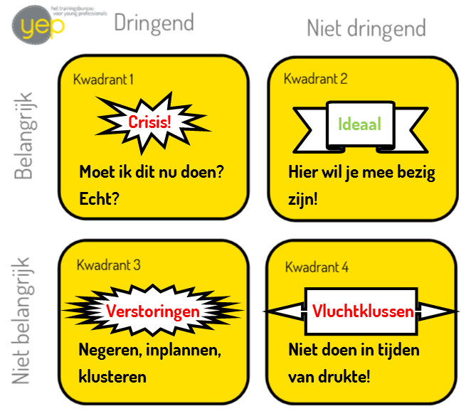

Een handig model dat ik in trainingen veel gebruik om inzicht te geven in wat handige keuzes zijn wanneer er sprake is van stress (of gevoel van te hoge werkdruk, of gevoel van: ik kan dit eigenlijk niet lang meer aan), is het Kwadrant van Eisenhower. Dwight Eisenhower was opperbevelhebber van de geallieerde strijdkrachten tijdens WOII (later ook Amerikaans president) en merkte in deze functie dat urgente zaken zelden belangrijk zijn en belangrijke zaken zelden urgent. Soldaten waren geneigd te beginnen met taken die urgent aanvoelden, waardoor er veel belangrijke zaken bleven liggen. De kern van zijn kwadrant (ook wel Eisenhower-Matrix) is dat je alle activiteiten die je kunt uitvoeren, kunt duiden aan de hand van 2 vragen:

- Hoe belangrijk is het dat ik deze activiteit uitvoer?
- Hoe dringend is het uitvoeren van de betreffende activiteit?

Hierdoor ontstaat een indeling van vier soorten activiteiten in de vier kwadranten van matrix.

## Hoe kun je je activiteiten indelen?

**Kwadrant 1:** activiteiten die belangrijk en dringend zijn. Een activiteit past alleen in dit kwadrant als de je volgende vraag met een volmondig 'JA' kunt beantwoorden: Moet ik dit nu doen? (of: Moet ik hier nu meteen iets mee?) Denk aan een belangrijke deadline, ruzie met iemand die belangrijk voor je is, brand in het gebouw of een gecrashte computer. Wanneer veel van jouw activiteiten in dit kwadrant, kwadrant 1, passen, dan voel je je waarschijnlijk opgejaagd, ben je steeds ad hoc bezig en heb je weinig tijd om over lange termijn oplossingen na te denken. Ik noem dit vaak _'het crisiskwadrant'_.

**Kwadrant 2:** activiteiten die belangrijk en niet dringend zijn. Een activiteit past in dit kwadrant als het bijdraagt aan jouw levenstaak, waarden en doelstellingen. Je kunt denken aan het uitvoeren van je (kern)functie, het vooruit denken en plannen, het werken aan relaties, het werken aan een goede gezondheid, activiteiten die bijdragen aan je persoonlijke ontwikkeling, en vooruit werken. Wanneer veel van jouw activiteiten in kwadrant 2 passen, dan voel je je waarschijnlijk in evenwicht, dan heb je de regie in handen, ben je gedisciplineerd bezig en ervaar je veel voldoening en weinig crisismomenten. Ik noem dit kwadrant _'het ideale kwadrant'_.

**Kwadrant 3:** activiteiten die niet belangrijk en dringend zijn. Kwadrant 3. Een activiteit past in dit kwadrant als het wel springerig om je aandacht vraagt, maar eigenlijk niet (zo) belangrijk is. Je kan denken alles waarbij je een notificatie krijgt (licht of geluidsignalen, bijvoorbeeld op je beeldscherm), de meeste collega's die aan je bureau komen met een vraag, de meeste vergaderingen, post, telefoontjes en rapporten. Ook aardigheidjes tegenover anderen vallen hier vaak onder. Ben je veel bezig in kwadrant 3, dan voel je je waarschijnlijk afgeleid, heb je aan het eind van de dag het gevoel dat je 'niks' hebt afgekregen of gedaan terwijl je wel druk bent geweest, ben je steeds gericht op korte termijn resultaten en ben je de controle over je eigen tijdsindeling kwijt. Ik noem dit vaak _'het kwadrant van de verstoringen'_.

**Kwadrant 4:** activiteiten die niet belangrijk en niet urgent zijn. Dit klinkt echt als een onzinnig kwadrant, he! Maar toch verzandt iedereen er wel eens in: doelloos rondstruinen op internet, kletspraatjes, Facebook, en verder alles waar je te lang mee bezig bent. Bijvoorbeeld: het maken van dubbele planningen, of het maken van een onnodig uitgebreide/mooie planning, het laten uitlopen van een vergadering (tenzij Kw. 1 oorzaak), treuzelen, een spelletje op je telefoon, roken.. Als je veel bezig bent in dit kwadrant, dan voel je je waarschijnlijk heel onvoldaan en onbetrokken bij je eigenlijke doelen en taken, ben je vaak afhankelijk van anderen en kun je als een berg tegen je werk opzien. Je bent aan het vermijden of aan het uitstellen. Ik noem dit kwadrant vaak '_het kwadrant van de vluchtklussen'_.

Door je eigen activiteiten in deze kwadrant te plaatsen, krijg je zicht op hoe je nu je tijd besteedt en wat je beter kunt minderen om meer toe te komen aan je doelen (kwadrant 2). Heel handig hierbij, is om eerst een aantal dagen een logboek bij te houden, waarin je nauwgezet bijhoudt waaraan je je tijd besteedt. Soms blijken er bijvoorbeeld veel meer verstoringen of activiteiten te zijn dan je je realiseert. Ook krijg je meteen een idee van hoe lang bepaalde taken duren.

Hieruit blijkt ook wat je prioriteiten zijn. Prioriteiten zijn namelijk dé activiteiten die je als eerste wil of moet doen. De dingen die je het meest belangrijk vindt. En deze staan altijd in kwadrant 1 en kwadrant 2. Crises kosten veel tijd en gooien je planning in de war. Idealiter ben je heel veel bezig met je kwadrant 2 activiteiten. Hierbij houd je zelf meer de controle en kun je een hoop kwadrant 1 activiteiten voorkomen.

Dit leidt tot de grootste vraag op het gebied van timemanagement: **Hoe maak je tijd vrij om aan kwadrant 2 te besteden?**

## Waar kun je op besparen?

In het algemeen geldt: Niet door iets uit kwadrant 1 te schrappen, wat die activiteiten moet je direct oppakken. Kan niet anders. Alleen scharen mensen vaak veel zaken onterecht onder kwadrant 1, waardoor ze onnodige brandjes aan het blussen zijn. Ten koste van hun planning en doelen! Denk maar eens aan een ziek kind dat van school moet worden gehaald. Dit is niet altijd iets dat jij nu, a la minute, moet doen. Misschien kan je partner of vertrouwde ander je kind ophalen. Misschien is het geen schrijnend geval en kun je nog een half uur je werk afronden voor je vertrekt. Door jezelf kritisch de vraag te stellen: "Moet ik dit nu doen? Echt??" Kun je waarschijnlijk het aantal activiteiten dat je als crisis ervaart flink doen afnemen. Heerlijk!

De verstoringen uit kwadrant 3 kun je in sommige gevallen uitzetten of negeren en in sommige gevallen inplannen. Op die manier pak je de controle terug. Voorbeelden hiervan zijn het inrichten van een spreekuur (in plaats van voortdurende parade langs je bureau), het checken van je mail op vaste momenten, het uitzetten van (notificaties op) je telefoon, het zorgen voor een overzichtelijke werkplek, het maken van afspraken met collega's over je bereikbaarheid, het schrijven van voorbeeld verslagen of het beschikbaar maken van antwoorden op de meest gestelde vragen.

En kwadrant 4 zou je in tijden van drukte en stress helemaal weg moeten strepen. Geen extra kop koffie, geen getreuzel en zeker niet snoozen. Alle dingen die je niet nodig hebt van je bureau, geen tabs open laten staan waar je niet meer op hoeft te kijken. Geen gezellige introductie bij mailtjes of praatjes, maar meteen, pats, tot de kern komen.

Tot zover, het kwadrant van Eisenhower om inzichtelijke te maken welke activiteiten bij je prioriteiten horen. Behoorlijk handig en bij kleine aanpassingen op het gebied van time management of persoonlijke effectiviteit vaak ook voldoende om jezelf weer op scherp te zetten.

