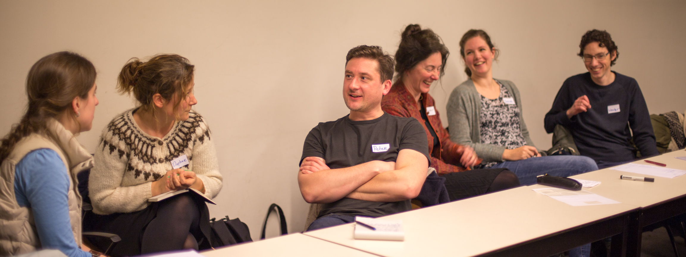

Maaike en Marijn verzorgden de afgelopen twee weken trainingen 'Lastig gedrag van studenten de baas' voor beginnende universitair docenten. De docenten krijgen te maken met mondige, stille, perfectionistische studenten en studenten met smoesjes.. Heel veel smoesjes! Toevallig stond er deze week in De Volkskrant ook een column van Ionica Smeets over lastige smoes nummer één: [een dode oma](http://www.volkskrant.nl/opinie/wat-kunnen-we-doen-om-de-levens-van-al-die-oma-s-te-redden~a4475661/), net voor de tentamenweek. Ionica beschrijft hoe uit een meerjarig onderzoek onder Amerikaanse studenten blijkt dat er in de week voor tentamens 20x zo veel familieleden overlijden als in andere weken. Het vermoeden dat het gaat om een smoes, is dan sterk. Maar dit is wel een heel lastig verhaal om professioneel op te reageren. Bij 1 op de 20 studenten die dit verhaal ophouden, is het ook echt waar. Hierdoor heb ik wat na zitten denken over professioneel omgaan met smoesjes op het werk.

Welke smoesjes horen we op de werkvloer? Niet zo vaak als op de universiteit gaat het om overleden familieleden. Wel horen we bijvoorbeeld: 'mijn kind is ziek', 'ik ben er niet aan toe gekomen/het was te druk', 'er was een enorme file'. Onvoorziene omstandigheden thuis, zoals een fikse lekkage, komen ook veel voor. Allemaal vervelende gebeurtenissen die ook écht gebeuren, dus hoe weet je nu of het om een smoesje gaat? Vaak weet je het gewoon niet zeker! En wat maakt een reactie op smoesjes nu handig of professioneel? Wij zien een oplossing als professioneel, wanneer je niet met je laat sollen, maar wel de relatie met de ander goed houdt.

## Niet handig
Drie tactieken lijken me op de werkvloer niet handig:

**Het ongelijk bewijzen** - Vaak is de eerste neiging van mensen om tegen de 'smoesverteller' in te gaan door de waarschijnlijkheid van het excuus aan te vechten: "Dat is wel erg toevallig..", "jaja", "Wel gek dat dit drie keer achter elkaar gebeurt bij dezelfde vergadering". Het effect: de ander kan voet bij stuk houden, jij bent je druk aan het maken en jullie onderlinge relatie loopt een deuk op.

**Vragen om bewijs** - Dit zou je in sommige situaties kunnen doen (vragen naar een bonnetje, of een verklaring van een monteur of arts), maar hiermee laat je zo duidelijk merken dat je twijfelt aan de geloofwaardigheid van je collega, dat dit voor de ander ook erg onprettig is. Bovendien kom je er nog niet altijd achter, want de ander zal mogelijk zijn best doen om je het bewijs te leveren, ook als het wel om een smoesje ging.

**Steeds weer begrip tonen** - Een andere tactiek is om smoesjes te accepteren als waarheid en aardig te blijven. "Goh, vervelend voor je zeg. Sterkte thuis!". Hiermee houd je je collega te vriend en het kan een prima aanpak zijn wanneer iemand het maar hoogst zelden af laat weten. Waarschijnlijk is wat hij of zij zegt gewoon waar en zo niet, dan ook prima: iedereen heeft wel eens een *off-day*. Daar wat ruimte voor laten bespaart jullie beiden een hoop gedoe! Als er veel verzaakt wordt, werkt deze aanpak niet meer. Je snijdt jezelf in de vingers en straalt mogelijk uit dat je het gedrag niet erg vindt, ook naar anderen toe. Resultaat: jij kan minder van je collega('s) op aan en op de lange duur schaadt het ook jullie relatie.

## Hoe wel te reageren?
Hoe kom je dan van de smoesjes af? Ik denk door aan te sluiten bij het verhaal en formeel te blijven. Zo kwets je de ander niet en houd je wel vast aan gezamenlijke doelen en afspraken.

**Aansluiten en aanspreken** - Met aansluiten bedoel ik: meegaan in het verhaal van de ander en dit niet in twijfel trekken. Je kunt hierbij in mijn ogen prima begrip tonen en je betrokkenheid tonen door vragen te stellen en er eens op terug te komen. Maar daar blijft het niet bij: je hebt een professionele relatie en je wil van je collega op aan kunnen. Spreek iemand daarom ook aan op hoe het is gelopen:kom terug op gemaakte afspraken en bespreek (zeker bij herhaling) het werkelijke probleemgedrag en een bijpassende oplossing voor het vervolg. Zo voorkom je een welles-nietes gesprek over het excuus en ontstaat er ruimte om het gesprek te richten op waar het wezenlijk om gaat: op tijd voorbereiden, ruimte voor onvoorziene gebeurtenissen inbouwen, tijdig werk overdragen aan een collega, en dergelijke.

_"Twee kinderen ziek, wat een ellende! Bij ons was het vorige week thuis ook *feest*. Dan is het echt even alle zeilen bijzetten, he." "Een virus?" "Hoe gaat het nu met ze? En met jou?" "Maar goed, er zitten nu vier collega's op ons projectplan te wachten. Wat had je al staan?" "Oh, je was helemaal nog niet begonnen? Nou, daar schrik ik wel van - ik rekende op je en nu kan ik niet verder met mijn onderdeel en de rest van het team ook niet. Ik zou het fijn vinden als je een volgende keer zorgt dat het niet op het laatste moment aankomt, zodat je deze situatie kan voorkomen. Met kinderen in huis weet je het maar nooit! Lukt dat?"_

