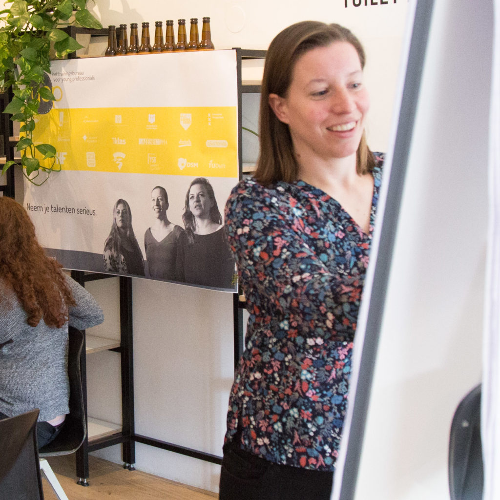

Op zoek naar een workshop of training die niet te lang duurt, maar die wel tastbaar bijdraagt aan persoonlijke ontwikkeling? Wij hebben een heel divers aanbod en kunnen vaak nog specifieke doelen van de organisatie of vereniging kwijt in de opzet, dus zie deze lijst als globale thema's die uitgebreid, gecombineerd en gespecificeerd kunnen worden. Tip: overleg binnen je vereniging of organisatie welk kort trainingsaanbod voor young professionals jullie voorkeur heeft en ga dan met een trainer van Yep in gesprek om het plan samen verder in te vullen. 

## Communicatie

*   Klantcontact verbeteren: luistervaardigheden. Communicatie verloopt zo veel beter als er goed geluisterd wordt! Het klinkt simpel, maar echt, er worden hier zo veel missers in gemaakt! In contact met klanten betekent dit concreet: een betere relatie en meer kansen om producten en diensten te verkopen. (30 -90 minuten) geschikt voor grote groepen.
*   Netwerken (60-180 minuten) geschikt voor grote groepen. Veel varianten!
*   Overtuigend presenteren, met video analyse (180 minuten) max 12 personen
*   Professioneel adviseren (120 -180 minuten) - de drie rollen ervaren waar die je als adviseur (ook als dat niet direct je functie is) kan innemen. Hier strategisch mee leren omgaan. Leuk voor ambtelijke organisaties en consultants! Max 15 personen.
*   Communicatiestijlen - aansluiten op je gesprekspartner (120 minuten) max 12 personen.
*   Pitch perfect (60 minuten) groep van max 12 personen. Heel leuk voor ondernemers of mensen die aan het solliciteren zijn.
*   Feedback geven en ontvangen (60-180 minuten). Kan voor grote groepen, leukst met 2 acteurs.
*   Non verbale communicatie met video analyse (120 minuten) max 12 personen.
*   Sterk reageren op negatieve opmerkingen/tegenwerpingen (120 minuten) max 15 personen.
*   STAR-gesprek of sollicitatiegesprek oefenen. (60 minuten) kan in grote groepen. Ook leuk met acteur! Ook inzetbaar als ‘kennismakingsgespreksoefening’ voor ondernemers.

## Teamwerk

*   Evaluatiebijeenkomst – gericht op teamleden of het proces – vooral leuk voorafgaand aan een bedrijfsborrel.
*   Teamrollen en teamontwikkeling (90-120 minuten) max 20 personen
*   Droom naar doel – Algemeen geformuleerd idee uitwerken tot concreet actieplan. Leuk voor ondernemers of mensen die moeite hebben om voor hun droom te gaan. Kan super zijn om met klein team de neuzen dezelfde kant op krijgen. Ook heel geschikt (andere opzet) als meer individuele oefening, waarbij we groepen tot wel 100 personen aankunnen die in vijf losse werkvormen hun droom concreet maken en vertalen tot aansprekend actieplan. (60-180 minuten)
*   Co-creatie (60-180 minuten) 1 of meerdere technieken inzetten om met een groep tot innovatieve ideeën te komen. Beter brainstormen. Kan met een organisatievraagstuk of ik kan een vraagstuk aandragen. Kan in groepen tot 25 personen.

## Persoonlijke effectiviteit

*   Time management (120-180 minuten) groep van max 25 personen.
*   Doelen stellen en behalen (120-180 minuten) groep van max 12 personen.
*   Nee zeggen en grenzen aangeven (30 minuten) groep van max 12 personen.
*   Wat ik wil – (120-180 minuten) scherp stellen wat je wil, waar je naar op zoek bent, wat voor jou de ideale situatie zou zijn. Dit geeft veel richting aan keuzes die je moet maken en helpt om uitstelgedrag en keuzestress te reduceren. Groep van max 12. Voor grote groepen is een aangepast programma mogelijk.
*   CV-check – kan in café setting: ongeveer een kwartier per cv nodig. Leuk met aantal coaches tegelijk.
*   Carrière coaching – kan in café setting: ongeveer een kwartier per persoon nodig om te sparren over iemands doel en één volgende stap. Leuk met aantal coaches tegelijk.
*   Talent en toekomst – een blik op de eigen talenten en hoe je deze wil benutten in de toekomst. (90-180 minuten) groep max 20 personen.
*   Online identiteit op scherp (nadruk op LinkedIn). (90 minuten) Groep van max 20 personen.

## Didactiek en dynamiek

*   Omgaan met weerstand (120 minuten) met acteur. Groep max 12 personen.
*   Interactie beïnvloeden (120 – 180 minuten), vrij theoretisch, groep max 12 personen
*   Experimenteren met gedrag (120-180 minuten) heel praktisch: het succesvol aangaan van lastige sociale situaties. Max 12 personen.
*   Coachend leidinggeven (180 minuten) max 8 personen. Met acteur.
*   Train-de-trainer (90-180 minuten), max 8 personen. We kunnen hierbij een specifiek onderdeel van het training geven behandelen, zoals het ontwerpen van een effectieve training, het omgaan met weerstand, interactie met trainees of de persoonlijke trainersstijl van de aanwezige trainers met daarbij kwaliteiten en valkuilen.
*   Boeien en binden: hoe zorg je ervoor dat jouw boodschap blijft hangen? (120 minuten) groepsgrootte kan variëren.
*   Improviseren: op speelse wijze leren om positief en vol zelfvertrouwen samen te werken. 60 - 180 minuten, 12 personen.

## Individueel

*   Opstellen van persoonlijk profiel of POP
*   Coaching
*   Begeleiding on the job (bijv in de vorm van observatie en feedback op een presentatie, projectplan of workshop).

We horen graag waar je aan denkt en wat je wil bereiken zodat we de korte workshop tot een langdurig succes kunnen maken!
