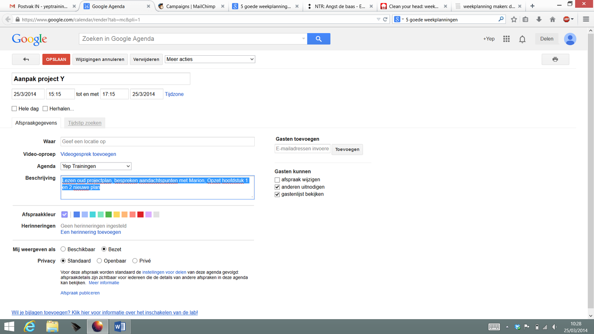

De laatste tijd zijn er extra veel aanvragen op het gebied van Timemanagement en ik merk dat veel young professionals zoekende zijn in het maken van een goede planning. Wat ik zie: veel losse to-do lijstjes (verzameling van briefjes, digitale notities en aantekeningen in agenda) en weinig overzicht. Bij deze deel ik 5 manieren om overzichtelijke weekplanningen te maken. Per manier zet ik er een aantal tips bij om de planning goed te gebruiken. Ik hoop dat er één voor je bij zit!

**Lijst 1: Simpel to do lijstje**

Deze lijst van een ongeordende sliert taken zie ik veel en kan prima voor je werken, zeker als je het lijstje wil gebruiken voor het overzicht per dag en je weekplanning al op een andere manier hebt georganiseerd. Het is de meest simpele vorm van een to-do lijst en kost relatief weinig tijd om te maken. Er zijn wel best een aantal dingen om rekening mee te houden als het gaat om effectiviteit.

Tips:

* Schrijf taken op, geen resultaten. (dus niet: 'Website af'. Maar wel: 'content Home pagina aanvullen')
* Breek grote taken op in blokken van maximaal 1 uur.
* Cluster kleine taken, zoals mailtjes of telefoontjes, zodat de lijst evenwichtig wordt. Doe je dit niet, dan bestaat de kans dat je de kleine taakjes steeds als eerste doet (lekker makkelijk scoren!) en dat de grote, belangrijke dingen blijven liggen.
* Geef aan welke taken de hoogste prioriteit hebben en spreek met jezelf af dat deze taken in elk geval gebeuren. Begin hier dus mee!
* Vul je lijst aan met een week en/of maandplanning, zodat je ook het overzicht hebt over de wat langere termijn.

**Lijst 2: Vrije weekplanning**

Op deze lijst zie je meteen wat er wanneer moet gaan gebeuren, welke dingen er aan een bepaalde tijd vast zitten en op welke dagen je het druk hebt of nog ruimte hebt. Dit is een lijst die ik zelf altijd gebruik! En daarnaast heb ik dan mijn Gmailkalender voor het lange termijn overzicht.

Tips:

* Zet wat je minimaal gedaan wil hebben in de weekplanning zodat er ruimte is voor eventuele uitloop, voor pauzes en onverwachte verstoringen.
* Voeg onderaan een blok toe met extra taken waar je graag aan toe zou willen komen. Deze taken zijn niet aan een dag gekoppeld en ga je pas doen als de rest af is. Heel stimulerend, want je loopt als het ware op jezelf vooruit :)
* Ook hier geldt dat grote taken vaak onaantrekkelijk zijn. Breek ze op in een aantal onderdelen zodat je in elk geval een aantal streepjes kan zetten terwijl je bezig bent. Klinkt misschien kinderachtig maar dit voorkomt dat je het gevoel krijgt dat je 'niet vooruit komt', 'niks hebt gedaan'.
* Je kunt, als je werk en privé planning op 1 vel wil zien, een kolom toevoegen of met een andere kleur je privé dingen erbij zetten. Zo blijf je het onderscheid zien. Dit doe ik, omdat ik veel thuis werk en tussendoor ook dingen regel voor vrijwilligerswerk of de kinderen.

**Lijst 3: Blokken planning**

Deze lijst geeft heel veel structuur en is handig voor mensen die het moeilijk vinden om overzicht te bewaren en zichzelf aan het werk te zetten. Je ziet niet alleen wat er wanneer moet gebeuren, maar ziet daarnaast in welke 'blokken' er gewerkt moet worden. Ik heb hier gekozen voor blokken van 1.5 uur. Dat moet vol te houden zijn. Er zitten vrij veel pauzes in en als je in de werk-blokken flink te keer gaat dan kun je die ook wel gebruiken. Werken tijdens de pauze mag, dat is bonustijd! Of uitlooptijd / vrijetijd / lunchtijd. Ook is er op deze planning ruimte om aan te geven wat je bij een bepaalde taak nodig hebt of wat je moet voorbereiden. Denk aan wat je moet lezen, meenemen, wat het adres is, of het nummer van je contactpersoon. Dit helpt je het overzicht te bewaren. Je kunt zelf bepalen hoe groot de blokken zijn. Bijv aan de start van de dag 1,5 u en na de lunch ook, maar verder kortere blokken. Sluit bij je eigen voorkeursritme aan!

Tips:

* Hou jezelf er strikt aan om tijdens werkblokken echt alleen maar te werken. Lukt dit je niet zomaar, dan kan de app Toggl mogelijk uitkomst bieden. Simpele app die een timer laat lopen tijdens werkblokken, zodat je meer aan je stoel/scherm genageld zit en je schuldiger gaat voelen als je toch even wat anders gaat doen.
* Maak de planning realistisch (niet te druk) en houd je eraan. Anders helpt hij je niet overzicht en discipline op te bouwen.
* Op deze lijst is het wat lastiger om taken op te delen of om er een boel kleine taken op kwijt te kunnen. Het is aan te bevelen om deze lijst als overzicht-lijst te hebben en daarnaast per dag een specifiekere lijst te maken.

**Lijst 4: Cluster-planning**

Op deze lijst zie je wat er deze week voor welk project moet gebeuren. Dus geordend op project en niet op werkdag. Dit is handig wanneer je meer in projecten denkt, veel verschillende klanten of klusen naast elkaar hebt, of als je wil kunnen zien waar de dingen die je doet bij horen.

Tips:

* Zet wat je minimaal gedaan wil hebben in de blokken.
* Voeg onderaan een blok toe met extra taken waar je graag aan toe zou willen komen. Deze taken zijn niet aan een dag gekoppeld en ga je pas doen als de rest af is. Heel stimulerend, want je loopt als het ware op jezelf vooruit :)
* Je kan meer structuur toevoegen aan het grootste lijstje door hierin weekdagen of prioriteiten aan te geven.
* Zet er geen taken in die meer dan een uur duren. Opbreken dus weer!

**Lijst 5: Digitale agenda**

Een digitale agenda zie je wat er wanneer gepland staat. Mooi aan deze vorm is dat je het overzicht altijd bij je hebt en vanaf verschillende apparaten kan inzien en dat je collega's of familieleden ook toegang kan geven tot je plannen. Ook kun je de planning eindeloos bewerken zonder dat het een rommeltje wordt en blijven je oude planningen automatisch bewaard, wat niet gezegd kan worden van papieren lijstjes. Een ander voordeel is dat je er veel extra info in kwijt kunt:  locatie, telefoonnummer van je contactpersoon etc.

Maar deze vorm heeft ook nadelen. Wanneer je effectief wil werken, raad ik aan om taken op te delen in hapklare brokken die maximaal een uur (maar liefst iets van 20 minuten) duren. In digitale agenda's worden korte taken niet goed weergegeven. Ze vallen over elkaar heen of er lijkt door de tekstgrootte meer tijd beschikbaar. Een ander nadeel (groter dan het lijkt!) is dat je in een digitale agenda niet kan strepen of afvinken. Alle taken worden als een vaststaand geheel gepresenteerd. Net alsof het logisch is dat je dat allemaal deze week gaat afkrijgen. Ik merk dat dit voor veel mensen minder voldoening geeft in het werk en zie dat zij er toch iets op papier bij willen hebben.

Tips:

* Zorg voor blokken van 1-1.5 uur en zet er in de opmerkingen bij wat je specifiek wil/moet gaan doen. Hier komen dus de kleine/opgedeelde taken. 

  

* Deze vorm nodigt uit tot het maken van een strakke planning. Houd wel rekening met tijd voor pauzes, onverwachte verstoringen en uitloop van belangrijke zaken.
* Jammer aan deze vorm is dat alles automatisch aan een tijd gebonden is en het niet duidelijk is wat de vaste punten zijn en welke punten evt ook op een ander moment kunnen. Dit kun je oplossen door van verschillende kleuren gebruik te maken. Ik zou gaan voor Moet, Goed, Leuk als kleurencodering. Deadlines, relevant werk en hobby projectjes of vrijetijdsplannen.
* Vind je het prettiger werken met papier en/of wil je graag kunnen strepen, danzou ik zeggen: digitaal de grote lijnen, deadlines, dagen die je wil blokken en vaststaande afspraken. Dit helpt je het overzicht te bewaren en in je specifiekere weekplanning kun je hier dan op aansluiten.
* Ik print 1x per kwartaal mijn Gmailplanning uit voor de komende 3 maanden. Dat gaat heel eenvoudig en geeft me direct overzicht over wanneer het druk wordt en hoe ik die piek kan opvangen.

Ik hoop dat je er wat aan hebt! Meer timemanagement tips nodig? Mail je vraag naar [Marijn@yeptrainingen.nl](mailto:Marijn@yeptrainingen.nl)