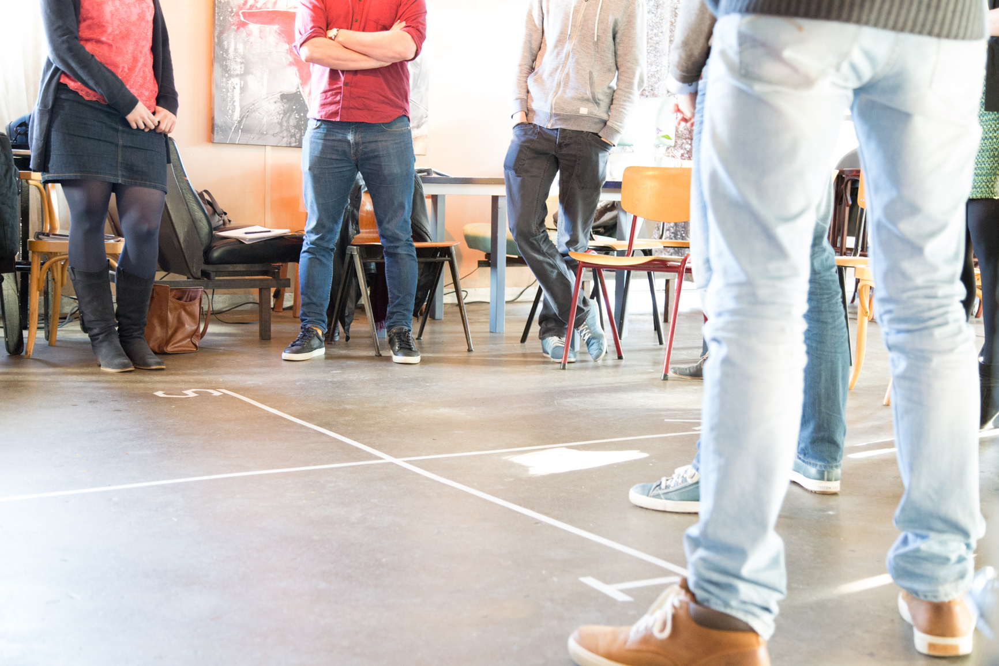

> “De relatie met collega's verloopt soms stroef. Ik wil bepaalde patronen leren herkennen en doorbreken. Zeker nu ik vanuit mijn functie veel met andere mensen moet samenwerken.”

In deze coachsessies staat jouw communicatie en interactie met anderen centraal. Je vergroot je repertoire aan vaardigheden en leert hoe je er voor zorgt dat de ander jou begrijpt en jij met waardering naar de ander kunt kijken.

Communicatie gaat over meer dan de woorden die we met elkaar wisselen. Het gaat uiteindelijk over de omgang met mensen. Bij sommige mensen gaat dit vloeiend terwijl het anderen minder makkelijk afgaat. Moeite met communicatie kan verschillende oorzaken hebben: gespannenheid, gevoelens van minderwaardigheid of ongemak in contact met anderen. Als je je daarin herkent, dan focussen we ons tijdens de coaching op het vergroten van zelfvertrouwen en experimenteren we samen met nieuw gedrag. Het kan ook zijn dat stroeve communicatie het gevolg is van een verschil in communicatiestijl tussen jou en de ander. Dat leggen we hierna uit.

## Hoe zorg je dat de ander jou begrijpt en jij met waardering naar de ander kunt blijven kijken?

Een simpel voorbeeld van een verschil in communicatiestijl: Wat doe jij als jij maandagochtend zin hebt om een vliegende start te maken en lekker direct in stilte het werk in te duiken, terwijl je collega bij het koffiezetapparaat uitgebreid vraagt en vertelt over het weekend? Of andersom? Bij de één staat tempo en doelgerichtheid centraal, terwijl de ander van nature houdt van vertraging en veel aandacht besteedt aan de verbinding. En zo valt er nog veel meer te leren over verschillen in communicatiestijlen.

Bewustwording van jouw patronen en begrip van communicatiestijlen is voor iedereen relevant die effectiever wil zijn in samenwerking met anderen. Dit coachingstraject is bij uitstek iets voor jou als je merkt dat je communicatie vaak moeizaam verloopt of als het bij jouw functie hoort om anderen te begeleiden (bijvoorbeeld in een leidinggevende functie).

