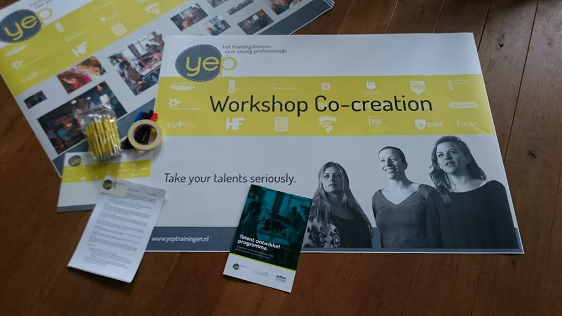
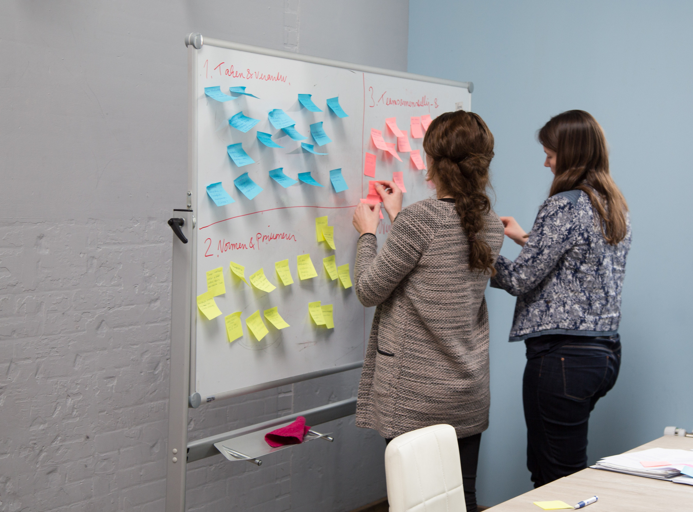
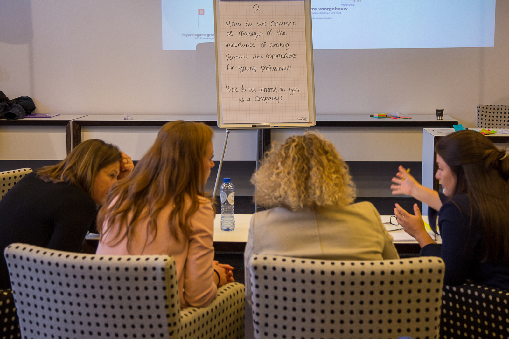

Een co-creatie workshop snijdt aan twee kanten: één of meerdere vraagstukken vanuit de organisatie worden grondig onder de loep genomen, én je team leert over diverse technieken om met elkaar op nieuwe en goede ideeen te komen. De technieken die worden gebruikt, zijn afhankelijk van de kaders die het vraagstuk schetst. Altijd bieden we handvatten om <em>Groupthink</em> te voorkomen en creativiteit te stimuleren. Echt leuk om met een groep te doen en er komt gegarandeerd inspiratie en energie vrij!

 

De workshop leent zich ook goed voor grotere groepen, bijvoorbeeld op een congres. Ook kunnen we de workshop aangepast digitaal verzorgen. Een uitgebreide workshop duurt 3 uur, maar een opzet van 60 minuten is ook mogelijk. 

 

> "Grappige, inspirerende werkvormen. En confronterend ook: ons team maakte zo ongeveer alle klassieke fouten bij het bedenken van oplossingen voor vraagstukken." - Thomen

 