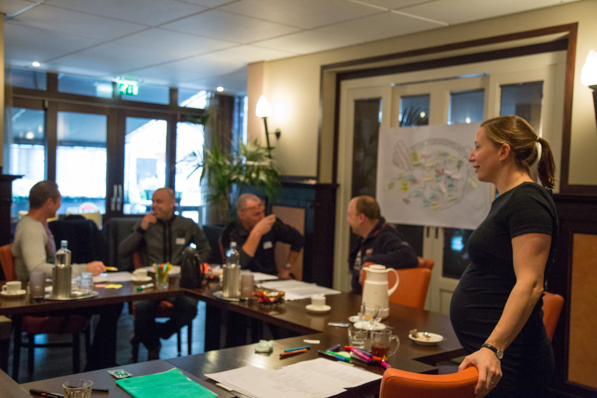

# Coaching Leadership: Empowering Teams and Leaders

**Coaching Leadership** is a high priority for many organizations. Whether you work in healthcare, firefighting, or as a consultant, traditional leadership based on sanctions and rewards often falls short. Instead of increasing engagement and effort, it creates dependency on external factors such as the presence of the leader. This comes at the expense of motivation and the sense of ownership employees exhibit, which often negatively impacts the atmosphere, safety, and results.

**Coaching leadership** provides a powerful alternative. By guiding employees with an engaged attitude and asking the right questions, you encourage them to think independently and take responsibility.

---

## What does the Coaching Leadership program deliver?

Insight, courage, and skills for meaningful impact!  
It also shapes agile, versatile leaders who:

- Are aware of their influence, behavior, and role.
- Activate and motivate employees to take ownership.
- Provide clarity about boundaries, expectations, and feedback.
- Boost employees’ confidence and help them grow in their responsibilities.
- Build and develop balanced, high-performing teams.
- Know the right course of action when problems arise.
- Recognize signs of stress and know how to approach these conversations effectively.

The Coaching Leadership program also offers the organization insights into how to better support their leaders in their roles.

---

## What does coaching leadership require from your organization?

The transition to coaching leadership demands effort from both leaders and the organization as a whole. What steps are needed within your organization to make this a reality?

We would be happy to discuss this with you. Contact us for a free exploratory conversation. Or take a look at our brochure for more inspiration and a clear overview of our approach and offerings. Pricing details are also included in the [brochure](../../Brochure-CL-Yep.pdf)

**Coaching leadership**: The key to stronger teams and sustainable results.

---

  
\*Above: A group of young leaders

 Above: A group of secondary school teachers practices under the guidance of trainer Marijn to delay giving advice in conversations. Instead, they provide structure so that students actively seek solutions themselves.

 Above: A group of team leaders follows a Coaching Leadership training that includes performance reviews, feedback culture, listening and observing, and giving and receiving feedback.

> Robert, Production Manager at a metal company - "All our team leaders and assistant team leaders have received support from Yep in conversation skills. They really needed this for the transition from executor to supervisor. How do you handle everyday situations, position yourself in a pleasant way, conduct performance reviews, and prepare when bad news needs to be delivered? It is nice that they have received a common foundation in this. The training sessions were in small groups and practically oriented, very suitable for our teams. Yep also kept HR and management sharp on how they could facilitate and embed desired changes in the organization."
