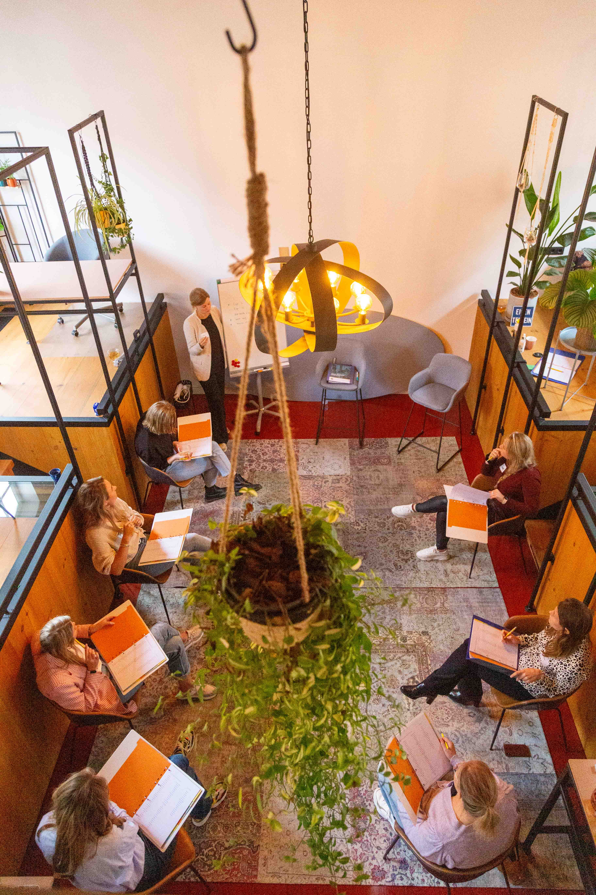
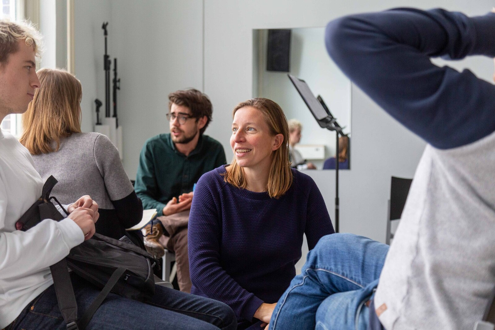
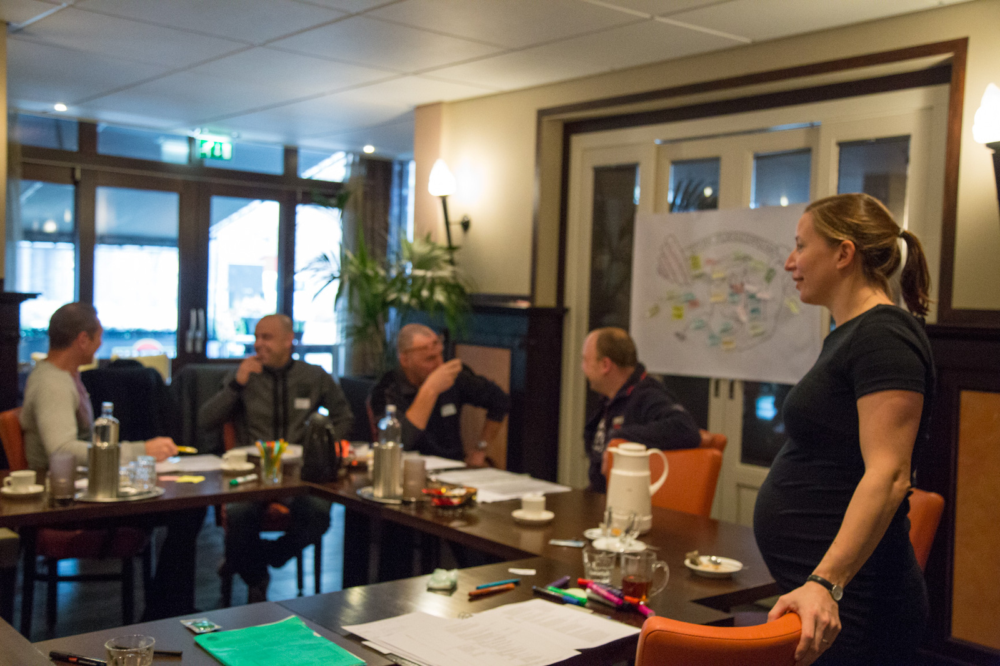

Coachend begeleiden is een onderwerp dat in veel organisaties hoog op de agenda staat. Van brandweer, leerkracht, consultant tot zorgverlener: sturen door middel van sancties en beloningen blijkt niet goed te werken. In plaats van dat dit de inzet van de werknemer verhoogt, wordt voor een inspectie of audit snel schoon schip gemaakt. Hierdoor komen het organisatieresultaat, de veiligheid en de motivatie van werknemers in het geding.

Coachend begeleiden geeft een nieuwe invalshoek. Door de medewerker door middel van vragen en met een betrokken houding te begeleiden gaat deze actiever reflecteren en is deze beter in staat adequate beslissingen te nemen. Beslissingen die bovendien ook goed passen bij de betreffende medewerker zelf. Op deze manier kan er lering worden getrokken uit successen, incidenten, klachten of meldingen. Dit is iets wat in organisaties die protocollair werken niet vanzelf sprekend is.
Om de omslag te maken naar een coachende stijl van leiderschap, is er een gedragsverandering nodig in alle lagen van de organisatie. Dit is niet gemakkelijk, maar levert veel op! Benieuwd wat er in uw team nodig is voor een ommezwaai naar het positieve? Wij komen graag langs voor een persoonlijk gesprek om samen met u de mogelijkheden en kansen te inventariseren.
Maak de beweging van aanspreken naar bespreken. Door middel van goede vragen kun je een ander helpen om zelf gemotiveerd tot oplossingen en actie te komen. Coachend begeleiden!

 Boven: Groep jonge medewerkers krijgt instructie van trainer Anna over het op coachende wijze uitvragen van informatie.

 Boven: Groep docenten in het middelbaar onderwijs oefent onder begeleiding van trainer Marijn met het uitstellen van advies in gesprekken. In plaats daarvan brengen ze structuur aan, zodat leerlingen actiever zelf oplossingen zoeken.

 Boven: Groep ploegleiders volgt een training Coachend Leiderschap waarin functioneringsgesprekken, aanspreekcultuur, luisteren en observeren en feedback geven en ontvangen aan bod komen.

> Robert, Productieleider metaalbedrijf - "Al onze ploegleiders en assistent-ploegleiders hebben ondersteuning gehad van Yep op het gebied van gespreksvoering. Dit hadden zij hard nodig bij de stap van uitvoerder naar leidinggevende. Hoe ga je om met alledaagse situaties, positioneer je jezelf op een prettige manier, hoe geef je vorm aan functioneringsgesprekken en bereid je je voor als er slecht nieuws gegeven moet worden? Het is fijn dat zij hierin een gemeenschappelijke basis hebben gekregen. De trainingen waren in kleine groepen en praktisch ingestoken, heel passend bij onze ploegen. Door Yep werd HR en management ook scherp gehouden op hoe zij gewenste veranderingen konden faciliteren en verankeren in de organisatie."
