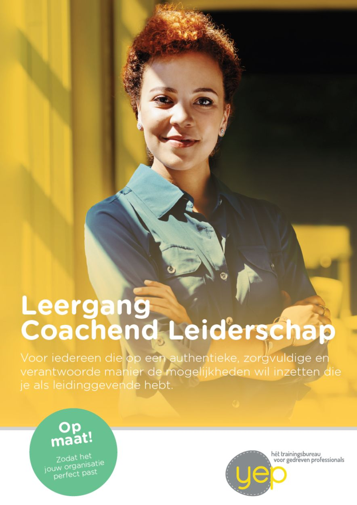
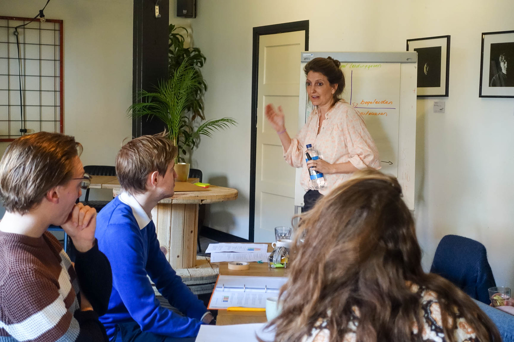

Coachend Leiderschap staat bij veel organisaties hoog op de agenda. Of je nu werkt in de zorg, het onderwijs, in de productie of als consultant, traditioneel leiderschap op basis van sancties en beloningen schiet tekort. In plaats van betrokkenheid en inzet te vergroten, creëert dit afhankelijkheid van externe factoren zoals de aanwezigheid van de leidinggevende. Dit gaat ten koste van de motivatie en het eigenaarschap dat medewerkers tonen. En dat heeft vaak een doorwerking op de sfeer, de veiligheid en de resultaten.

Wat wij ook veel tegenkomen, is een losse stijl van leidinggeven. Verantwoordelijkheden zijn niet helder belegd, functies en regels onduidelijk omschreven. Dit kan ervoor zorgen dat medewerkers elkaar niet aanspreken. De onduidelijkheid vormt hierin een drempel: 'Klopt het wel om jou hierop aan te spreken?'. Dit kan leiden tot duikgedrag, klagen over collega's, en het laat signaleren van problemen.

Coachend begeleiden biedt een krachtig alternatief. Door medewerkers met een betrokken houding te begeleiden en de juiste vragen te stellen, stimuleer je hen om zelfstandig te denken en verantwoordelijkheid te nemen.

## Wat de leergang Coachend Leiderschap oplevert?

Inzicht, durf en vaardigheid voor maatschappelijke impact!
Plus wendbare, veelzijdige leidinggevenden die:

- zich bewust zijn van hun invloed, gedrag en rol.
- medewerkers activeren en motiveren om zelf eigenaarschap te tonen.
- duidelijk zijn op het gebied van grenzen, verwachtingen en feedback.
- medewerkers zelfvertrouwen geven en helpen groeien in hun verantwoordelijkheden.
- een gebalanceerd team kunnen samenstellen en verder ontwikkelen.
- de gewenste route kennen wanneer er problemen zijn.
- stress signaleren en hierover handig in gesprek kunnen en durven gaan.

Een leergang Coachend Leiderschap levert de organisatie daarnaast inzichten op over hoe zij hun leidinggevenden verder kunnen faciliteren in hun rol.

## Wat vraagt coachend leiderschap van uw organisatie?

De overstap naar coachend begeleiden vraagt wat van leidinggevenden én van de organisatie als geheel. Welke stappen zijn nodig binnen uw organisatie om dit te realiseren?

Wij gaan hierover graag met jullie in gesprek. Neem contact met ons op voor een vrijblijvend en verkennend gesprek. Of bekijk onze brochure voor meer inspiratie en een duidelijk beeld van onze aanpak en mogelijkheden. Ook onze tarieven staan in de [brochure.](../../Brochure-CL-Yep.pdf)

Coachend begeleiden: de sleutel tot sterkere teams en duurzame resultaten.

 Boven: Een groep jonge leidinggevenden leert van Céline om sturend en ondersteunend gedrag te combineren.

 Boven: Groep docenten in het middelbaar onderwijs oefent onder begeleiding van trainer Marijn met het uitstellen van advies in gesprekken. In plaats daarvan brengen ze structuur aan, zodat leerlingen actiever zelf oplossingen zoeken.

 Boven: Groep ploegleiders volgt een training Coachend Leiderschap waarin functioneringsgesprekken, aanspreekcultuur, luisteren en observeren en feedback geven en ontvangen aan bod komen.

> Robert, Productieleider metaalbedrijf - "Al onze ploegleiders en assistent-ploegleiders hebben ondersteuning gehad van Yep op het gebied van gespreksvoering. Dit hadden zij hard nodig bij de stap van uitvoerder naar leidinggevende. Hoe ga je om met alledaagse situaties, positioneer je jezelf op een prettige manier, hoe geef je vorm aan functioneringsgesprekken en bereid je je voor als er slecht nieuws gegeven moet worden? Het is fijn dat zij hierin een gemeenschappelijke basis hebben gekregen. De trainingen waren in kleine groepen en praktisch ingestoken, heel passend bij onze ploegen. Door Yep werd HR en management ook scherp gehouden op hoe zij gewenste veranderingen konden faciliteren en verankeren in de organisatie."

> Teamleider middelbare school - "Ik dacht voorheen dat ik een directieve communicatiestijl moest aannemen om een goede leider te zijn, en dat authentiek leiderschap niet voor mijn persoonlijkheid was weggelegd.
> Wel dus!"
