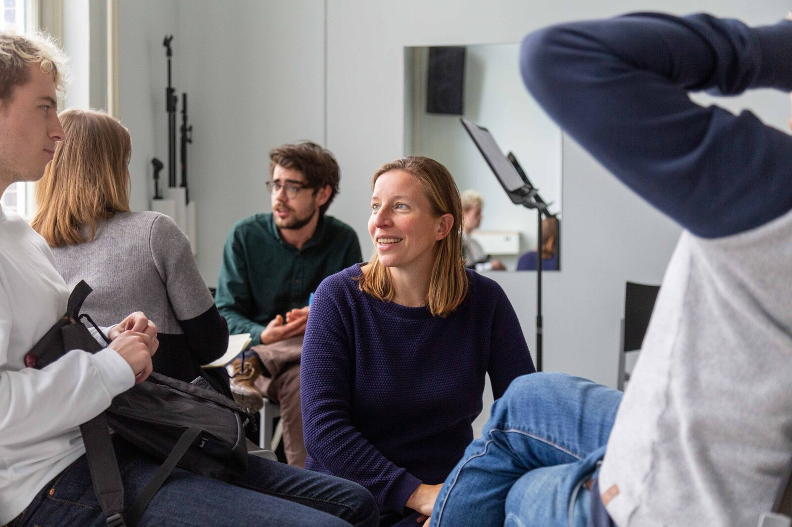

We provide a lot of custom communication training. Too many to list them all separately on this overview page, which is why we summarize it in this section. We always tailor communication training to your needs and have many themes and experiences to draw from. So, please contact [Marijn@yeptrainingen.nl](mailto:Marijn@yeptrainingen.nl) to explain the group's needs and situation, and we will think along with you!

What can a communication and dynamics training at Yep include?

- Giving and receiving feedback
- Strengthening the feedback culture
- Delivering bad news
- Exploring interests
- Dealing with conflicts and opposing interests
- Dealing with resistance
- Handling emotions
- Customer orientation
- Understanding interaction, dynamics, and taking control
- Taking the lead in conversations
- Advisory skills
- Coaching
- Setting boundaries
- Dealing with different communication styles
- Performance reviews
- Listening skills
- Digital conversation skills
- Pitching or presenting

 Above: A group of young employees receives instructions from trainer Anna on how to apply a coaching style of leadership.

 Above: A group of secondary school teachers practices under the guidance of trainer Marijn to delay giving advice in conversations. Instead, they provide structure so that students actively seek solutions themselves.

 Above: A group of team leaders follows a Coaching Leadership training that includes performance reviews, feedback culture, listening and observing, and giving and receiving feedback.

> Sharon, Project Leader - “Marijn has a lot of knowledge and helps you reflect on the cases and assignments during the training. Thanks to her, I gained insight into my communication skills and received tools to professionally give and receive feedback. I would definitely recommend the training and this agency!"

> Ivana, Coordinator of work experience placements at a large municipality - "I enjoy working with Yep because their training is substantively strong and interactive, they know how to connect well with the target group, and there is room for customization and an individual approach. Additionally, they are very enthusiastic and skilled trainers. We have taken many different communication training courses: Giving and receiving feedback, Assertiveness, Convincing presenting, Dealing with resistance and dynamics, Conversation leadership."

> Robert, Production Leader at a metal company - "All our team leaders and assistant team leaders have received support from Yep in conversation skills. They really needed this for the transition from executor to supervisor. How do you handle everyday situations, position yourself in a pleasant way, conduct performance reviews, and prepare when bad news needs to be delivered? It is nice that they have received a common foundation in this. The training sessions were in small groups and practically oriented, very suitable for our teams. Yep also kept HR and management sharp on how they could facilitate and embed desired changes in the organization."
