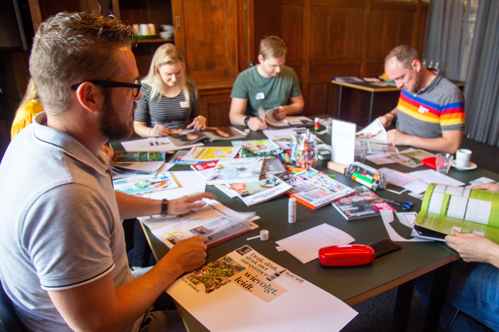
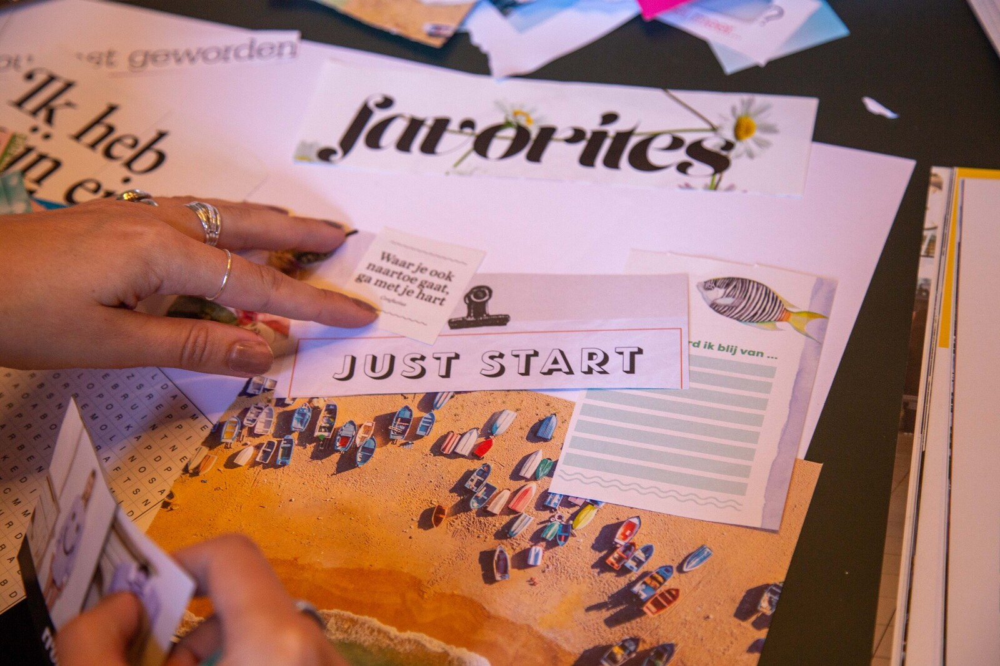

Deze training helpt je om in 3 uur tijd een abstract idee of een droom naar een haalbaar doel te vertalen. Een snelkookpan die veel energie voor je droom bij je gaat losmaken omdat het allemaal heel concreet wordt!

Tijdens de training doorloop je 5 gerichte en creatieve oefeningen, in totaal in 3 uur tijd. Bij uitstek geschikt voor iedereen die (grootse) plannen heeft: het opzetten van een onderneming, het verwerken van je persoonlijke ambities in je baan. Ook met kleinere, of vagere wensen kun je goed verder komen met deze training: meer impact ervaren in je werk, meer gezamenlijkheid in je leven, een bepaald talent opnieuw benutten nadat je het wat uit het oog bent verloren, het opdoen van nieuwe werkervaringen. 

 

**Incompany** We kunnen goed variëren met de training en daarmee leent hij zich goed voor uiteenlopende gelegenheden: een middag voor een jong personeelsvereniging of een kortere workshop op een beurs of grotere bijeenkomst. Voor een leuke invulling hebben we minimaal een uur nodig. Voor grote groepen hebben we een aparte vorm. Op die manier kunnen wel 100 personen tegelijk bezig gaan met het vormgeven van hun doel! Voor een offerte op maat neemt u het beste contact op via Marijn@yeptrainingen.nl 

**Open inschrijving** Af en toe organiseren we deze training ook als open variant voor individuele deelnemers in kleine groepen en als onderdeel van open en maatwerk talentprogramma's. De training wordt dan gehouden in kleine groepen waardoor het lukt om ieder plan diepgaand te analyseren op sterke en zwakke plekken. 

Aan het einde van de drie uur heb je diverse praktische oefeningen gedaan en je plan vertaald naar een actieplan waar je energie van krijgt. Je weet dan precies wat je te doen staat om van je idee een haalbare werkelijkheid te maken! 

We plannen nieuwe trainingen in op aanvraag. De open training kost €300 btw vrij per persoon voor groepen van maximaal 6 deelnemers. Voor een training in besloten groep hanteren wij onze vaste tarieven en kunnen we zoals gezegd varieren in groepsgrootte en werkwijze. 

XXX Hieronder vind je de reeds geplande startdata en het inschrijfformulier. Inschrijfmogelijkheden (springest)

Eerst informatie aanvragen kan uiteraard ook. Stuur dan een mailtje naar Marijn@yeptrainingen.nl 

> “De training heeft alles waar ik mee bezig ben op scherp gezet. Een verfrissende methodiek, helder en duidelijk. De oefeningen waren origineel en leuk, maar vooral nuttig.” - Yorgos, Ondernemer.

