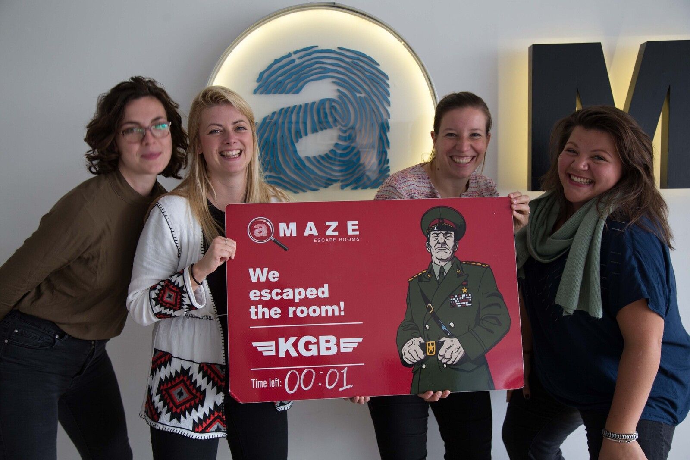

> "Een escape room is het perfecte middel om teamgedrag aan het licht te brengen en bespreekbaar te maken. De tijdsdruk en de spannende sfeer zorgen ervoor dat deelnemers helemaal opgaan in het spel en zich precies zo laten zien als zij zijn."  

> "Indrukwekkend wat je in één dag spelenderwijs kunt bereiken als team!"

Een escape room is een gave activiteit om als team te doen én biedt veel kansen om de samenwerking binnen het team te bespreken en verbeteren. Daarom bieden wij samen met Amaze Escape Den Haag aan. Uw team doet eerst de escape room en daarbij kijkt één van onze psycholoog-trainers mee. Na de ontsnapping (of mislukking!) staat er een heerlijke lunch klaar en vervolgens gaan we een middag lang aan de slag met wat er is gebeurd in het team tijdens het oplossen van de puzzels. Afhankelijk van jullie doelen kunnen we hierbij een focus aanbrengen. Wanneer er feedback gegeven wordt, hebben we de mogelijkheid om videobeelden van de ontsnappingspoging te bekijken.  Videobeelden onderstrepen en versterken de feedback. Voor deelnemers werkt dit positief-confronterend, waardoor zij de feedback beter plaatsen. Dit alles kan ook op afstand in een virtual reality omgeving. En zelfs digitaal!

## Invulling naar wens

Een trainingsdag die bij uw team past is het meest effectief. We houden daarom rekening met uw wensen en voorkeuren voor leerdoelen en vaardigheden. We hebben drie escape roomthema’s die zijn afgestemd op veelvoorkomende wensen: Communicatie, Timemanagement en Samenwerkingsvaardigheden. Tijdens het intakegesprek kunt uw voorkeuren aangeven!

### Thema Communicatie: **_Als je begrijpt wat ik bedoel_**

De zenuwslopende escape room is een ideale manier om spelenderwijs je natuurlijke communicatiestijl te ontdekken, want die komt door de tijdsdruk vanzelf bovendrijven. We gebruiken observaties uit de escape room om de communicatie op de werkvloer bespreekbaar te maken. Aan het einde van de training heb je antwoorden op vragen als:

* Welke boodschappen zend ik uit?
* Hoe duidelijk zijn mijn boodschappen?
* Welke communicatiestijl heeft mijn voorkeur?
* Hoe stem ik mijn communicatie af op de ander?
* Welke misverstanden ontstaan er gemakkelijk in het team? Waardoor?
* Hoe kunnen wij onze onderlinge communicatie verbeteren?

### Thema Timemanagement: **_Stop de tijd_**

‘Je zestig minuten gaan nu in!’ Bij de escape room heb je één uur de tijd om uit te breken. Een tijdsdruk die we in ons werk vaker terugzien dan we zouden willen. Na de escape room maken we de koppeling naar de timemanagementvaardigheden van individuele deelnemers en het team als geheel. Aan het einde van de training hebben alle deelnemers antwoorden op vragen als:

* Hoe effectief benutten wij onze gezamenlijke tijd? Wat valt ons hierbij op?
* Wat voor effect heeft tijdsdruk op onze samenwerking?
* Wat herkennen we hiervan in onze werksituatie?
* Welke winst kunnen we behalen? Hoe pakken wij dit aan?
* Hoe kunnen wij effectiever onderling informatie uitwisselen?

### Thema Samenwerken: **_Ontsnappen doe je samen_**

Nog niemand is ooit in z’n eentje uit een escape room gebroken. Wil je missie slagen, dan móet je samenwerken. De spannende escape rooms leggen in een uur veel bloot over de samenwerking binnen een team. In dit programma krijgen deelnemers antwoord op vragen zoals:

* Welke teamrollen zijn er in ons team vertegenwoordigd en wat betekent dit voor onze samenwerking?
* Wie hebben er een sturende rol in ons team? Wie komen er veel en weinig aan bod?
* Wat zou er gebeuren als we de rollen eens omdraaien?
* Hoe kunnen wij zo effectief mogelijk samenwerken?

 

## Hoe werkt het?

* U neemt [contact](http://yeptrainingen.nl/contact/) op met Yep Trainingen en geeft aan waar u behoefte aan heeft.
* Wij komen langs voor een intakegesprek op uw locatie. In dit gesprek kunt u als organisator aangeven waar u met de teamactiviteit de nadruk op wilt leggen. Wij denken mee en stellen met u een aantal concrete doelen op voor de dag.
* De trainer ontwerpt op basis van het gesprek een passend dagprogramma, maakt afspraken met Amaze Escape en de cateraar en stuurt u de offerte toe.
* Tijdens de trainingsdag beginnen we met het programma van een basis-escape room. Na de lunch volgt het verdiepende programma. Als organisator mag u de gehele dag bij het programma aanwezig zijn. Tip: laat het van tevoren weten als u zelf ook aan de escape room wilt meedoen, dan zorgen wij ervoor dat het voor uzelf net zo spannend is als voor de groep.
* We komen na afloop van de teamdag langs voor een evaluatiegesprek.

 

> **Deelnemer:** "Ons ontwikkeltraject, verzorgd door Yep Trainingen, hebben we afgerond met deze dag. Een leuke en spannende slotdag, waarop ook duidelijk werd hoe we individueel en als team vooruit zijn gegaan en welke valkuilen er nog zijn."   

> **Trainer:** "Door de tijdsdruk en de uitdagende puzzels komen interactiepatronen op het team aan het licht en kunnen we ook veel zien ten aanzien van vaardigheden op het gebied van samenwerken, invloed uitoefenen, timemanagement en onderlinge communicatie. Dus terwijl het team druk met of tegen elkaar in de weer is, zit ik te observeren. Na afloop van de escape room gaan we actief verder met de gekozen thema’s en krijgen deelnemers persoonlijke feedback van elkaar en van mij. Indrukwekkend wat je dan spelenderwijs in één dag kunt bereiken als team!"  

> **Deelnemer:** "Erg leuke en lastige escape rooms! Gaaf om te spelen. De spiegel die je vervolgens door de feedback en de ondersteunende videobeelden krijgt voorgehouden zorgde bij ons voor eyeopeners waar we zeker meer mee gaan doen."

