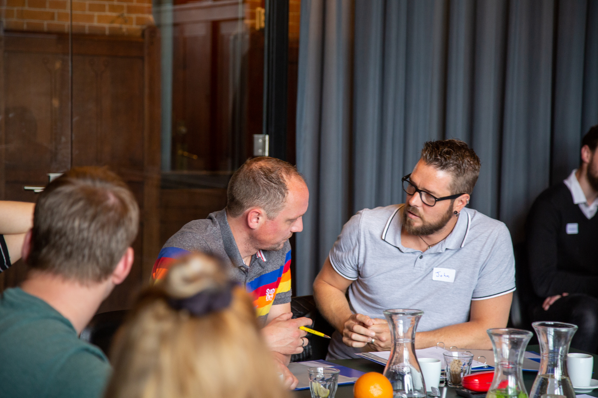

Providing feedback is something you do a lot in education: stickers, stars, goal setting, parent-teacher meetings, assignment reviews, and peer consultations are examples. But how does your school use feedback to achieve **sustainable improvement in education**? This involves a lot and also depends on your school's situation. We are happy to bring our experience in the following areas for customized programs:

- Skill training on giving and receiving feedback
- Train-the-trainer (coaching skills)
- Change management
- Culture change
- Directed theater

## What is possible at Yep?

We offer **customization** and work **free of VAT** in the Netherlands, so all hours and costs are purposefully spent! In any case, we start with a conversation at school and an intake with all participating teachers. This can also be done digitally or in the form of a survey. We do this, because we believe it is very important that the training and the change it initiates are supported by the entire team. And because we want to align with what you are already doing in terms of providing feedback in the school. Furthermore, we attach great importance to experiential learning methods. And a lot is possible: from a one-day study day to a year-long program. From focusing on skills in dealing with students, parents, and colleagues, to a culture change. From actively practicing with role-playing games to watching educational (directed) theater. We are happy to think along with what the school envisions and considers feasible. To give an impression, we list a few example situations below.

### Situation 1: Improving the feedback culture in the team

> Request from the school: _Our goal is to improve the feedback culture within the team. We want to create an atmosphere where feedback among colleagues is considered important and natural. To achieve this, we need to work on good observation skills and feedback skills. We also need guidance to embed this well within the organization. The time available: 3 half-days spread over the school year + additional time for consultation, coaching, and assignments._

Yep's approach: We shape the guidance by planning 3 meetings with the management team (MT), organizing 3 half study days with the entire team, and providing coaching on request. The MT guidance takes place prior to the study day and aims to help the MT facilitate the team in the intended change.

We start with a survey within the team: where are the gains, what are the obstacles in freely giving feedback, what do they want to learn and tackle? Next, we choose a joint kickoff of a half-day on study day 1: first, we work on mutual trust and the joint image of where the team currently stands regarding the feedback culture. They explore through creative work forms and dialogue what it will mean to improve the feedback culture, what this will yield, and what it requires from them. We ensure openness, safety, and energy.

On the next study day, observation skills, giving feedback, and receiving feedback are central. The team is divided into groups of 6-10 people, each working with their own trainer. This can be extended to a full day, allowing more room for conversation techniques. We practice with entry-level cases. At the end of the day, there is an exercise where teachers seek each other out in pairs in a low-threshold way to ask for feedback.

After that, the first classroom observations (internal) and coaching conversations take place. Teachers apply some assignments and additional literature is available for those who want it. On the third study day, we discuss how things are going and practice with more complex situations in the same groups as on study day 2. We use a training actor for this. We reflect on successes and setbacks and pay attention to embedding the changes in the structure and organization. Intervisions (supervised by us) are a possibility here.
With the MT, sparring moments take place prior to each study day. How can the improvement culture be integrated into the existing system? How can the MT set an example and support the team in a pleasant way to continue giving feedback regularly? Which points from the guidance need follow-up from them? We discuss the possibilities in terms of organization, technique, and behavior.

### Situation 2: Half-day feedback between team members

> Request from the school: _We want to set aside one half-day for giving feedback within our team. We want everyone to be able to give professional feedback by the end of the session. The teachers at our school are already under a lot of pressure with their schedules. We, therefore, choose a program that requires a limited additional investment of their time._

Yep's approach: For this request, we at Yep are a bit hesitant. We like to have a conversation with the school to dive deeper into the situation. A half-day is generally sufficient to master the basics of giving and receiving feedback. However, we often find that prerequisites for giving good feedback are missing, so focusing purely on the skills does not work. We fear this may even have a negative effect on the overall atmosphere, as people may feel unseen.

So, we like to explore with (part of) the team what makes giving feedback insufficient and what they and we see as necessary to address this. This could include:

- Opportunities to observe each other at work.
- A shared mission or common ambitions that give feedback a clear purpose.
- A foundation of trust among colleagues, perhaps due to many changes.

We find it important to consider the team's time investment with the work pressure that exists and to work effectively. Sometimes it is possible to address the prerequisites internally within existing activities, so we can indeed keep the training time very limited. Otherwise, situation 3 below might be a good alternative to start with feedback this school year.

### Situation 3: Feedback to students and parents

> Request from a school: _We wish to specifically focus on giving feedback to students and their parents. What resonates well? What can they handle? We notice that some teachers are unmotivated to give feedback to parents due to the reactions they may receive or because they see little effect. What can we do about this?_

Yep's approach: First, we take time to investigate how things are going so far and what makes the current feedback ineffective (at times). We take a look at feedback skills, but also at other aspects that might be getting in the way of your goals. Alignment with parents' level, follow-up on feedback, or something else. We start with one training session consisting partly of a dialogue between teachers and partly of a similation with an actor in the role of a parent. This will give insight into what works well. After that we know if anything else is needed and we advise the school in the steps forward.

A basic training on giving feedback to students and parents can be done in half a day for groups of up to 10 people. This can be a stepping stone to a team feedback program at a later time.

## Further inspiration!

> "When the learning objective is clear, students and parents start asking more questions."

If we embark on a longer program together, it is possible to include several other goals. Below is a list of what we can offer in combination with guidance around feedback:

- Culture ladder/culture change – how does the team perceive the culture at our school and what steps can we take? What does this yield?
- Digital conversation skills - practicing online feedback conversations.
- Broader focus on conversation skills - e.g., dealing with emotions, structuring, and activating.
- Setting goals and measuring success – How do goals help in asking for and giving feedback?
- Students – how do I create more opportunities for feedback to students? How do I encourage them to ask for feedback themselves?
- MT guidance on team development, the joint mission, and/or guiding and facilitating team members.
- Receiving feedback – what should you pay attention to when receiving feedback?
- Individual coaching or team intervision
- Building mutual trust
- Following up on feedback
- How do you avoid repeating yourself with important feedback?
- On-the-job observation
- Assignments between teammates
- Effective compliments
- Motivational interviewing
- Educational theater for teachers or students and their parents
- Training students to give feedback to peers (tutoring)

We are happy to brainstorm with you!

## Education-specific experience at Yep:

In addition to the aforementioned experience with the themes of didactics, feedback, change management, and culture change, one might wonder what are specific experience is with schools, teachers and students. We train a wide range of organizations, from municipalities to production companies. Since 2014, we have taught teachers in the Onderwijstraineeship, Trainees in Onderwijs foundation, and Traineeship Eerst de Klas. Since 2012, we have guided university teachers during the Basic Qualification Education in the field of interaction with students. Feedback is a central theme here. Furthermore, we regularly guide teachers, and team coordinators in conversations through talent programs, incompany training, and individual coaching. We have also provided trajectories for several complete school teams on study days on the themes of improvement culture, feedback, and professional distance.

Various members of our team have professional experience with students in primary, secondary, and higher education, either as a teacher, mentor, volunteer or in educational theater.

## Useful links:

- The Dutch National Program Education: [https://www.nponderwijs.nl/](https://www.nponderwijs.nl/)
- The high impact of better Feedback in education: [https://educationendowmentfoundation.org.uk/education-evidence/teaching-learning-toolkit/feedback](https://educationendowmentfoundation.org.uk/education-evidence/teaching-learning-toolkit/feedback)
- Feedback as an intervention: [https://www.nponderwijs.nl/interventies/feedback](https://www.nponderwijs.nl/interventies/feedback).
- The role of feedback in effective school learning : [https://www.uu.nl/en/research/education-and-learning/better-feedback-at-school](https://www.uu.nl/en/research/education-and-learning/better-feedback-at-school)
