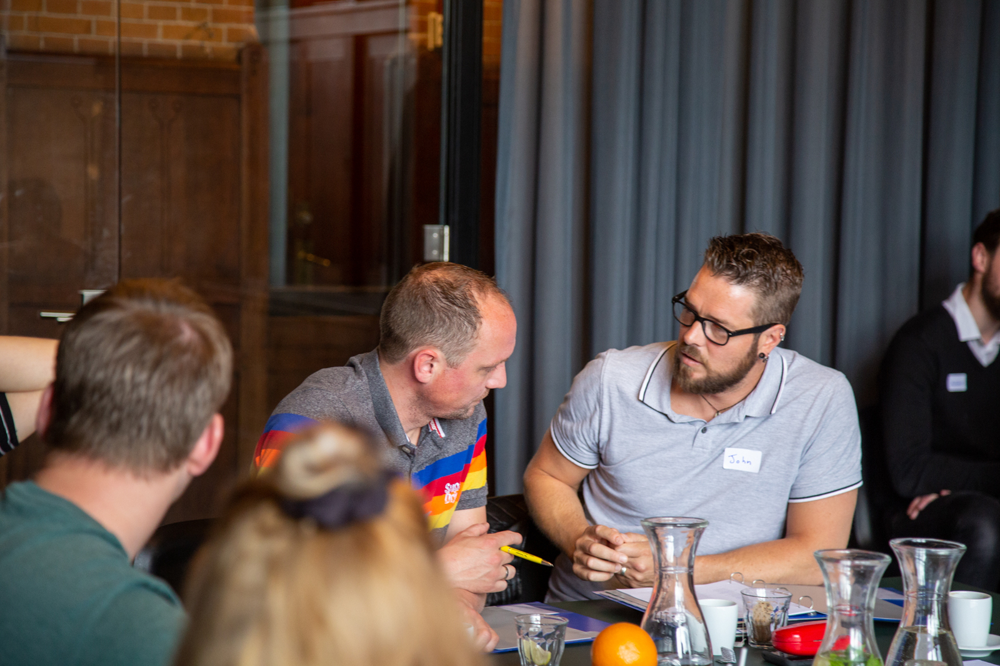
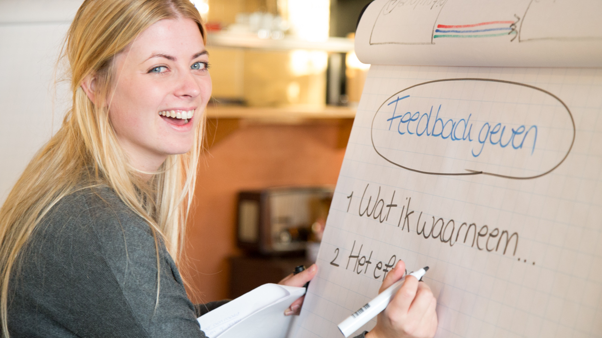
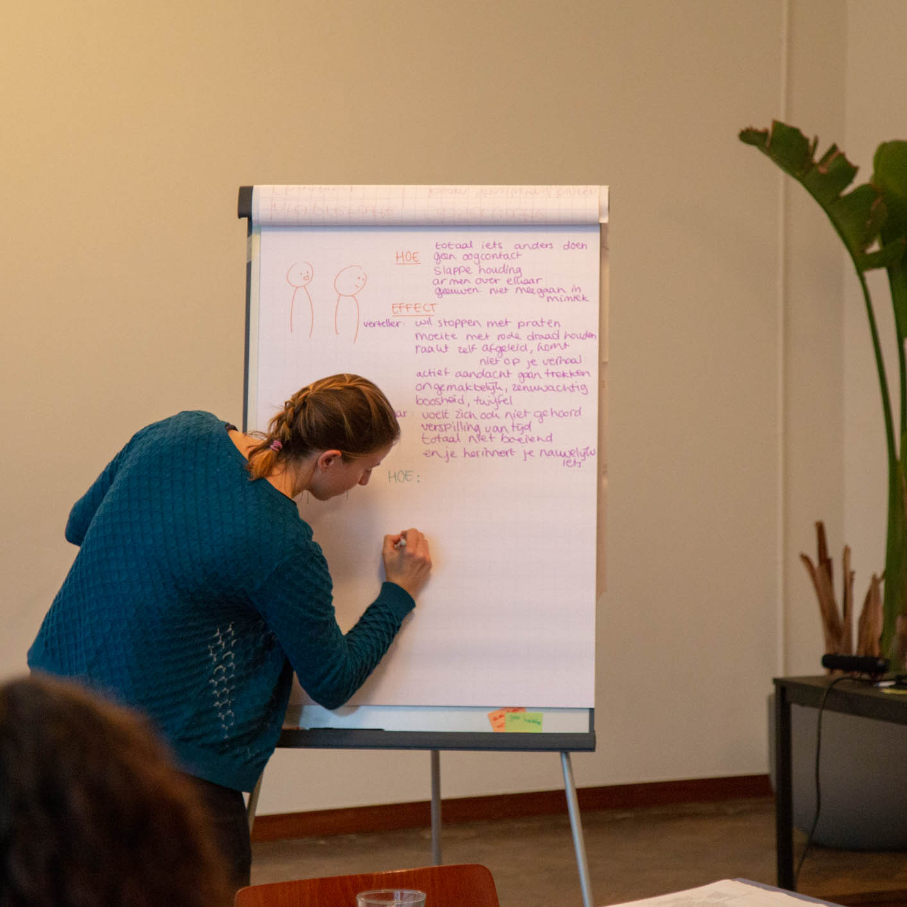
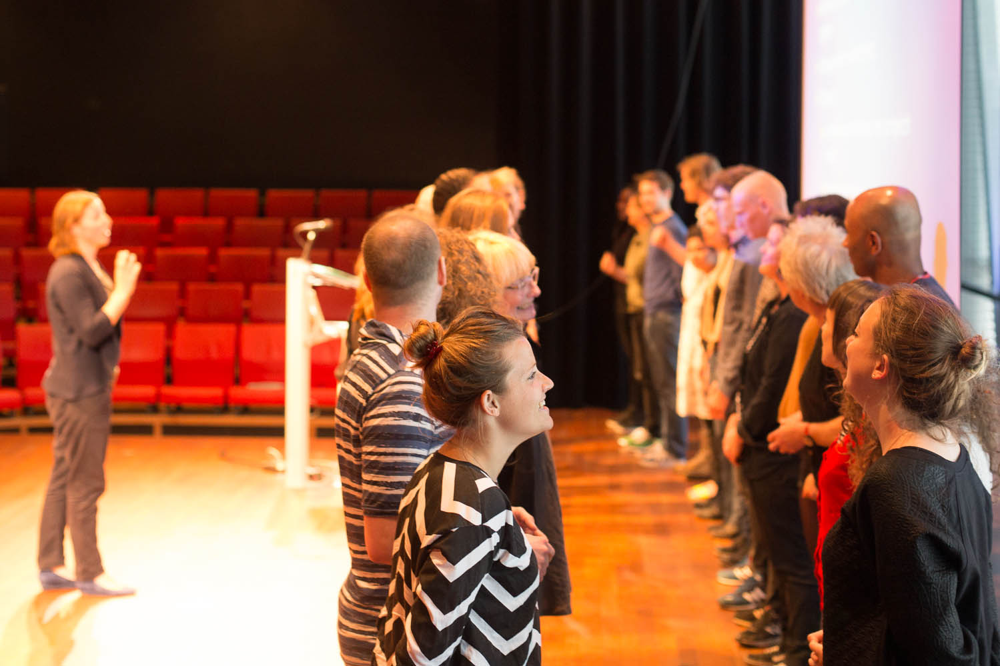

Feedback geven is iets dat je in het onderwijs veel doet: stickers, krullen, strepen, doelgespreken, oudergesprekken, opdrachtbesprekingen en bijvoorbeeld collegiale consultatie zijn hier voorbeelden van. Maar hoe kom je als school met feedback tot **een duurzame verbetering van het onderwijs**? Daar komt best veel bij kijken en dit is ook afhankelijk van de situatie op jullie school. Wij brengen voor maatwerk programma’s graag onze ervaring in op het gebied van:

- vaardigheidstrainingen rondom feedback geven en ontvangen
- train-de-trainer (begeleidingsvaardigheden)
- verandermanagement
- cultuurverandering
- regietheater

## Wat is er mogelijk bij Yep?

Wij bieden **maatwerk** en werken **vrij van btw**, alle uren en kosten worden doelgericht besteed! In ieder geval starten we met een gesprek op school én een intake met alle deelnemende leerkrachten/docenten. Dit kan ook digitaal of in de vorm van een enquête. Dit doen we omdat we het erg belangrijk vinden dat de training en de verandering die ermee wordt ingezet gedragen wordt door het hele team. En omdat we willen aansluiten bij wat jullie al doen op het gebied van feedback geven in het onderwijs. Verder hechten wij erg veel waarde aan ervaringsgerichte leervormen. En is er veel mogelijk: van 1 studiedag tot een traject van een jaar. Van een focus op vaardigheden in de omgang met leerlingen, ouders en collega's, tot een cultuurverandering. Van zelf actief oefenen met rollenspellen tot het kijken naar educatief (regie)theater. We denken hierin graag mee met wat de school voor ogen heeft en haalbaar acht. Om een indruk te geven zetten we hieronder een paar voorbeelden situaties neer.

### Situatie 1: Aanspreekcultuur in het team verbeteren

> Vraag vanuit de school: _Ons doel is een betere aanspreekcultuur in het team. We willen een sfeer creëren waarbij feedback onderling als belangrijk en vanzelfsprekend wordt ervaren. Daarvoor moete we in elk geval werken aan goede observatievaardigheden en vaardigheden rond feedback geven. We willen dit in de organisatie goed borgen. Daar hebben we ook begeleiding bij nodig. De tijd die we beschikbaar hebben: 3 halve dagen verspreid over het schooljaar + los daarvan ruimte voor overleg, coaching en opdrachten._

Aanpak vanuit Yep: We geven de begeleiding vorm door 3 bijeenkomsten met het MT te plannen, 3 halve studiedagen met het hele team in te richten en daarnaast op aanvraag coaching te verzorgen. De MT begeleiding vindt steeds voorafgaand aan de studiedag plaats en heeft als doel het MT zo goed mogelijk te helpen om het team te faciliteren in de voorgenomen verandering.

We starten met een enquête binnen het team: waar ligt de winst, wat zijn nog hindernissen in het vrijuit geven van feedback, wat wil men graag leren en aanpakken? Vervolgens kiezen we voor een gezamenlijke aftrap van een halve dag op studiedag 1: eerst werken we aan het onderlinge vertrouwen en het gezamenlijke beeld van waar het team nu staat wat betreft aanspreekcultuur. Zij verkennen onderling door middel van creatieve werkvormen en een dialoog wat het zal betekenen om de aanspreekcultuur te verbeteren, wat dit oplevert en wat dit vraagt van hen. We zorgen voor openheid, veiligheid en energie.

Op de volgende studiedag staan staan vaardigheden rond observeren, feedback geven, feedback ontvangen centraal. Het team is opgedeeld in groepen van 6-10 personen die elk met een eigen trainer aan de slag gaan. Dit kan aangevuld worden naar een hele dag, waarmee er ruimte ontstaat voor meer gesprekstechnieken. We oefenen met instap casussen. Aan het eind van de dag is er een werkvorm waarbij leerkrachten elkaar op een laagdrempelige manier in tweetallen opzoeken om feedback te vragen.

Daarna vinden de eerste klassenobservaties (intern) en coaching gesprekken plaats. Leraren passen enkele opdrachten toe en voor wie dat wil is er aanvullende literatuur.
Op de derde studiedag bespreken we hoe het gaat en wordt er in dezelfde groepen als op studiedag 2 met complexere situaties geoefend. Hierbij zetten we een trainingsacteur in. We staan stil bij successen en tegenvallers en hebben aandacht voor het inbedden van de veranderingen in de structuur en organisatie.
Met het MT vinden de sparringmomenten steeds voorafgaand aan een studiedag plaats. Hoe kan de verbetercultuur geïntegreerd worden in het bestaande systeem? Hoe kan het MT een voorbeeldrol neerzetten en het team op een prettige manier ondersteunen om met regelmaat feedback te blijven geven? Welke punten uit de begeleiding hebben opvolging van hen nodig? We bespreken de mogelijkheden zowel op het gebied van organisatie, techniek en gedrag.

### Situatie 2: dagdeel feedback binnen het team

> Vraag vanuit de school: _Wij willen één dagdeel uittrekken voor het geven van feedback onderling binnen ons team. We willen dat iedereen professioneel feedback kan geven na afloop. De leerkrachten op onze school staan al erg onder druk qua werktijden. Wij kiezen daarom voor een programma dat een beperkte extra investering van hun tijd vraagt._

Aanpak vanuit Yep: Voor deze vraag zijn we bij Yep een beetje huiverig. We gaan graag met de school in gesprek om ons wat meer te verdiepen in de situatie. Een dagdeel is in principe voldoende om de basis van het feedback geven en ontvangen onder de knie te krijgen. Toch merken we dat er vaak randvoorwaarde voor het geven van goede feedback ontbreken, waardoor een insteek op puur de vaardigheden niet werkt. Wij vrezen dat dit zelfs een negatief effect kan hebben op de algehele sfeer, omdat men zich mogelijk niet gezien voelt.

Dus graag verkennen we met (een deel van) het team wat maakt dat feedback nog onvoldoende wordt gegeven en wat zij en wij zien dat er hiervoor aanvullend nodig is. Je kan hierbij denknen aan:

- momenten om elkaar aan het werk te zien.
- een gezamelijke missie of gezamenlijke ambities waardoor je feedback een duidelijk doel dient.
- een vertrouwensbasis onderling, misschien omdat er veel wisselingen zijn geweest.

We vinden het belangrijk om met de tijdsinvestering voor het team rekening te houden met de werkdruk die er is en om effectief te werk te gaan. Soms is het mogelijk om intern binnen bestaande activiteiten aan de randvoorwaarde te werken, zodat we de trainingstijd inderdaad heel beperkt kunnen houden. En anders kan situatie 3 hieronder een goed alternatief zijn om toch een start te maken met feedback in dit schooljaar.

### Situatie 3: Feedback aan kinderen en ouders

> Vraag van een school: _Wij willen ons specifiek verdiepen in het geven van feedback aan leerlingen en ouders. Wat slaat goed aan? Wat kunnen zij aan? We merken dat sommige docenten ongemotiveerd zijn om feedback aan ouders te geven, door de reacties die ze erop kunnen krijgen of doordat ze er weinig effect van terug zien. Wat kunnen we hiermee?_

Bijpassende aanpak van Yep: Wij stellen voor om eerst te onderzoeken hoe het tot nu toe gaat en wat maakt dat er weinig effect te zien is. Mogelijk ligt dit niet aan de feedback vaardigheden, maar aan iets anders? Aansluiting op niveau van ouders, opvolging van de feedback of iets anders. We beginnen met een onderzoek dat deels uit gesprekken met leerkrachten bestaat en deels uit een trainingssessie met acteur (in rol van ouder) waarbij de acteur steeds teruggeeft of hij/zij wat met de tips wil en kan gaan doen. Daarna plannen we de rest van het traject pas in. Docenten geven hiervoor ook hun leerwensen op en hun voorkeuren t.a.v. de manier van leren: groepstrainingen, opdrachten met daaraan verbonden intervisie, of individuele begeleiding met een gezamenlijk start- en eindmoment.

Een basistraining feedback geven aan leerlingen en ouders kan al in een halve dag voor groepen van maximaal 10 personen. Dit kan een opstap zijn naar een team-traject feedback aan elkaar op een later moment.

## Verdere inspiratie!

> "Als het leerdoel helder is, gaan leerlingen en ouders zelf meer vragen stellen."

Gaan we een langer traject met elkaar aan, dan is het mogelijk om hier meerdere andere doelen bij te betrekken. Hieronder een lijst met wat wij zoal kunnen bieden in combinatie met de begeleiding rondom feedback:

- Cultuurladder/cultuurverandering – hoe ervaart het team de cultuur op onze school en wat zijn stappen die we hierin kunnen maken? Wat levert dit op?
- Digitale gespreksvaardigheden - oefenen met online feedback gesprekken.
- Breder inzetten op gespreksvaardigheden - bijv het omgaan met emoties, structureren en activeren.
- Het stellen van doelen en meetbaar maken van succes – Hoe helpen doelen bij het vragen en geven van feedback?
- Leerlingen – hoe creëer ik meer gelegenheid voor feedback aan leerlingen? Hoe stimuleer ik hen om zelf naar feedback te vragen?
- MT begeleiding op het gebied van teamontwikkeling, de gezamenlijke missie en/of het begeleiden en faciliteren van teamleden.
- Feedback ontvangen – waar kun je op letten als je feedback krijgt?
- Individuele coaching of team intervisie
- Bouwen aan onderling vertrouwen
- Feedback opvolgen
- Hoe voorkom je dat je bij belangrijke feedback in herhaling blijft vallen?
- On the job observatie
- Opdrachten tussen teamgenoten
- Complimenten met effect
- Motiverende gespreksvoering
- Educatief theater voor onderwijzers of leerlingen en hun ouders
- Leerlingen opleiden in het geven van feedback aan mede leerlingen (tutoring)

We denken graag vrijblijvend mee!

## Onderwijs-specifieke ervaring bij Yep:

Naast de eerder genoemde ervaring met de thema's begeleiden, feedback, verandermanagement en cultuurverandering, is er misschien de vraag wat wij als partij hebben met het onderwijs. Wij trainen namelijk een breed scala aan organisaties, van gemeentes tot productiebedrijven. We hebben tussen 2014 en heden startende docenten begeleid in het Onderwijstraineeship, Trainees in Onderwijs stichting Onderwijs in en Traineeship Eerst de Klas. Tussen 2012 en heden begeleidden we startende Universitair docenten tijdens de Basis Kwalificatie Onderwijs op het gebied van interactie met de student. Feedback is hierbij een centraal thema. Verder begeleiden we met regelmaat leerplichtambtenaren, docenten en teamcoördinatoren in de gespreksvoering door middel van talentprogramma's, gerichte trainingen en individuele coaching. Ook hebben we een aantal complete scholenteams op studiedagen mogen begeleiden bij de thema's verbetercultuur, feedback en professionele afstand.

Diverse leden van ons team hebben ervaring met het begeleiden van leerlingen uit basis-, middelbaar- en hogeronderwijs, bijvoorbeeld als leraar, mentor of in educatief theater. Trainer Marijn is lid van de MR van een basisschool en voorzitter van de GMR van een scholenkoepel.

## Handige links:

- Nationaal Programma Onderwijs: [https://www.nponderwijs.nl/](https://www.nponderwijs.nl/)
- Feedback als interventie: [https://www.nponderwijs.nl/interventies/feedback](https://www.nponderwijs.nl/interventies/feedback).
- De [Menukaart van het Ministerie van OCW](https://www.nponderwijs.nl/interventies/feedback) Volgens de menukaart is feedback een belangrijke en effectieve interventie voor het basis- en middelbaaronderwijs om opgelopen leerachterstanden in te halen: tot 8 maanden leerwinst!
- Tutoring / Leren van en met mede-leerlingen: [nponderwijs.nl/interventies/leren-van-en-met-medeleerlingen](https://nponderwijs.nl/interventies/leren-van-en-met-medeleerlingen)
