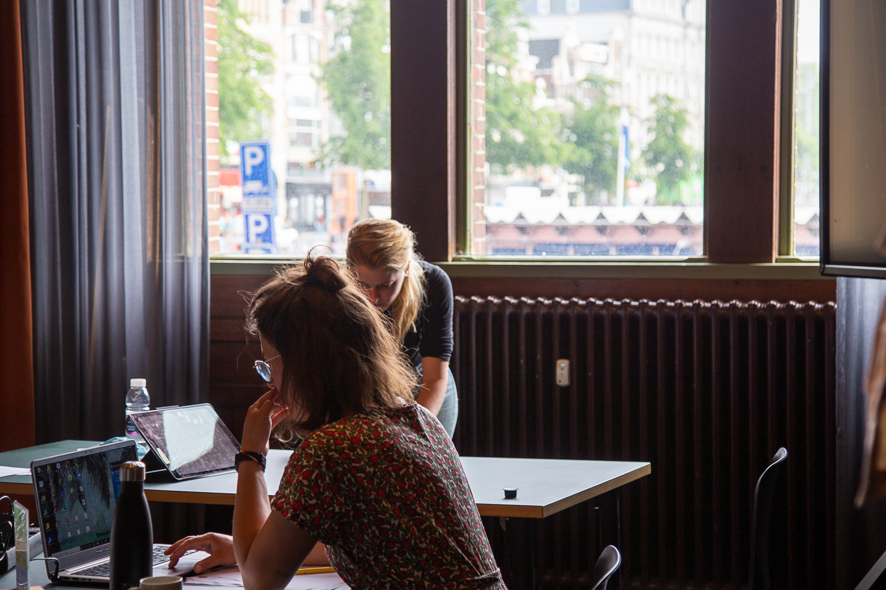

Trainingen, vergaderingen en bijeenkomsten vinden sinds de coronatijd regelmatig met een gemixt gezelschap plaats: een deel van de mensen is fysiek aanwezig, een ander deel logt online in. 

Dat het technisch mogelijk is om een hybride bijeenkomst te begeleiden, betekent nog niet dat het in alle omstandigheden wenselijk is.

In een online workshop van 1,5 leer je onder welke voorwaarden je een hybride overleg op een effectieve manier kunt begeleiden met voldoende aandacht voor de mensen thuis en in de zaal. Daarnaast krijg je in de workshop tips mee over hoe je een hybride bijeenkomsten praktisch kunt inrichten, en oefenen we met de techniek die in jullie werkomgeving beschikbaar is. 

Het resultaat is dat je met zelfvertrouwen een hybride overleg kunt gaan begeleiden. Verschillende aspecten van het begeleiden van hybride bijeenkomsten komen aan bod:

* Verwachtingen: Welke verwachtingen schep je vooraf zodat het voor deelnemers duidelijk is wat digitale deelname betekent?
* Techniek: Hoe richt je de ruimte in? Hoe zorg je dat digitale deelnemers goed zichtbaar en hoorbaar zijn in de zaal en andersom: hoe krijg je het voor elkaar dat de deelnemers in de zaal goed zichtbaar zijn voor de mensen thuis? Welke technische hulpmiddelen kun je daarvoor gebruiken?
* Aandacht verdelen: Hoe verdeel je de aandacht tussen de mensen thuis en in de zaal? Welke werkvormen helpen daarbij? Welke andere tips zijn er om ervoor te zorgen dat je het groepsproces op een stevige manier kunt begeleiden?Lees TODO: [ons blog over hybride bijeenkomsten begeleiden](https://yeptrainingen.nl/hybride-bijeenkomsten-bereid-je-voor-op-de-volgende-uitdaging-in-het-vergaderen/), om alvast je voordeel te doen met onze tips.

 De training vindt plaats op aanvraag en kan ook incompany georganiseerd worden: van korte lunchworkshop tot uitgebreid programma op maat. Interesse? Stuur een mailtje naar Anna@yeptrainingen.nl