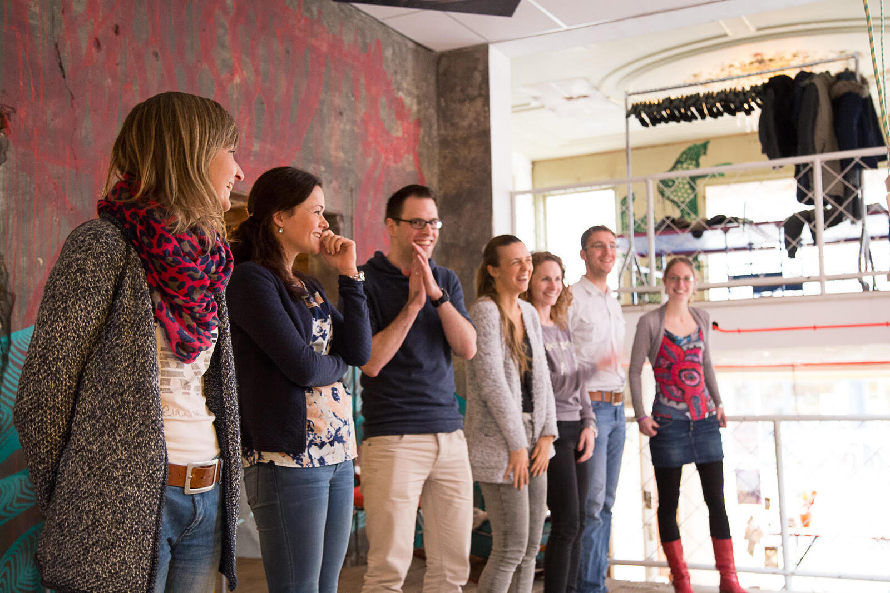
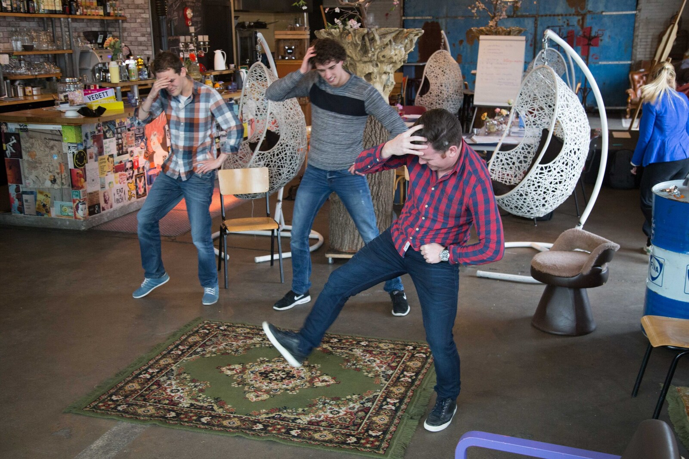

Improvisatie is al eeuwen een belangrijk basis voor het acteren. De Canadese Keith Johnstone heeft gemerkt dat improviseren het kind in ons naar boven haalt. Het kind dat "Ja" durft te zeggen op een idee van een ander. Dat durft te falen met een glimlach, dat bezig is zijn eigen grenzen te verkennen en durft te verleggen. Maar het is niet alleen een basis voor acteren, improviseren is een bewezen methode om tot meer durf te komen! Heb jij één van de volgende doelen?

- Uit je comfort zone stappen
- positiever denken
- meer durven
- sterker in je schoenen staan
- minder twijfelen
- luider praten.

De training Improviseren is geschikt voor iedereen die nieuwsgierig is naar het (verkennen en) verleggen van eigen grenzen. Ervaring is niet vereist.

**Incompany** We kunnen de training geven aan groepen tot 12 personen en hebben twee tot drie uur nodig. Afhankelijk van de aanleiding voor de training, kunnen we de werkvormen aanpassen en gerichte reflectie-oefeningen toevoegen. Ook mogelijk als ingekorte workshop op een personeelsdag of event. En we kunnen dit ook digitaal!

> Trainer - “Ik krijg na een workshop Improviseren vaak terug dat deelnemers meer zelfvertrouwen hebben gekregen. Of dat ze zichzelf verrast hebben. Als je iets doet waarvan je niet had verwacht dat je het zou durven krijg je een zelfvertrouwen-boost”.

