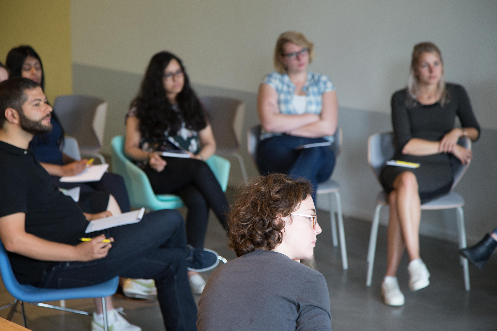

Tijdens intervisie hebben professionals de tijd om met elkaar leren. Persoonlijke werkvragen staan centraal. Samen met je collega’s ervaar je dat er ruimte is om te delen wat je bezighoudt en kom je samen tot nieuwe inzichten. Als je net een intervisiegroep start of als je behoefte hebt aan structuur en feedback, dan kan intervisiebegeleiding helpen om als groep meer uit je de intervisiebijeenkomsten te halen.

## Waarom is intervisie relevant?

Bij veel mensen is de werkpraktijk helemaal niet meer zo duidelijk als vroeger. Functies zijn niet vastomlijnd en de werkpraktijk verandert regelmatig. Soms is bovendien de werkdruk hoog en is er weinig ruimte om stil te staan bij onderwerpen die lastig zijn. Juist in die context is uitwisseling met collega’s over de persoonlijke werkervaring heel waardevol.

## Wat is intervisie?

Tijdens een intervisiebijeenkomst komen professionals samen om te delen waar ze tegen aan lopen in het werk. Iemand brengt een lastige werkcasus in en daarop volgen open vragen of reflecties van anderen. Collega’s geven in principe geen pasklare antwoorden, want intervisie is juist bedoeld om de beleving van de inbrenger centraal te stellen.

> Waarom is iets voor iemand een probleem? Welke lading ervaart iemand rondom een vraagstuk? Welke dilemma houdt iemand precies bezig?

De inbrenger van een casus wordt door de groep in staat gesteld om te reflecteren op zijn beleving. Doordat hij de ruimte krijgt en gehoord wordt door anderen, voelt hij dat er weer beweging in zijn denken komt. Vaak is dat voor mensen de crux. Ze krijgen de ruimte om zelf verder te komen, aangemoedigd door vragen en een luisterend oor van collega’s. Natuurlijk is het tijdens intervisie niet verboden om elkaar concrete tips en oplossing te geven, maar juist de vertraging en ruimte voor reflectie is waar van mensen vaak aangeven het meest aan te hebben.

## Hoe ziet de intervisie er praktisch uit?

Intervisie vindt vaak plaats in een groep van 3 tot 6 mensen die vooraf met elkaar afspraken maken over de manier waarop het gesprek onderling plaats vindt. Zij kiezen (vaak) een specifieke gespreksmethode en bepalen met elkaar welke type vragen/casus aan bod kunnen komen. De regelmaat en de duur van de intervisie wordt vooraf bepaald (vaak eens per maand met een bijeenkomst van 90-120 minuten). Ook commitment, het belang van een veilige sfeer en praktische afspraken komen aan de start van de intervisie aan bod. Begeleiding van het gesprek is prettig omdat dit structuur en veiligheid geeft. Zo kan het leren beter plaatsvinden.

## Waar richt de begeleiding zich op?

De intervisiebegeleiding richt zich op het volgende:

* Het creëren van een veilige omgeving voor gezamenlijk leren
* Inbrengen en uitleggen van verschillende intervisiemethodieken
* Het geven van feedback op communicatieve vaardigheden binnen de intervisiegroep (bijvoorbeeld als er scherper doorgevraagd kan worden op elkaars inbreng, zodat het leren versterkt wordt)

Bij begeleide intervisie komen we regelmatig bijeen. We bouwen stap voor stap aan een prettige leeromgeving waar ieder ook echt een casus wil inbrengen. Deelnemers worden beter in het stellen van open vragen die collega’s raken en verder brengen en worden ook meer bedreven in het geven en ontvangen van feedback. Daarmee wordt de opbrengst van de intervisie groter.

## Zelfstandig verder?

De meeste groepen kunnen na een aantal sessies zelfstandig verder met de intervisie. De ervaring leert echter dat groepen het prettig vinden om de begeleiding voort te zetten. Doordat ze zichzelf begeleiding gunnen, blijft de intervisie een belangrijke plek innemen in het werk. 

## Intervisiebegeleiding zelf organiseren

Wil je niet afhankelijk zijn van externe inzet, dan is het is ook mogelijk om een paar medewerkers op te leiden tot intervisiebegeleider zodat zij de intervisiesessies kunnen begeleiden. 