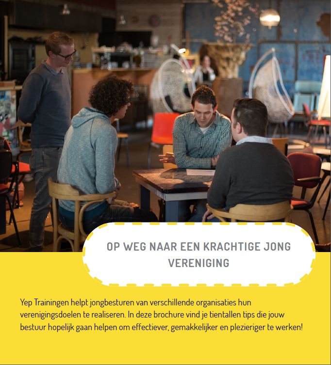

Yep Trainingen helpt jong verenigingen (jong-personeelsverenigingen of jonge medewerkers netwerken) van verschillende organisaties hun verenigingsdoelen te realiseren. Dit zijn doelen zoals:

* de persoonlijke ontwikkeling van jonge personeelsleden stimuleren
* het interne netwerk versterken
* het externe netwerk van de organisatie versterken
* het uitwisselen van kennis tussen afdelingen of organisatie-niveaus bevorderen
* het verbeteren van innovatie en kwaliteit in de organisatie
* jonge medewerkers binden aan de organisatie en uitstroom voorkomen

Wij verzorgen regelmatig activiteiten voor jong verenigingen en krijgen daarbij ook vragen van bestuursleden die willen weten hoe zij effectiever te werk kunnen gaan. Zij hebben bijvoorbeeld te maken met een lage opkomst bij activiteiten, beperkte (financiële) ondersteuning vanuit de organisatie of moeite om de bestuurstaken te combineren met de werkzaamheden die bij hun functie horen.

Om hen beter te kunnen adviseren hadden wij zelf ook meer informatie nodig. Wij hebben toen een onderzoek gedaan onder diverse jongverenigingen en jong-netwerken. We hebben hen gevraagd om zowel knelpunten als tips te delen, zodat er een kennisuitwisseling kan ontstaan tussen de besturen van jongverenigingen.

Er hebben 25 verenigingen uit zowel publieke als commerciële organisaties uitgebreid gereageerd. Alle tips en inzichten die we bij de jong verenigingen hebben opgedaan, hebben we gecombineerd met onze eigen ervaringen vanuit Yep Trainingen. We hebben de tips gebundeld rond de thema's die het vaakst genoemd zijn als knelpunt, waardoor er hopelijk een handige [brochure](../../static/Brochure%20Krachtige%20Jongvereniging.pdf) is ontstaan voor (startende) jongbesturen.

> "Het is zeker een handig boekje voor beginnende besturen; vanuit verschillende invalshoeken als activiteiten, maar ook aanhaken van de directie. Het is ook makkelijk even erbij te pakken met de concrete tips."

Bij deze delen wij de tips graag met andere geïnteresseerden, in de hoop dat ook jullie hiermee meer uit je vereniging kunnen halen, en waarde toevoegen voor je achterban én de organisatie. Uiteraard kun je bij ons terecht voor een verdere toelichting of om samen te sparren over hoe één en ander praktisch toe te passen is!

Benieuwd voor welke thema's je bij Yep terecht kan? Bekijk [deze flyer](../../static/NL_Ontmoet%20Yep.pdf) eens!

> Jongbestuur: "Wij organiseren jaarlijks 1 - 3 activiteiten waarbij Yep betrokken is. Vaak korte workshops rond actuele thema's die spelen op het gebied van persoonlijke ontwikkeling. Zoals Timemanagement, Zelfmanagement bij het thuiswerken, Netwerken, het verkennen van belangen. Eén keer hadden we een hele festivaldag met 5 verschillende workshops in carrousselvorm georganiseerd. Improviseren, Overtuigend presenteren, Aandachtig luisteren, Netwerken en Co-creatie. Dat was een heel verbindende dag vol energie!"
