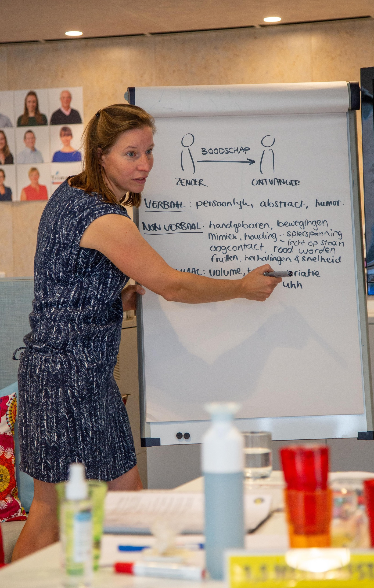

This presentation training is ideal for anyone who needs to present in a business context. You will receive practical tools for giving presentations as well as conducting other professional conversations.

The focus of the training is on convincingly conveying a message and ensuring that this message sticks. Each participant will have different focal points due to varying backgrounds and experiences. We can focus on the content, on overcoming fear, on (non)verbal communication possibilities and more! The training is tailored to your situation, but you can expect plenty of opportunities to experiment and learn from others.

Video analysis is among the possibilities. Currently, we only offer this training incompany only. We provide customized training, which can start from €950 excluding VAT, depending on location, content, and group size. You can request information via Info@yeptrainingen.nl

> “The training is well-structured and very practical, with ample time to practice and then plenty of time for (self)reflection. Learned a lot from it!” - Eveline

> “Marijn \[trainer\] explains calmly and clearly, invites participation and observes well, and before you know it, you’ve taken a step, done an exercise, received feedback on your presentation style. I left with the feeling of having overcome something (myself?) and having learned something lasting.” - Marc

