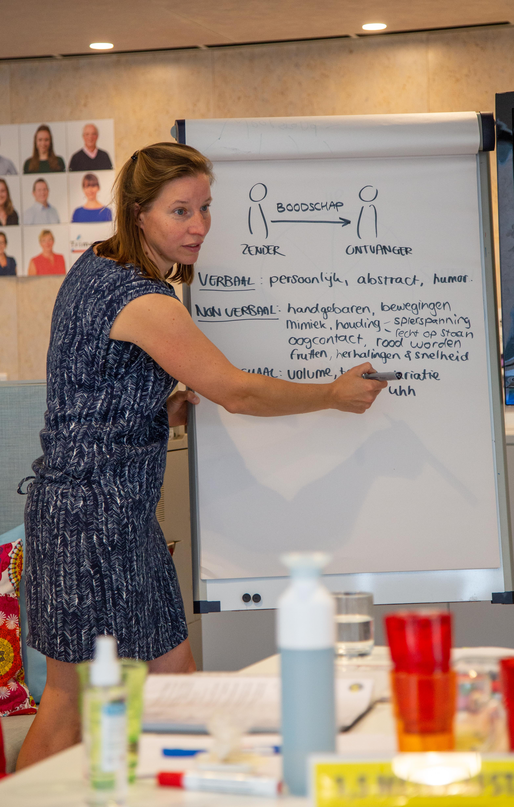

Deze presentatietraining is bij uitstek geschikt voor iedereen die zich regelmatig zakelijk moet presenteren. Je krijgt praktische handvatten voor zowel het geven van presentaties, als het voeren van andere professionele gesprekken.

Het overtuigend overbrengen van een boodschap en het zorgen dat deze boodschap blijft hangen staan centraal in de training. Ieder haalt hier, doordat de voorgeschiedenis en ervaring verschilt, weer andere aandachtspunten uit. De training wordt op maat gemaakt voor jouw/jullie situatie, maar je kan er in elk geval vanuit gaan dat er volop kansen zijn om zelf te experimenteren en om te leren van anderen!

Video-analyse behoort tot de mogelijkheden. We hebben op dit moment alleen een incompany variant van deze training beschikbaar. We bieden maatwerk en dat kan, afhankelijk van de locatie, inhoud en groepsgrootte al vanaf €750 excl. Btw. Informatie aanvragen kan via Info@yeptrainingen.nl

> “De training is goed opgebouwd en heel praktisch van opzet, met uitgebreide aandacht om zelf te doen en vervolgens veel tijd voor (zelf)reflectie. Veel van geleerd!” - Eveline

> “Marijn \[trainer\] legt rustig en duidelijk uit, nodigt uit en observeert goed, en voor je het weet heb je een stap gezet, een oefening gedaan, feedback op je stijl van presenteren gehad. Ik ging weg met het gevoel iets (mezelf?) overwonnen en blijvend bijgeleerd te hebben.” - Marc

