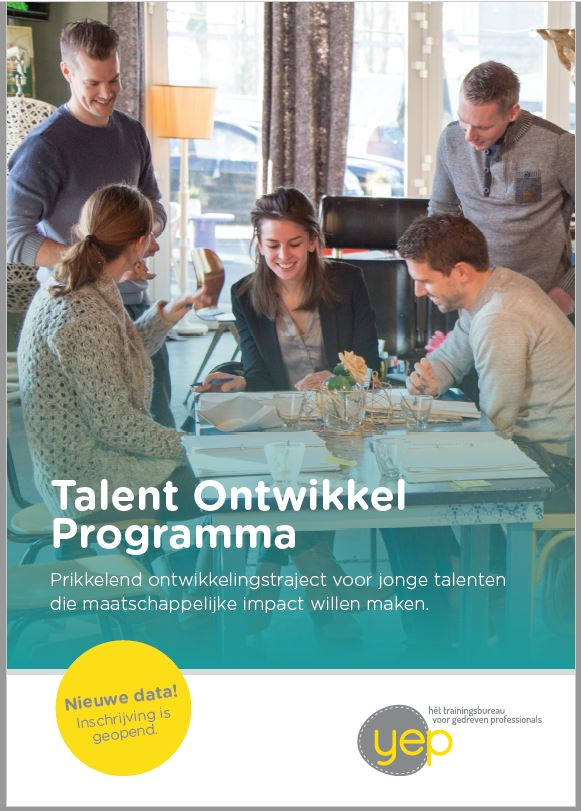
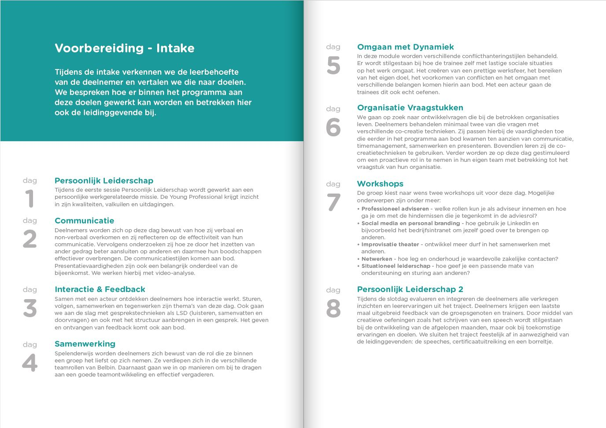

Our Talent Development Program (TDP) is our flagship program in which we help individuals and organizations achieve social impact. Starters with up to 6 years of work experience follow this intensive and broad program in a group of up to 12 participants. Everything related to personal effectiveness and collaboration in the workplace is covered. This enables participants to stand strongly in their organizations and make the impact they aim for.

The program is available in both an open and a customized versions. Participants describe the program as follows:

> "A highly educational course to understand and utilize your qualities!"

> "An intensive journey in the field of self-knowledge and leadership, where you have influence over the learning environment and content."

> "An activating program with committed trainers. Sharp feedback, lots of variety, and also one-on-one sparring moments."

You can find more information in our
[brochure](../../Brochure-TOP-YEP.pdf). This is available in Dutch only.

---

The Talent Development Program consists of 8 full training days, each centered around a specific theme with challenging exercises. Below you can see the overview, with the focus point per day. In addition to the training days, the program includes on-the-job assignments, 7 intervision meetings, and individual coaching.

 The training costs €4100 including arrangement and isfree of VAT. The group consists of 6 to 12 participants. New groups start every year in September, usually with Dutch participants. On request, other start dates and customized content is also possible. Send an email to Marijn@yeptrainingen.nl if you wish to get in contact about the possibilities.

