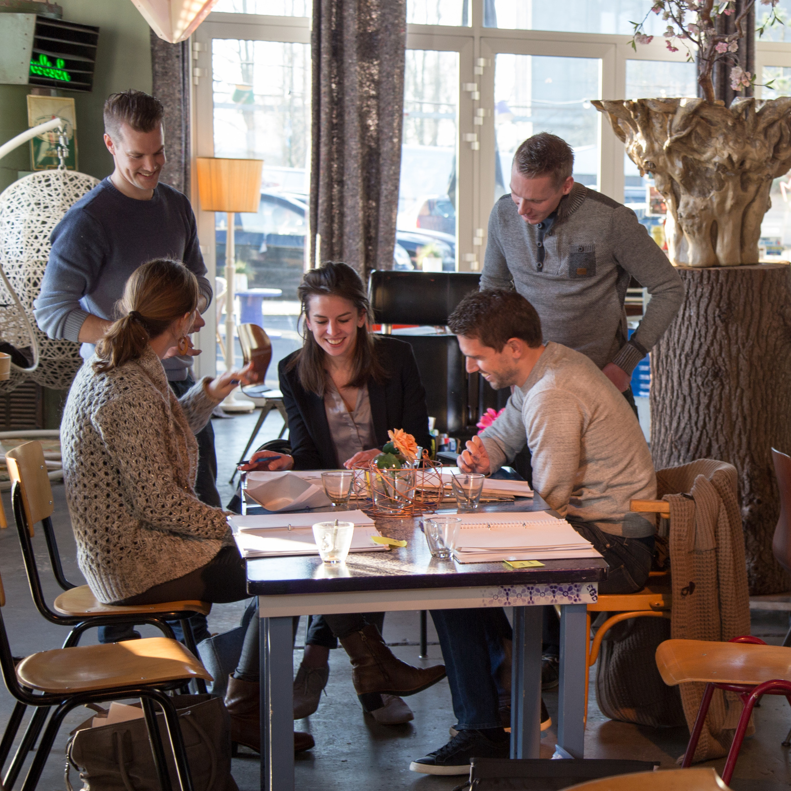

Ons Talent Ontwikkelprogramma is voor ons hét programma is waarin we individuen en organisaties helpen bij het realiseren van maatschappelijke impact. Starters met tot 6 jaar werkervaring volgen dit intensieve en brede programma in een groep van maximaal 12 deelnemers. Alles wat er op het vlak van persoonlijke effectiviteit en samenwerking komt kijken bij het werk krijgt een plek. Daarmee stelt het deelnemers in staat om krachtig in hun organisaties te staan en die impact te gaan maken, waar het hen om draait. 

Het programma is er in een open en in een maatwerk variant en er is een aangepaste versie voor ambitieuze jonge medewerkers die al wat meer werkervaring hebben: _"young leaders"_. Deelnemers beschrijven het programma als volgt:

> "Herkennen, erkennen en leren door oefeningen binnen en buiten je comfortzone, een leerzame cursus om je kwaliteiten te begrijpen en in te zetten!"

> "Een intensieve reis op het gebied van zelfkennis en leiderschap, waarbij je zelf invloed hebt op de leeromgeving en inhoud."  

> "Activerend programma met betrokken trainers. Scherpe feedback, veel variatie en ook één-op één sparringsmomenten"  

Meer ervaringen
TODO: link naar springest: https://www.springest.nl/yep-trainingen-2/talent-ontwikkel-programma-top#ervaringen

Meer informatie vind je in onze 
TODO: THIJS:
(../../static/Brochure-TOP Yep.pdf[brochure] [

* * *

* * *

Het Talent Ontwikkel Programma bestaat uit 9 volle trainingsdagen plus 8 intervisiebijeenkomsten, waarin steeds weer een nieuw thema met uitdagende werkvormen centraal staat. Hieronder zie je het overzicht staan, met het speerpunt per dag.  De training kost €4100 inclusief arrangement en vrij van Btw. De groep bestaat uit 6 tot 12 deelnemers. Elk jaar in september gaan de nieuwe groepen van start. Op aanvraag zijn er ook andere startdata en maatwerk invullingen mogelijk. Hieronder vind je de reeds geplande startdata en het inschrijfformulier. 

TODO Inschrijfmogelijkheden https://www.springest.nl/yep-trainingen-2/talent-ontwikkel-programma-top#overzicht

Eerst informatie aanvragen kan uiteraard ook. Stuur dan een mailtje naar Marijn@yeptrainingen.nl

