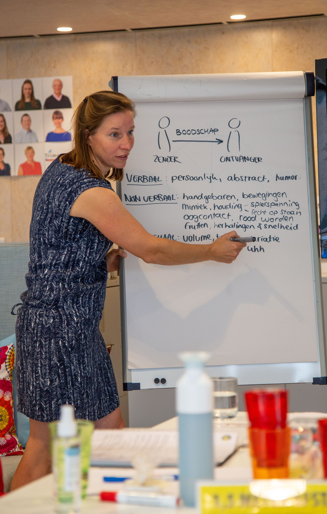

Our Train-the-trainer is an accessible four-session course in which we cover the most important basics for delivering effective and enjoyable training. The course is based on the UvA Psychology Master's program 'Training and Development', which our trainers have completed. It is conducted in small groups of three to six people, allowing participants to effectively achieve their own learning goals. Check out the [brochure](./../Brochure-Train-de-trainer-Yep.pdf). We will outline our essential course below. Please note that we also offer advanced modules for experienced trainers upon request.

# The structure of the Train-the-trainer course is as follows:

## Session 1: Theory

During the first session of the train-the-trainer, we interactively cover the two most important theories a trainer must master. One on communication and one on interaction.

## Session 2: Difficult situations

In the second session, we simulate difficult training situations with an actor. After this session, all trainers will be able to handle resistance from participants and effectively address behavior.

## Session 3: Training design

The third session is about designing training programs. How do you describe a learning objective, and how do you work towards this goal with training components? We cover the creation of appropriate and inspiring exercises. We also discuss topics such as transfer to the workplace, attention span, energy, and engagement.

## Session 4: Practicing

In the fourth session, all participants give a short workshop and receive feedback from the group and trainer on their personal training style and structure, along with various tips on exercises.

The training is suitable for both novice and experienced trainers who want to gain inspiration and improve their basics. The open training costs €800, tax-free. The group consists of a maximum of 6 participants. We schedule new training sessions on request. Below you will find the already planned start dates and the registration form. Reviews from former participants can be found on Springest. You can read them [here](https://www.springest.nl/Yep-Trainingen/train-de-trainer#ervaringen)!

You can also request information first. Send an email to Marijn@yeptrainingen.nl

> “Yep offers a practical Train-the-trainer course that teaches you how to handle difficult training situations and build your training effectively. I found the exercises used inspiring, and the trainer provided real eye-openers. After the course, I viewed my own workshops very differently.” - Anneke, Communication professional

We also offer in-depth modules for groups or one-on-one coaching for trainers. This allows you to tackle specific questions at the moment they arise. This can be done on-site or digitally. Questions such as: "How do I work with training actor?", "How do we handle specific types of resistance?", "Can you brainstorm with me about this new script?", "What is an effective (digital) exercise for this learning objective?", "Why is the learning process stagnating in this group?", "How do I take my own needs into account during a training that I host?" are well-suited for this!
