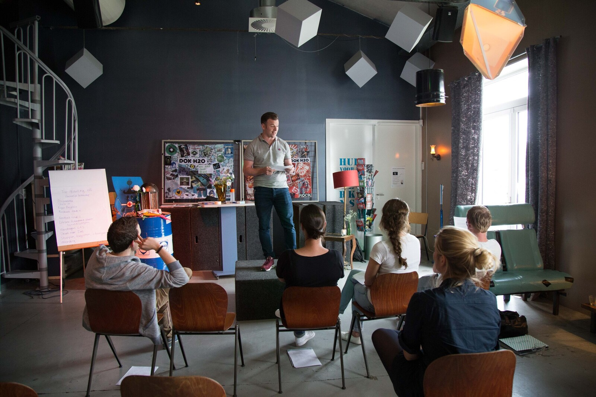

Onze Train-de-trainer is een laagdrempelige cursus van vier dagdelen waarin we de belangrijkste basis voor het geven van effectieve en leuke trainingen behandelen. De cursus is gebaseerd op de UvA Psychologiemaster ‘Training and Development’, die onze trainers gevolgd hebben. Hij wordt gegeven in kleine groepen van drie tot zes personen, zodat deelnemers hun eigen leerdoelen er goed in kwijt kunnen. 

TODO: THIJS:
(../../static/Brochure-Train-de-trainer Yep.pdf) 

# De opbouw van de Train-de-trainer cursus is als volgt:

## Dagdeel 1: Theorie

Tijdens het eerste dagdeel van de train-de-trainer behandelen we op een interactieve manier de twee belangrijkste theorieën een trainer moet beheersen. Een over communicatie en een over interactie.

## Dagdeel 2: Lastige situaties

Het tweede dagdeel simuleren we met een acteur lastige trainingssituaties. Alle trainers kunnen na dit onderdeel omgaan met weerstand van cursisten en goed aanspreken op gedrag.

## Dagdeel 3: Trainingsontwerp

Het derde dagdeel gaat over het ontwerpen van trainingen. Hoe beschrijf je een leerdoel en op welke manier werk je met trainingsonderdelen naar dit doel toe? Het bedenken van passende en inspirerende werkvormen komt aan bod. Ook gaan we in op onderwerpen als transfer naar de werkplek, spanningsboog, energie en leukmakers.

## Dagdeel 4: Zelf doen

Het vierde dagdeel geven alle deelnemers een korte workshop en ontvangen zij van de groep en trainer feedback op hun persoonlijke trainingsstijl en trainingsopbouw en krijgen ze nog diverse tips rond werkvormen. 

 De training is geschikt voor zowel startende als ervaren trainers die inspiratie willen opdoen en hun basis willen verbeteren. De open training kost €800 euro btw vrij. De groep bestaat uit maximaal 6 deelnemers. We plannen nieuwe trainingen in op aanvraag. Hieronder vind je de reeds geplande startdata en het inschrijfformulier. Op Springest staan de reviews van oud-deelnemers. Die kun je [hier](https://www.springest.nl/Yep-Trainingen/train-de-trainer#ervaringen) lezen! 

TODO: Inschrijfmogelijkheden springest 

Eerst informatie aanvragen kan uiteraard ook. Stuur dan een mailtje naar Marijn@yeptrainingen.nl

> “Yep geeft een praktische Train-de-trainer cursus, die je leert met lastige trainingssituaties om te gaan en je training goed op te bouwen. Ik vond de werkvormen die werden gebruikt inspirerend en de trainer zorgde voor echte eye-openers. Ik ben na de cursus mijn eigen workshops heel anders gaan bekijken.” - Anneke, Communicatie professional

Meer Ervaringen springest #ervaringen

We bieden overigens ook verdiepende modules aan voor groepen of één-op-één coaching voor trainers. Zo kun je, op het moment waarop het voor jou speelt met een gerichte vraag aan de slag. Dit kan zowel op locatie als digitaal. Vragen zoals: "Hoe zet ik een trainingsacteur goed in?", "Hoe gaan we om met specifieke vormen van weerstand?", "Wil je met me sparren over dit nieuwe draaiboek?", "Wat is een rake (digitale) werkvorm voor dit leerdoel?", "Waarom stagneert het leerproces bij deze groep?", "Hoe zorg ik beter voor mijzelf tijdens het trainen?", lenen zich hier goed voor!