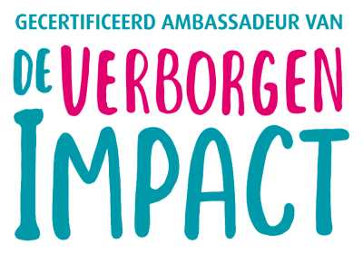
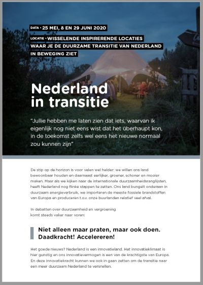

Heel graag helpen wij organisaties met het (creeren van draagvlak voor het) duurzamer maken van hun processen en het stimuleren van duurzaam gedrag van medewerkers. Marijn is Ambassadeur van de methode Verborgen Impact, van Babette Porcelijn en kan groepen begeleiden met het in kaart brengen van hun persoonlijke voetafdruk en het inzicht vergroten in waar de grote winst ligt op het gebied van duurzaamheid.

Voor organisatiebrede verbeteringen, werken wij samen met duurzaam innovatiebureau Noorderwind. Wij verzorgen samen drie-daagse trainingen om aanjagers van transities binnen Nederlandse organisaties te helpen om deze transities in een stroomversnelling te brengen. Yep brengt de softskills die hiervoor nodig zijn: change management, vaardigheden om anderen mee te krijgen en sterke gespreksvaardigheden zorgen voor een solide basis in je organisatie. Noorderwind brengt de 'design thinking tools' die helpen om op een kort-cyclische manier te ontdekken wat er mogelijk is en om in een overzichtelijk tijdsbestek gevalideerde keuzes te maken. En daarnaast: heel veel expertise en ervaring op het gebied van verduurzaming. Dus kom maar op met alle uitdagingen van het land!

## Wie kunnen er meedoen?

Het trainingsprogramma is exclusief voor professionals die voor hun organisatie (verder) aan de slag willen gaan met een verduurzamingsproces en die dit proces graag willen versnellen. Een groep bevat 4 tot 12 deelnemers die elkaar ook na de training kunnen blijven ondersteunen. We raden organisaties aan om twee tot vier professionals per transitie deel te laten nemen, zodat er meerdere kartrekkers in de organisatie zijn die elkaar kunnen versterken. Transitieversnellers - editie Nederland in transitie is passend wanneer het om een vraagstuk op wijk- of regionaal niveau gaat. Een paar ideeën:

- Hoe benutten we de reststromen van de industrie in onze regio?
- Hoe zorgen we voor voor duurzame stroomvoorzieningen in een nieuw woningbouwproject?
- Hoe kunnen we initiatieven van burgers en bedrijfsleven bij elkaar brengen?
- Hoe zoeken we voor regionale vraagstukken een lokale samenwerking op?
- Hoe voegen we zo veel mogelijk waarde toe met vernieuwende groenvoorzieningen?

## Wat kun je verwachten?

Na de drie trainingsdagen weet je met wie en met welke tools je (verder) aan de slag moet om meer resultaten te boeken in jouw eigen organisatie en met jullie eigen product. Je hebt dan al een aantal experimenten kunnen doen en veel voorbeelden om je heen gezien, van successen maar ook van missers. Jouw eigen transitie uitdaging is dus het startpunt. Concrete en gevalideerde resultaten zoals een intern actieplan, nieuw product ontwerp, technisch prototype of een _blueprint_ van een nieuwe business case zijn het eindresultaat.

Heb je interesse en wil je meer weten? Mail Marijn op Marijn@YepTrainingen.nl. Wij gaan graag de uitdagingen van de 21ste eeuw met je aan!
