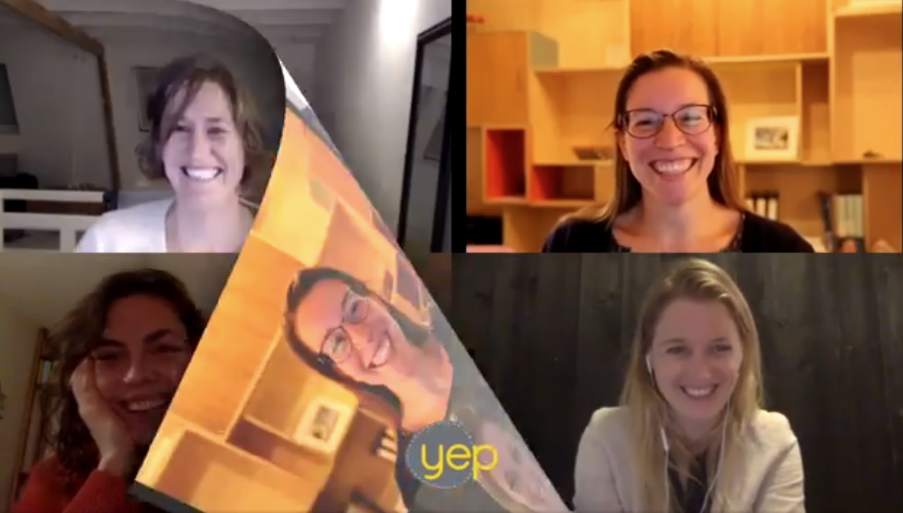

# Online meetings - Connecting digitally

Organizations have continued using video calls and remote meetings after the pandemic. It works, is practical, and the technology is easy to master. But how do you achieve the same level of contact and connection with others? For teams working remotely or professionals who want to have meaningful conversations with clients, it is worthwhile to consider how to foster connection in digital interactions.

In custom training sessions on this topic, we take on the challenge with the group by using practical simulations to experience how digital contact can become more pleasant and effective.

Digital conversation techniques are the focus. This includes welcoming a new colleague or client, responding to non-verbal cues, managing emotions, providing structure in the conversation, engaging your team or conversation partner, etc. Additionally, trying out digital tools and team-building exercises are among the possibilities!

Renske:

> “I gained a few simple yet very helpful insights in this training—using the video effectively, making eye contact, hiding my own video so I'm not distracted. I now know how to approach this and feel more confident behind the screen. Digital contact now requires less energy and provides a stronger sense of connection.”

Raiid:

> “I want to work from home more in the future, but it shouldn’t come at the expense of contact with my team. I found it valuable to hear how they experience digital communication and to explore what is needed and possible in this area. We practiced with new digital tools. I might continue using them. In any case, I now have a better understanding of the possibilities, and I’m happy with that.”

**Custom training**

Price and details upon request. Marijn@yeptrainingen.nl [Marijn@yeptrainingen.nl](mailto:Marijn@yeptrainingen.nl)